# Exercises — Legs

83 exercises. Back to [[_Index]].

## Abductor Machine

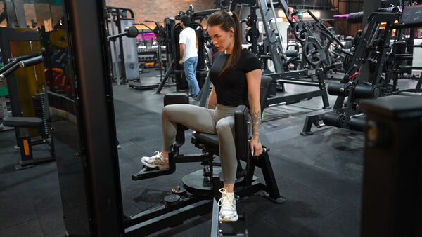

- **Primary:** Glutes
- **Secondary:** —
- **Equipment:** Abduction Machine

Setup
**Grip:** Hold the side handles lightly with both hands for stability.
**Position:** Sit upright on the machine, back flat against the pad, knees bent at 90°, legs pressed against the outer pads.
Instructions
- Push both legs outward against the pads.
- Open as far as the range of motion allows, squeezing the outer glutes and hip abductors at the end.
- Hold briefly at the widest point.
- Slowly return the legs back to the starting position with control.

## Banded hip thrust

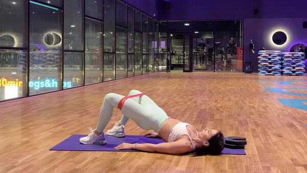

- **Primary:** Glutes
- **Secondary:** Hamstrings, Core
- **Equipment:** Long Band

Setup
**Grip:** Arms relaxed at your sides, palms facing down on the mat.
**Position:** Lie on your back with knees bent, feet flat on the floor, resistance band looped around both legs just above the knees, core engaged.
Instructions
- Press through both heels to drive the hips upward toward the ceiling.
- Push the knees outward against the band, then bring them back together.
- Lower the hips back down with control.
- Keep the core engaged and avoid arching the lower back at the top.

## Banded hip thrust

- **Primary:** Glutes
- **Secondary:** Hamstrings, Core
- **Equipment:** Long Band

Setup
**Grip:** Arms relaxed at your sides, palms facing down on the mat.
**Position:** Lie on your back with knees bent, feet flat on the floor, resistance band looped around both legs just above the knees, core engaged.
Instructions
- Press through both heels to drive the hips upward toward the ceiling.
- Push the knees outward against the band, then bring them back together.
- Lower the hips back down with control.
- Keep the core engaged and avoid arching the lower back at the top.

## Banded lunge

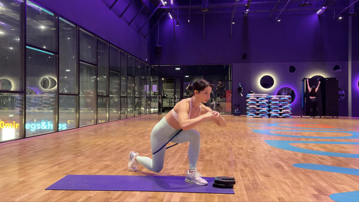

- **Primary:** Glutes
- **Secondary:** Quadriceps, Hamstrings
- **Equipment:** Long Band

Setup
**Grip:** Hands clasped together in front of the chest. 
**Position:** Stand with feet hip-width apart, resistance band looped around both ankles, core engaged.
Instructions 
- Step one foot forward into a lunge, lowering the back knee toward the floor.
- Descend until the front thigh is parallel to the floor and the back knee nearly touches the mat.
- Keep the front knee aligned over the toes and the chest upright.
- Push through the heel of the front foot to return to the starting position.

## Banded rdl

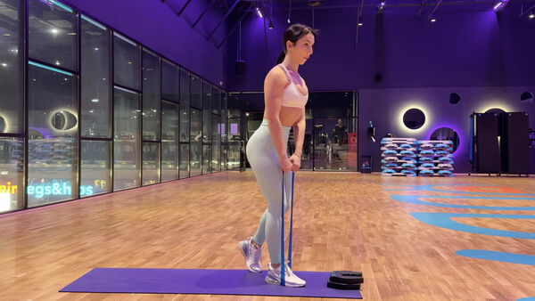

- **Primary:** Hamstrings
- **Secondary:** Glutes, Core
- **Equipment:** Long Band

Setup
**Grip:** Hold the resistance band with both hands, arms extended down in front of the body.
**Position:** Stand with feet hip-width apart, both feet on the band to anchor it, slight bend in the knees.
Instructions
- Hinge forward, lowering the hands along the front of the legs while keeping the back flat.
- Lower until you feel a stretch in the hamstrings, keeping the band close to the body.
- Drive the hips forward to return to the upright position.
- Squeeze the glutes at the top of the movement.

## Banded side steps

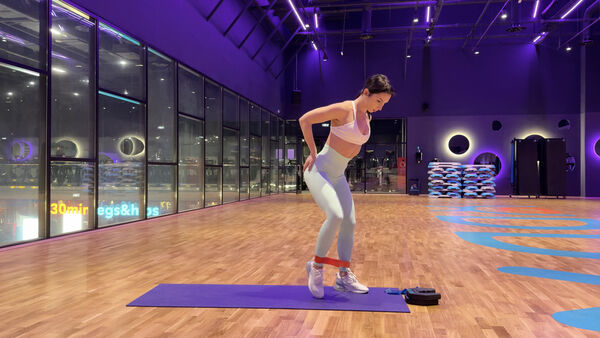

- **Primary:** Glutes
- **Secondary:** Quads, Core
- **Equipment:** Long Band

Setup
**Grip:** Both hands on the hips.
**Position:** Stand with feet hip-width apart, resistance band looped around both ankles, knees slightly bent, torso hinged slightly forward.
Instructions
- Step one foot out to the side, stretching the band to create resistance.
- Step the other foot toward the center, lightly touching the floor with the toes.
- Return to the starting position and repeat the same movement with the other foot.
- Keep the knees slightly bent and the torso hinged forward throughout the movement.
- Avoid bringing the feet too close together — maintain constant tension in the band.

## Banded Side Steps

- **Primary:** Glutes
- **Secondary:** Quads, Core
- **Equipment:** Long Band

Setup
**Grip:** Hands clasped together in front of you.
**Position:** Stand with feet hip-width apart, resistance band looped around both legs at thigh level, knees slightly bent, torso hinged slightly forward.
Instructions
- Step one foot out to the side, stretching the band to create resistance.
- Step the other foot toward the center, lightly touching the floor with the toes.
- Return to the starting position and repeat the same movement with the other foot.
- Keep the knees slightly bent and the torso hinged forward throughout the movement.
- Avoid bringing the feet too close together — maintain constant tension in the band.

## Banded Squat

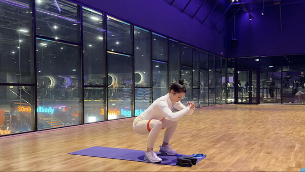

- **Primary:** Quads
- **Secondary:** Glutes, Hamstrings, Core
- **Equipment:** Long Band

Setup
**Grip:** Hands clasped together in front of the chest.
**Position:** Stand with feet shoulder-width apart, toes slightly turned out, resistance band looped around both thighs, core engaged and spine neutral.
Instructions
- Lower into a squat by pushing the hips back and bending the knees.
- Descend until the thighs are at least parallel to the floor.
- Keep the knees pushing out against the band throughout the movement.
- Drive through the heels to return to the standing position.
- Keep the chest up and spine neutral throughout the movement.

## Barbell walking lunges

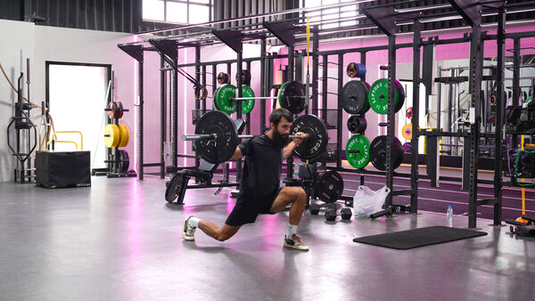

- **Primary:** Quads
- **Secondary:** Glutes, Hamstrings, Calves
- **Equipment:** Barbell

Setup
**Grip:** Grip the bar slightly wider than shoulder-width, palms facing forward. Place it across the upper traps, keeping elbows pointing down and back to create a stable shelf.
**Position:** Stand tall with feet hip-width apart, bar resting on the upper traps. Core braced, chest up and gaze forward.
Instructions
- Step one foot forward and lower your body by bending both knees until the back knee nearly touches the floor.
- Keep the front knee tracking directly over the toes and the torso upright throughout the descent.
- Drive through the heel of the front foot to rise up and bring the back foot forward to meet the front.
- Step immediately forward with the opposite foot and repeat the lunge on the other side.

## Broad Jumps

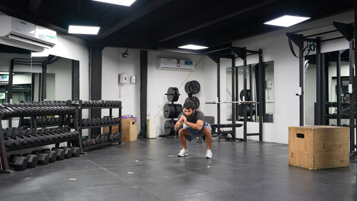

- **Primary:** Quads
- **Secondary:** Glutes, Hamstrings, Calves
- **Equipment:** No Equipment, Body Weight

Setup
**Grip:** Hands clasped together in front of the chest.
**Position:** Stand with feet shoulder-width apart, knees slightly bent, core engaged.
Instructions
- Lower into a shallow squat, swinging the arms back to load the jump.
- Explosively push through both feet, swinging the arms forward to jump as far forward as possible.
- Land softly on both feet simultaneously, with knees bent to absorb the impact.
- Land in a stable squat position and hold briefly before resetting.

## Bulgarian Split Squats

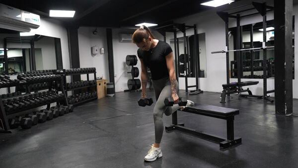

- **Primary:** Quads
- **Secondary:** Glutes, Hamstrings
- **Equipment:** Dumbbell, Bench

Setup
**Grip:** Hold a dumbbell in each hand, arms hanging down at your sides.
**Position:** Stand facing away from the bench, place one foot behind you on the bench, front foot planted firmly on the floor, core engaged and torso upright.
Instructions
- Lower the body by bending the front knee, descending until the front thigh is parallel to the floor.
- Keep the front knee aligned over the toes throughout the descent.
- Keep the torso upright and avoid leaning excessively forward.
- Push through the heel of the front foot to return to the starting position.

## Bulgarian-style deadlift

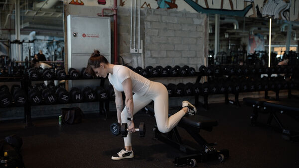

- **Primary:** Glutes
- **Secondary:** Hamstrings, Lower Back, Core
- **Equipment:** Dumbbell, Bench

**Setup**
**Grip:** Hold a dumbbell in the working hand with a neutral grip, arm hanging straight down.
**Position:** Place one knee on the bench behind you and step the opposite foot forward on the floor. Hinge slightly at the hip, keeping your back flat, chest up, and core engaged. The dumbbell hangs at arm's length beside the front leg.
**Instructions**
- Drive through the heel of the front foot, extending your hip to lift the dumbbell and stand upright.
- Keep the dumbbell close to your leg throughout the movement.
- Squeeze your glutes at the top and fully extend your hip.
- Slowly hinge back at the hip, lowering the dumbbell to the starting position in a controlled motion.
- Repeat for the prescribed number of repetitions, then switch sides.

## Burpees

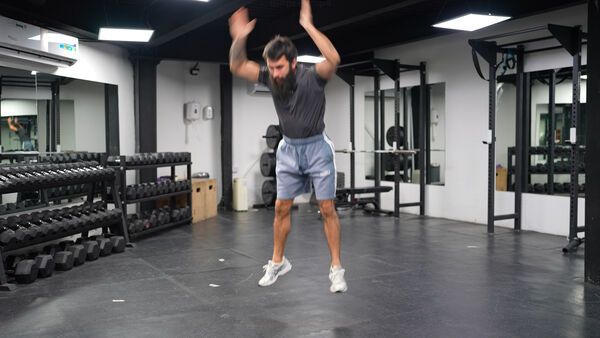

- **Primary:** Quads
- **Secondary:** Glutes, Chest, Shoulders
- **Equipment:** No Equipment, Body Weight

Setup
**Grip:** Keep hands open and relaxed at the sides at the start. Palms flat on the floor during the push-up phase.
**Position:** Stand tall with feet shoulder-width apart, chest up, core braced and arms at the sides.
Instructions
- Bend the knees, place both hands on the floor and jump or step the feet back into a high plank position.
- Lower the chest to the floor by bending the elbows, performing a full push-up.
- Press back up to the plank, then explosively jump or step the feet forward toward the hands.
- Drive through the full foot and swing the arms upward to launch into a vertical jump.

## Cable Glute Kickback

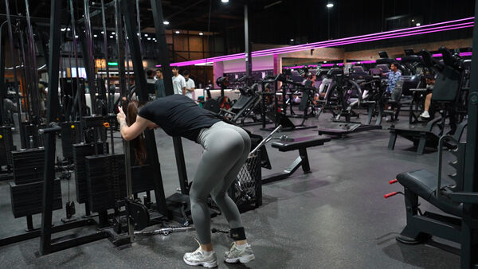

- **Primary:** Glutes
- **Secondary:** Hamstrings
- **Equipment:** DAP Machine (Cable)

Setup
**Grip:** Hold the cable machine frame or handle with both hands for support, torso leaned slightly forward.
**Position:** Stand facing the cable machine, ankle cuff attached to one leg, slight bend in the standing knee.
Instructions
- Drive the working leg straight back and upward against the cable resistance.
- Squeeze the glute firmly at the top of the movement.
- Hold briefly at the top, keeping the hips square and level.
- Lower the leg back down slowly and with control.
- Keep the back flat and avoid arching the lower back during the kickback.

## Cable Hip Abduction

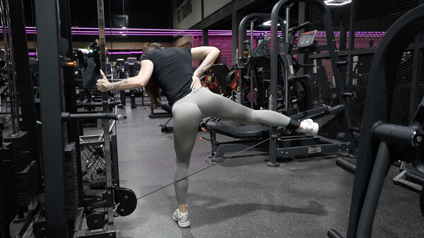

- **Primary:** Glutes
- **Secondary:** Quads, Core
- **Equipment:** DAP Machine (Cable)

**Setup**
**Grip:** Hold onto a stable support (cable machine frame or upright) with both hands for balance.
**Position:** Attach the ankle cuff to the working leg and set the cable pulley to the lowest position. Stand sideways to the machine, with the working leg closest to it. Keep your standing leg slightly bent and torso slightly hinged forward.
**Instructions**
- Lift the working leg out to the side in a wide arc, keeping it straight.
- Raise as high as comfortable while keeping your hips square and level.
- Pause briefly at the top, squeezing the glute of the working leg.
- Slowly lower the leg back to the starting position in a controlled motion.
- Avoid leaning your torso to the opposite side — keep the movement isolated to the hip.

## Classic deadlift

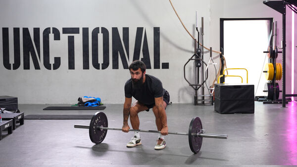

- **Primary:** Hamstrings
- **Secondary:** Glutes, Lower Back, Forearms
- **Equipment:** Barbell

**Setup**
**Grip:** Grip the bar just outside the legs with both hands using a double overhand or mixed grip. 
**Position:** Stand with feet hip-width apart, bar over the mid-foot. Hinge at the hips and bend the knees until the shins touch the bar. Chest up, shoulders directly over or slightly in front of the bar, core braced.
**Instructions**
- Take a deep breath, brace the core hard and create full-body tension before initiating the pull.
- Press the floor away through the full foot, extending the knees and hips simultaneously.
- Keep the bar in contact with the legs throughout the entire lift, maintaining a vertical bar path.
- Lock out by fully extending the hips and squeezing the glutes at the top, standing tall.

_Master the move — Master the move Deadlift:_ Watch the correct form and key tips before you start your workout.

## Curtsey lunge + classic lunge

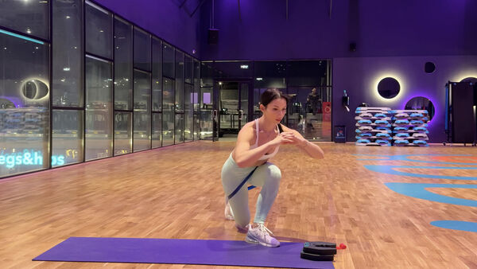

- **Primary:** Glutes
- **Secondary:** Quads, Hamstrings, Core
- **Equipment:** Long Band

Setup
**Grip:** Hands clasped together in front of the chest.
**Position:** Stand with feet hip-width apart, resistance band looped around both thighs, core engaged.
Instructions
- Step one foot diagonally behind the body into a curtsey lunge, lowering the back knee toward the floor.
- Rise up, then step the other foot straight back into a classic reverse lunge.
- Push through the front heel to return to the starting position.
- Keep the chest up and core engaged throughout both movements.

## Curtsey lunge + Сlassic lunge

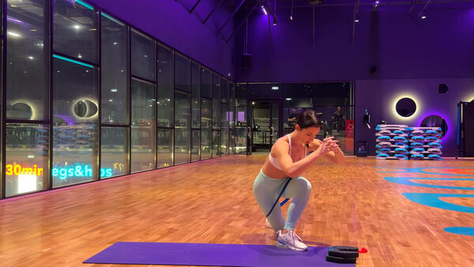

- **Primary:** Glutes
- **Secondary:** Quads, Hamstrings, Core
- **Equipment:** Long Band

Setup
**Grip:** Hands clasped together in front of the chest.
**Position:** Stand with feet hip-width apart, resistance band looped around both thighs, core engaged.
Instructions
- Step one foot diagonally behind the body into a curtsey lunge, lowering the back knee toward the floor.
- Rise up, then step the other foot straight back into a classic reverse lunge.
- Push through the front heel to return to the starting position.
- Keep the chest up and core engaged throughout both movements.

## Deficit deadlift (platform 5–7 cm)

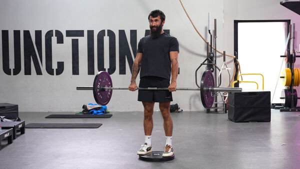

- **Primary:** Hamstrings
- **Secondary:** Glutes, Lower Back, Forearms
- **Equipment:** Plate, Barbell

Setup
**Grip:** Grip the bar just outside the legs with both hands, using either a double overhand or mixed grip. Wrap fingers firmly around the bar with wrists neutral.
**Position:** Stand on a platform 5–7 cm high with feet hip-width apart, bar over the mid-foot. Hinge at the hips, push the knees out and lower the hips until the shins touch the bar. Chest up, shoulders directly over or slightly in front of the bar.
Instructions
- Take a deep breath, brace the core hard and create full-body tension before initiating the pull.
- Press the floor away through the full foot, extending the knees and hips simultaneously.
- Keep the bar in contact with the legs throughout the entire lift, maintaining a vertical bar path.
- Lock out by fully extending the hips and squeezing the glutes at the top, standing tall.

_Master the move — Master the move Deadlift:_ Watch the correct form and key tips before you start your workout.

## Dumbbell lunges

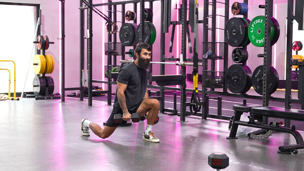

- **Primary:** Quads
- **Secondary:** Glutes, Hamstrings
- **Equipment:** Dumbbell

Setup
**Grip:** Hold a dumbbell in each hand with a neutral grip, palms facing inward. 
**Position:** Stand tall with feet hip-width apart, dumbbells hanging at the sides. Core braced, chest up and gaze forward.
Instructions
- Step one foot forward and lower your body by bending both knees until the back knee nearly touches the floor.
- Keep the front knee tracking directly over the toes and the torso upright throughout the descent.
- Drive through the heel of the front foot to push back up and return to the starting position.
- Step the opposite foot forward and repeat the movement on the other side.

## Dumbbell Romanian deadlift

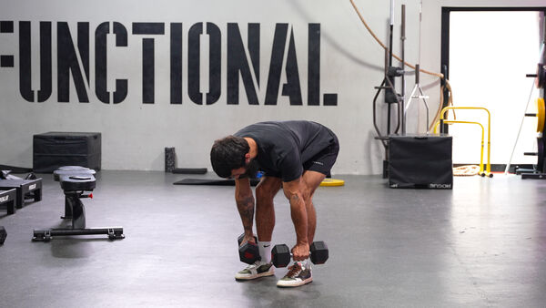

- **Primary:** Hamstrings
- **Secondary:** Glutes, Lower Back
- **Equipment:** Dumbbell

Setup
**Grip:** Hold a dumbbell in each hand with an overhand grip, palms facing the body.
**Position:** Stand tall with feet hip-width apart, dumbbells resting against the front of the thighs. Core braced, chest up, shoulders retracted.
Instructions
- Hinge at the hips by pushing them back, lowering the dumbbells along the front of the legs while keeping the back flat.
- Keep a slight bend in the knees throughout — this is a hip hinge, not a squat.
- Lower until you feel a strong stretch in the hamstrings, keeping the dumbbells close to the legs at all times.
- Drive the hips forward to return to the starting position, squeezing the glutes at the top.

## Dynamic Lunges

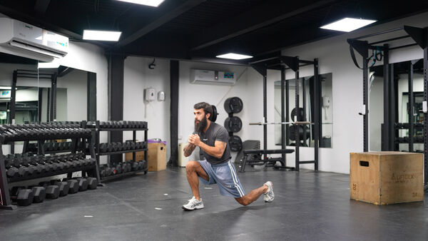

- **Primary:** Quads
- **Secondary:** Glutes, Hamstrings
- **Equipment:** Body Weight, No Equipment

Keep your chest upright and core engaged to maintain balance and reduce joint stress.

Setup
**Grip:** Clasp hands together in front of the chest or keep arms relaxed at the sides for balance.
**Position:** Stand tall with feet hip-width apart, chest up, core braced and gaze forward.
Instructions
- Step one foot forward and lower your body by bending both knees until the back knee nearly touches the floor.
- Keep the front knee tracking directly over the toes and the torso upright throughout the descent.
- Drive through the front heel to push back up and return the foot to the starting position.
- Step the opposite foot forward and repeat the movement on the other side.
- Maintain a steady rhythm and controlled pace throughout all reps.

## Elevated Lunges

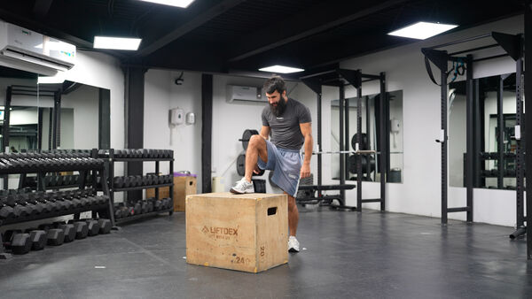

- **Primary:** Quads
- **Secondary:** Glutes, Hamstrings
- **Equipment:** Box

Setup
**Grip:** Clasp hands together in front of the chest or keep arms relaxed at the sides for balance.
**Position:** Stand facing a box or elevated surface. Place one foot fully on top of the box, with the knee bent and the other foot on the floor behind. Torso upright, core braced.
**Instructions**
- With the front foot elevated, lower your body by bending both knees until the back knee nearly touches the floor.
- Keep the front knee tracking directly over the toes and the torso upright throughout the descent.
- Drive through the heel of the elevated foot to push back up to the starting position.
- Maintain a steady controlled pace and full-body tension throughout all reps.

## Fire hydrant

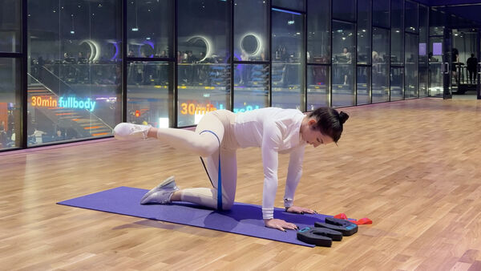

- **Primary:** Glutes
- **Secondary:** Core, Hamstrings
- **Equipment:** Long Band

Setup
**Grip:** Hands flat on the floor, shoulder-width apart, fingers pointing forward.
**Position:** Start on all fours with knees hip-width apart, resistance band looped around both thighs, back flat.
Instructions
- Lift one knee out to the side, keeping it bent at 90 degrees and pushing against the band.
- Raise until the thigh is parallel to the floor, keeping the hips square.
- Hold briefly at the top, squeezing the glute.
- Lower the knee back down slowly and with control.

## Front squat

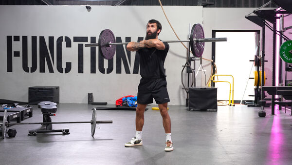

- **Primary:** Quads
- **Secondary:** Glutes, Lower Back
- **Equipment:** Barbell

Setup
**Grip:** Hold a barbell close to the chest.
**Position:** Stand with feet shoulder-width apart, toes slightly turned out, core engaged.
Instructions
- Slowly lower into a squat, pushing the hips back and bending the knees until thighs are parallel to the floor.
- Keep the elbows high and the chest upright throughout the descent.
- Keep the knees tracking over the toes and heels flat on the floor.
- Push through the heels to return to the standing position.

_Master the move — Master the move Squat:_ Watch the correct form and key tips before you start your workout.

## Front Squats with Bottles

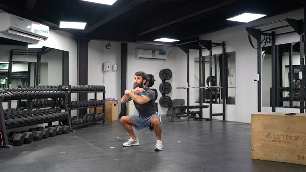

- **Primary:** Quads
- **Secondary:** Glutes, Core
- **Equipment:** DIY Weight

Setup
**Grip:** Hold a water bottle close to the chest.
**Position:** Stand with feet shoulder-width apart, toes slightly turned out, core engaged.
Instructions
- Slowly lower into a squat, pushing the hips back and bending the knees until thighs are parallel to the floor.
- Keep the elbows high and the chest upright throughout the descent.
- Keep the knees tracking over the toes and heels flat on the floor.
- Push through the heels to return to the standing position.

## Glute bridge

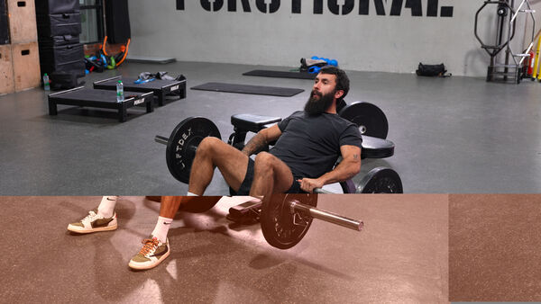

- **Primary:** Glutes
- **Secondary:** Hamstrings, Lower Back, Core
- **Equipment:** Barbell

Setup
**Grip:** Hold the barbell with an overhand grip, hands shoulder-width apart, bar resting across the hips.
**Position:** Sit on the floor with upper back resting against a bench, knees bent, feet flat on the floor, barbell positioned across the hip crease.
Instructions
- Press through both heels to drive the hips upward, lifting the barbell.
- Rise until the body forms a straight line from shoulders to knees.
- Squeeze the glutes firmly at the top and hold briefly.
- Lower the hips back down slowly and with control.

## Glute bridge

- **Primary:** Glutes
- **Secondary:** Hamstrings, Lower Back
- **Equipment:** Barbell, Bench

Setup
**Grip:** Hold the barbell with an overhand grip, hands shoulder-width apart, bar resting across the hips.
**Position:** Sit on the floor with upper back resting against a bench, knees bent, feet flat on the floor, barbell positioned across the hip crease.
Instructions
- Press through both heels to drive the hips upward, lifting the barbell.
- Rise until the body forms a straight line from shoulders to knees.
- Squeeze the glutes firmly at the top and hold briefly.
- Lower the hips back down slowly and with control.

## Glute kickback

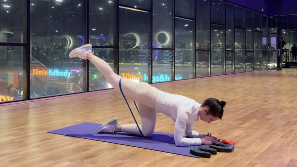

- **Primary:** Glutes
- **Secondary:** Hamstrings, Core
- **Equipment:** Long Band

Setup
**Grip:** Forearms flat on the floor, hands loosely clasped, elbows aligned under shoulders.
**Position:** Start on all fours with knees hip-width apart, resistance band looped around both thighs, back flat. 
Instructions
- Extend one leg straight back and lift it upward, pushing against the resistance of the band.
- Squeeze the glute at the top of the movement, keeping the hips square to the floor.
- Hold briefly at the top, then lower the leg back down with control.
- Keep the lower back flat and avoid arching as the leg rises.
- Repeat all reps on one leg before switching sides.

## Goblet squat

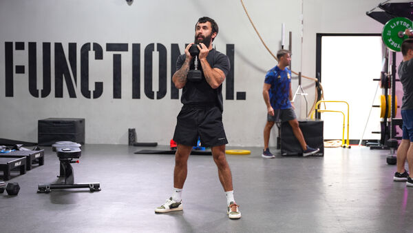

- **Primary:** Quads
- **Secondary:** Glutes, Hamstrings
- **Equipment:** Dumbbell

Setup
**Grip:** Hold a dumbbell or kettlebell vertically with both hands, cupping the top end close to the chest. Keep elbows pointing down and wrists firm throughout the movement.
**Position:** Stand with feet slightly wider than shoulder-width, toes pointed slightly outward. Hold the weight at chest height, core braced and chest up.
Instructions
- Hinge slightly at the hips and bend the knees simultaneously, descending straight down between the legs.
- Keep the elbows inside the knees as you descend, using them to push the knees outward.
- Lower until the hips drop below parallel, keeping the torso upright and the weight close to the chest.
- Drive through the full foot to press the floor away and return to the standing position.
- Keep the chest tall and the weight held steady throughout — do not let it pull you forward.

_Master the move — Master the move Squat:_ Watch the correct form and key tips before you start your workout.

## Good mornings with backpack

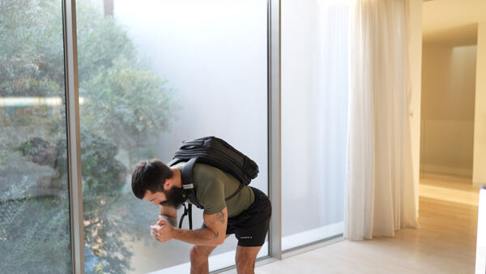

- **Primary:** Hamstrings
- **Secondary:** Glutes, Lower Back
- **Equipment:** Weighted Backpack

Setup
**Grip: **Hands clasped in front of the chest or holding the backpack straps for stability.
**Position: **Stand upright with feet hip-width apart. Wear the backpack securely on your back. Knees slightly bent, chest up, spine neutral. Brace the core before initiating the movement.
Instructions
- Hinge at the hips by pushing them backward while keeping the spine neutral.
- Lower your torso forward until you feel a stretch in the hamstrings.
- Keep knees slightly bent and weight distributed through mid-foot and heels.
- Maintain a flat back and engaged core throughout the movement.
- Drive hips forward to return to the starting position and repeat.

## Hamstring curls

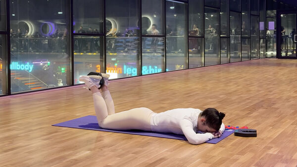

- **Primary:** Hamstrings
- **Secondary:** Glutes, Calves
- **Equipment:** Plate

Setup
**Grip:** Arms folded under the head, forehead resting on them.
**Position:** Lie face down on the mat, legs straight, dumbbell secured between both feet, core lightly engaged.
Instructions
- Curl both legs upward by bending the knees, lifting the dumbbell toward the glutes.
- Squeeze the hamstrings at the top of the movement.
- Hold briefly at the top, then slowly lower the legs back to the starting position.
- Keep the hips pressed into the mat and avoid lifting them during the curl.

## High-bar squat (with 2-sec pause)

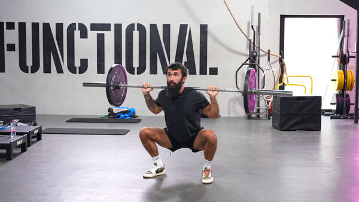

- **Primary:** Quads
- **Secondary:** Glutes, Hamstrings, Lower Back
- **Equipment:** Barbell

Setup
**Grip:** Place hands on the bar slightly wider than shoulder-width, wrapping fingers around it. Elbows point down and slightly back to keep the torso upright.
**Position:** Rest the bar high on the upper traps, directly on top of the shoulders. Feet shoulder-width apart, toes pointed slightly outward, chest tall.
Instructions
- Take a deep breath, brace your core and unrack the bar by standing tall.
- Bend the knees and push the hips straight down, keeping the torso as upright as possible.
- Lower until your hips reach below parallel, driving knees out in line with the toes.
- Hold the bottom position for 2 seconds, maintaining tension and an upright torso.
- Drive through the full foot to press the floor away and return to the starting position.

_Master the move — Master the move Squat:_ Watch the correct form and key tips before you start your workout.

## Hip extension

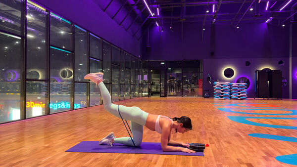

- **Primary:** Glutes
- **Secondary:** Hamstrings, Core
- **Equipment:** Long Band

Setup
**Grip:** Forearms and palms flat on the floor, elbows aligned under shoulders.
**Position:** Start on all fours with knees hip-width apart, back flat, core engaged and spine neutral.
Instructions
- Extend one leg straight back and lift it upward, squeezing the glute at the top.
- Keep the hips square to the floor — avoid rotating to the side.
- Hold briefly at the top, then lower the leg back down with control.
- Keep the lower back flat and avoid arching as the leg rises.

## Hip Extension Pulse

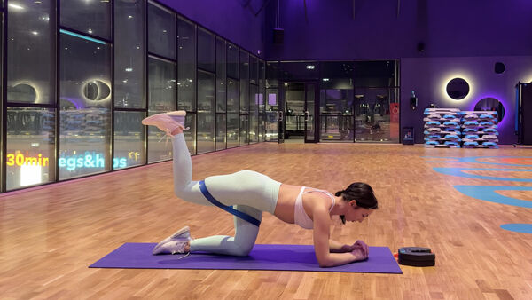

- **Primary:** Glutes
- **Secondary:** Hamstrings, Core
- **Equipment:** Long Band

Setup
**Grip:** Forearms flat on the floor, hands loosely clasped, elbows aligned under shoulders.
**Position:** Start on all fours with knees hip-width apart, resistance band looped around both thighs, back flat, core engaged.
Instructions
- Extend one leg straight back and lift it upward, keeping the knee bent at 90 degrees.
- From this raised position, perform small controlled pulses upward.
- Squeeze the glute with each pulse at the top.
- Keep the hips square to the floor — avoid rotating to the side.
- Keep the lower back flat and avoid arching throughout the movement.

## Hip Thrusts

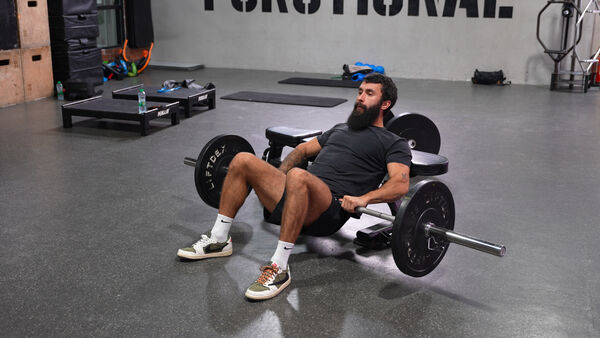

- **Primary:** Glutes
- **Secondary:** Hamstrings, Quads
- **Equipment:** Bench, Barbell

Setup
**Grip:** Hold the barbell with an overhand grip, hands shoulder-width apart, bar resting across the hips.
**Position:** Sit on the floor with upper back resting against a bench, knees bent, feet flat on the floor, barbell positioned across the hip crease.
Instructions
- Press through both heels to drive the hips upward, lifting the barbell.
- Rise until the body forms a straight line from shoulders to knees.
- Squeeze the glutes firmly at the top and hold briefly.
- Lower the hips back down slowly and with control.

## Hip-dominant smith machine squat

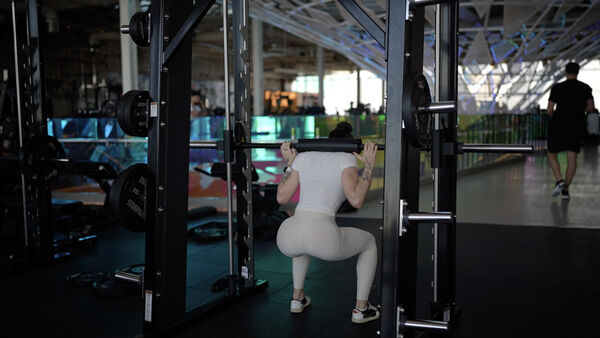

- **Primary:** Glutes
- **Secondary:** Quads, Hamstrings, Lower Back
- **Equipment:** Smith Machine

**Setup**
**Grip:** Overhand grip on the bar, hands slightly wider than shoulder width.
**Position:** Feet set slightly forward and wider than hip-width, toes turned slightly out, torso inclined forward.
**Instructions**
- Position the bar across your upper back and step your feet slightly forward under the bar.
- Brace your core, keep your chest stable, and unrack the bar.
- Initiate the squat by pushing your hips back, minimizing forward knee travel.
- Lower under control until you reach a depth that maintains a neutral spine.
- Keep your shins relatively vertical and weight through the heels.
- Drive through your heels to stand up, squeezing your glutes.

## Jump Squats

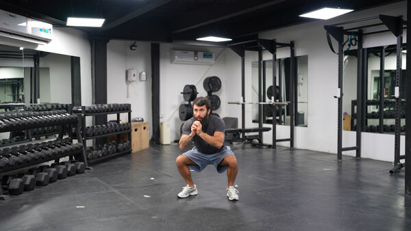

- **Primary:** Quads
- **Secondary:** Glutes, Hamstrings, Calves
- **Equipment:** Body Weight, No Equipment

Setup
**Grip:** Arms relaxed at your sides or slightly out for balance.
**Position:** Stand with feet shoulder-width apart, toes slightly turned out.
Instructions
- Lower into a squat by pushing the hips back and bending the knees until thighs are parallel to the floor.
- Explosively push through both heels to jump off the floor.
- Land softly on the balls of the feet, immediately bending the knees to absorb the impact.
- Land back into the squat position and repeat without pausing.

## Leg curls

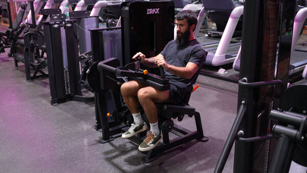

- **Primary:** Hamstrings
- **Secondary:** Calves
- **Equipment:** Leg Curl

Setup
**Grip:** Hold the side handles of the machine firmly with both hands to stabilize the torso throughout the movement.
**Position:** Sit upright on the machine seat with back fully pressed against the pad. Place legs straight out with the ankle pad resting on the lower shins just above the ankles. Core braced and feet flexed.
Instructions
- Press the feet downward and curl the legs under the seat by bending the knees as far as the machine allows.
- Keep the back flat against the pad throughout — avoid lifting the hips off the seat.
- Squeeze the hamstrings hard at the peak contraction when the legs are fully curled.

## Leg extensions

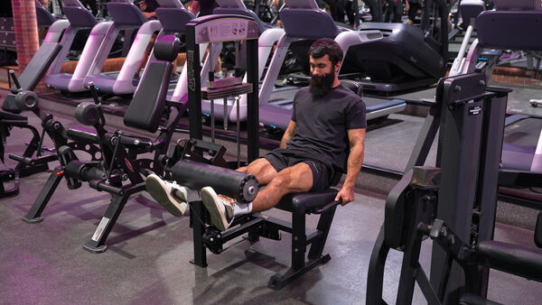

- **Primary:** Quads
- **Secondary:** —
- **Equipment:** Leg Extension Machine

Setup
**Grip:** Hold the side handles of the machine firmly with both hands to keep the torso stable throughout the movement.
**Position:** Sit upright on the machine seat with back fully pressed against the pad. Place legs under the ankle pad with it resting just above the ankles. Knees aligned with the machine's pivot point, feet flexed.
Instructions
- Extend both legs upward simultaneously by straightening the knees in a smooth controlled arc.
- Lift until the legs are fully extended and parallel to the floor, squeezing the quadriceps hard at the top.
- Pause briefly at the peak contraction, maintaining maximum tension in the quads.
- Lower the legs in a controlled manner back to the starting position, resisting the weight on the way down.

## Leg press (Wide stance)

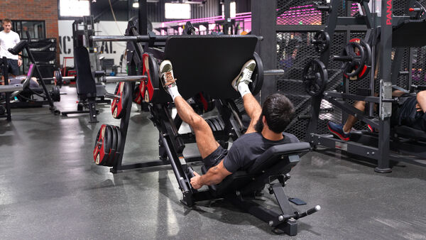

- **Primary:** Glutes
- **Secondary:** Hamstrings, Quads, Calves
- **Equipment:** Cyber LP Machine

Setup
**Grip:** Hold the side handles of the machine firmly with both hands to keep your lower back pressed against the seat throughout the movement.
**Position:** Sit back fully in the machine with your lower back and hips flat against the pad. Place feet wide on the platform, toes angled slightly outward.
Instructions
- Release the safety handles and lower the platform slowly toward your chest by bending the knees.
- Descend until your knees reach approximately a 90° angle, keeping them tracking over the toes.
- Do not let your lower back peel off the pad at the bottom of the movement.
- Press through the full foot to extend the legs and push the platform back up.
- Stop just short of locking out the knees at the top to keep tension on the muscles.

## Leg press (Сlassic stance)

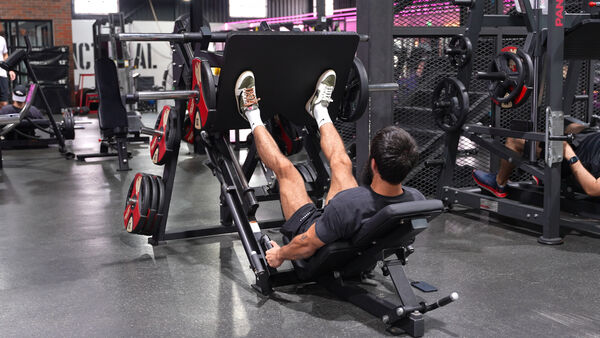

- **Primary:** Quads
- **Secondary:** Glutes, Hamstrings, Calves
- **Equipment:** Cyber LP Machine

Setup
**Grip:** Hold the side handles of the machine firmly with both hands to keep the lower back pressed against the seat throughout the movement.
**Position:** Sit back fully in the machine with lower back and hips flat against the pad. Place feet shoulder-width apart in the center of the platform, toes pointing slightly outward.
Instructions
- Release the safety handles and lower the platform slowly toward the chest by bending the knees.
- Descend until the knees reach approximately a 90° angle, keeping them tracking over the toes.
- Do not let the lower back peel off the pad at the bottom of the movement.
- Press through the full foot to extend the legs and push the platform back up.
- Stop just short of locking out the knees at the top to keep constant tension on the muscles.

## Low-bar squat

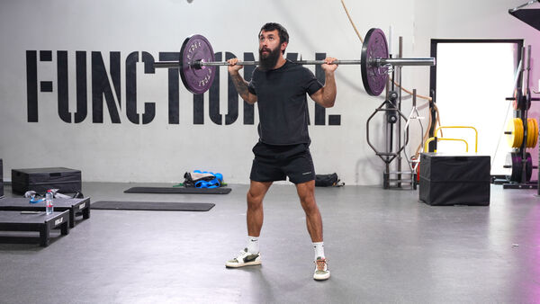

- **Primary:** Glutes
- **Secondary:** Hamstrings, Quads, Lower Back
- **Equipment:** Barbell

Setup
**Grip:** Place hands on the bar slightly wider than shoulder-width, wrapping fingers firmly around it. Elbows point back and slightly down to create a stable shelf with the rear deltoids.
**Position:** Position the bar low on the upper back, resting on the rear deltoids — not on the neck. Feet shoulder-width apart, toes pointed slightly outward.
Instructions
- Take a deep breath, brace your core and unrack the bar by standing tall.
- Hinge at the hips and bend the knees simultaneously, pushing them out in line with the toes.
- Lower until your hips drop just below parallel, keeping your chest up and back flat.
- Drive through the heels to push the floor away and return to a standing position.
- Keep the bar path straight and the torso angle consistent throughout the movement.

_Master the move — Master the move Squat:_ Watch the correct form and key tips before you start your workout.

## Lunge

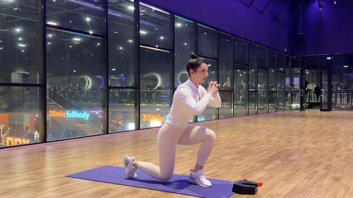

- **Primary:** Quads
- **Secondary:** Glutes, Hamstrings
- **Equipment:** Body Weight, No Equipment

Setup
**Grip:** Hands clasped together in front of the chest.
**Position:** Stand with feet hip-width apart, core engaged.
Instructions
- Step one foot forward, lowering the back knee toward the floor.
- Descend until the front thigh is parallel to the floor and the back knee nearly touches the mat.
- Keep the front knee aligned over the toes and the chest upright.
- Push through the heel of the front foot to return to the starting position.
- Keep the core engaged and avoid leaning forward throughout the movement.

## Lunge with kickback

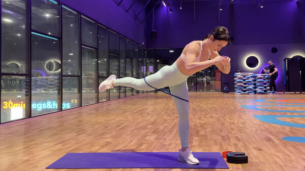

- **Primary:** Glutes
- **Secondary:** Quads, Hamstrings, Core
- **Equipment:** Long Band

Setup
**Grip:** Hands clasped together in front of the chest.
**Position:** Stand with feet shoulder-width apart, resistance band looped around both thighs, core engaged.
Instructions
- Step one foot back into a reverse lunge, lowering the back knee toward the floor.
- As you rise, drive the back leg straight behind you, controlling the movement.
- Squeeze the glute at the top of the kickback, keeping the hips square.
- Keep the torso hinged slightly forward and the core tight throughout the movement.

## Lunges

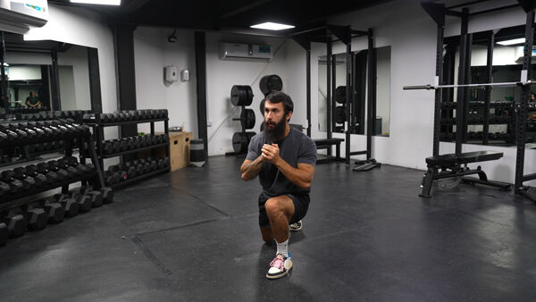

- **Primary:** Quads
- **Secondary:** Glutes, Hamstrings
- **Equipment:** Body Weight, No Equipment

Setup
**Grip:** Hands clasped together in front of the chest.
**Position:** Stand with feet hip-width apart, core engaged.
Instructions
- Step one foot forward, lowering the back knee toward the floor.
- Descend until the front thigh is parallel to the floor and the back knee nearly touches the mat.
- Keep the front knee aligned over the toes and the chest upright.
- Push through the heel of the front foot to return to the starting position.
- Keep the core engaged and avoid leaning forward throughout the movement.

## Lying leg curl (single leg)

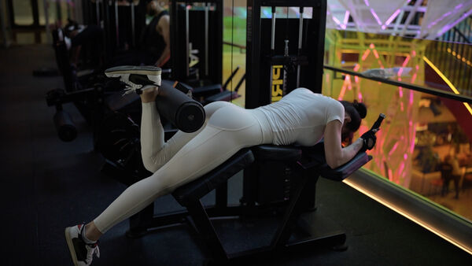

- **Primary:** Hamstrings
- **Secondary:** Glutes, Calves
- **Equipment:** Leg Curl

**Setup**
**Grip:** Hold the handles on the sides of the machine to stabilize your upper body.
**Position:** Lie face down on the leg curl machine with your hips flat against the pad. Align your knees just off the edge of the bench.
**Instructions**
- Curl the working leg upward by bending the knee, bringing your heel toward your glutes.
- Lift as high as possible, aiming for a full contraction of the hamstring at the top.
- Pause briefly at the top of the movement.
- Slowly lower the leg back to the starting position in a controlled motion.
- Keep your hips pressed firmly against the pad throughout — avoid lifting them.
- Complete all reps on one leg, then switch to the other.

## Lying Leg Extension

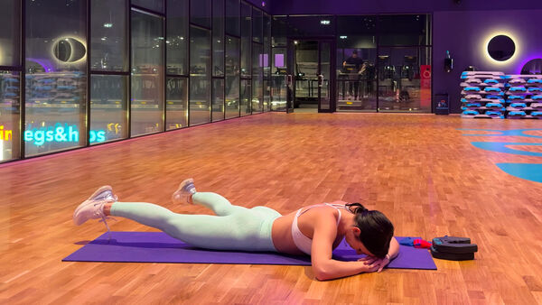

- **Primary:** Glutes
- **Secondary:** Core, Hamstrings
- **Equipment:** Body Weight, No Equipment

Setup
**Grip:** Rest your forearms on the mat with your hands folded or flat, forehead resting on your hands.
**Position:** Lie face down on the mat with your body fully extended. Legs straight, hips pressed into the floor, core lightly engaged.
Instructions
- Lift one leg straight up off the floor by squeezing the glute, keeping the leg fully extended.
- Raise as high as comfortable without rotating your hips or lifting them off the mat.
- Pause briefly at the top, holding the contraction in the glute.
- Slowly lower the leg back down to the starting position.
- Keep your lower back relaxed — drive the movement through the glute, not the spine.

## Narrow-stance leg press (quad focus)

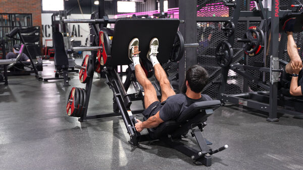

- **Primary:** Quads
- **Secondary:** Glutes, Hamstrings, Calves
- **Equipment:** Cyber LP Machine

Setup
**Grip:** Hold the side handles of the machine firmly with both hands to keep the lower back pressed against the seat throughout the movement.
**Position:** Sit back fully in the machine with lower back and hips flat against the pad. Place feet narrow and close together in the center of the platform, toes pointing straight forward or slightly outward.
Instructions
- Release the safety handles and lower the platform slowly toward the chest by bending the knees.
- Descend until the knees reach approximately a 90° angle, keeping them tracking directly over the toes.
- Do not let the lower back peel off the pad at the bottom of the movement.
- Press through the full foot to extend the legs and push the platform back up, focusing on driving through the quads.

## Paused deadlift (1-sec pause at bottom)

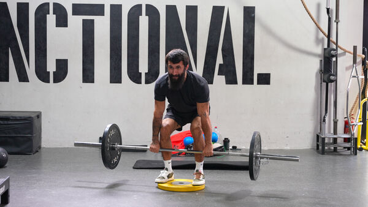

- **Primary:** Hamstrings
- **Secondary:** Glutes, Lower Back
- **Equipment:** Barbell, Plate

Setup
**Grip:** Grip the bar just outside the legs with both hands using a double overhand or mixed grip. Wrap fingers firmly around the bar with wrists neutral.
**Position:** Stand with feet hip-width apart, bar over the mid-foot. Hinge at the hips and bend the knees until the shins touch the bar. Chest up, shoulders directly over or slightly in front of the bar, core braced.
Instructions
- Lower yourself into the starting position and pause for 1 second at the bottom, building full tension before pulling.
- Take a deep breath, brace the core hard and ensure the entire body is locked in before initiating the lift.
- Press the floor away through the full foot, extending the knees and hips simultaneously.
- Keep the bar in contact with the legs throughout the entire lift, maintaining a vertical bar path.
- Lock out by fully extending the hips and squeezing the glutes at the top, then lower back to the paused starting position with control.

_Master the move — Master the move Deadlift:_ Watch the correct form and key tips before you start your workout.

## Pistol squats

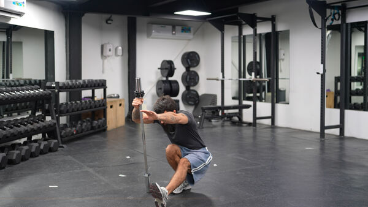

- **Primary:** Quads
- **Secondary:** Glutes, Hamstrings, Calves
- **Equipment:** Body Weight, Bar

Setup
**Grip:** Extend both arms straight forward at shoulder height for balance, or hold a bar/support lightly with one hand if needed.
**Position:** Stand tall on one foot with the other leg extended straight forward off the floor.
Instructions
- Slowly bend the standing knee and lower your body down by sitting back into the hips, keeping the extended leg straight and off the ground.
- Keep the standing knee tracking over the toes and the torso as upright as possible throughout the descent.
- Descend until the glute of the standing leg nearly touches the heel, reaching full depth.
- Drive through the full foot of the standing leg to press back up to the starting position.

## Rdl + rear delt fly

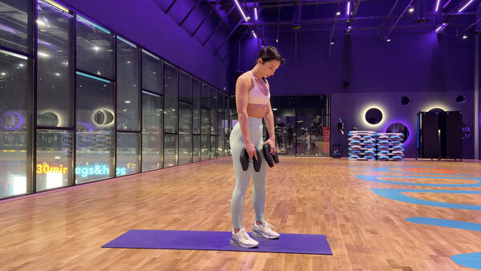

- **Primary:** Hamstrings
- **Secondary:** Glutes, Shoulders, Lower Back
- **Equipment:** Plate

Setup
**Grip:** Hold a dumbbell in each hand with a neutral grip, palms facing each other, arms hanging straight down.
**Position:** Stand with feet hip-width apart, slight bend in the knees, core engaged.
Instructions
- Hinge forward at the hips, lowering the dumbbells along the front of the legs while keeping the back flat.
- Lower until you feel a stretch in the hamstrings.
- From this hinged position, raise both arms out to the sides in a wide arc until they are parallel to the floor, squeezing the rear deltoids and shoulder blades together.
- Lower the arms back down, then drive the hips forward to return to the upright position.
- Keep the torso still and avoid using momentum throughout the movement.

## Reverse and lateral lunges

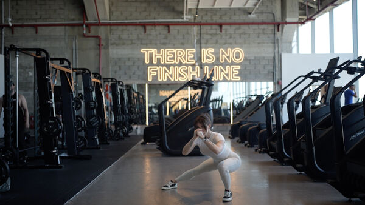

- **Primary:** Glutes
- **Secondary:** Hamstrings, Quads, Core
- **Equipment:** No Equipment, Body Weight

**Setup**
**Grip:** Hands together in front of the chest or arms extended forward for balance.
**Position:** Standing upright, feet hip-width apart.
**Instructions**
- Stand tall with your feet hip-width apart and core engaged.
- Step one leg backward into a reverse lunge, lowering until the front thigh is nearly parallel to the floor.
- Push through the front heel to return to the starting position.
- From the standing position, step the same leg out to the side into a lateral lunge.
- Sit back into the hip of the lunging leg while keeping the opposite leg straight.
- Push through the bent leg to return to the center.

## Reverse Lunges

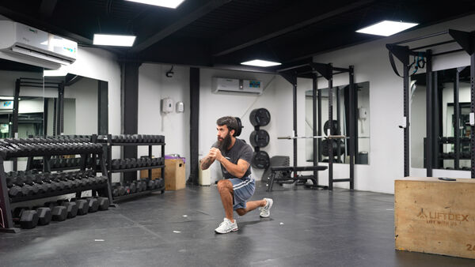

- **Primary:** Glutes
- **Secondary:** Quads, Hamstrings
- **Equipment:** Body Weight, No Equipment

Setup
**Grip:** Hands clasped together in front of the chest.
**Position:** Stand with feet hip-width apart, core engaged.
Instructions
- Step one foot straight back, lowering the back knee toward the floor.
- Descend until the front thigh is parallel to the floor and the back knee nearly touches the mat.
- Keep the front knee aligned over the toes and the chest upright.
- Push through the heel of the front foot to return to the starting position.

## Romanian deadlift

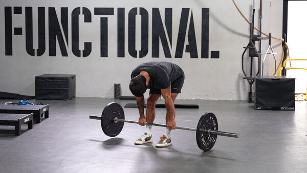

- **Primary:** Hamstrings
- **Secondary:** Lower Back, Glutes
- **Equipment:** Barbell

Setup
**Grip:** Grip the bar just outside the hips with both hands using an overhand grip, palms facing the body.
**Position:** Stand tall with feet hip-width apart, bar resting against the front of the thighs. Core braced, chest up, shoulders retracted.
Instructions
- Hinge at the hips by pushing them back, lowering the bar along the front of the legs while keeping the back flat.
- Keep a slight bend in the knees throughout — this is a hip hinge, not a squat.
- Lower until you feel a strong stretch in the hamstrings, keeping the bar in contact with the legs at all times.
- Drive the hips forward to return to the starting position, squeezing the glutes hard at the top.

_Master the move — Master the move Deadlift:_ Watch the correct form and key tips before you start your workout.

## Romanian Deadlifts (Dumbbells)

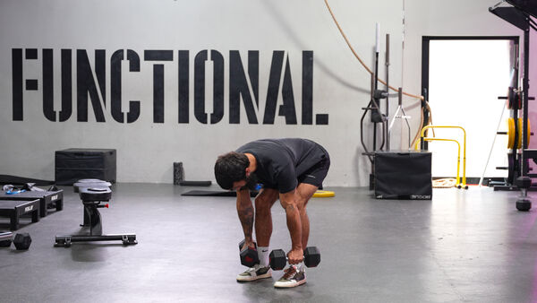

- **Primary:** Hamstrings
- **Secondary:** Glutes, Forearms, Lower Back
- **Equipment:** Dumbbell

Setup
**Grip:** Hold a dumbbell in each hand with a neutral grip, arms hanging down.
**Position:** Stand with feet shoulder-width apart, slight bend in the knees.
Instructions
- Hinge forward, lowering the dumbbells along the front of the legs while keeping the back flat.
- Lower until you feel a deep stretch in the hamstrings, keeping the dumbbells close to the body.
- Drive the hips forward to return to the upright position.

## Side kickback

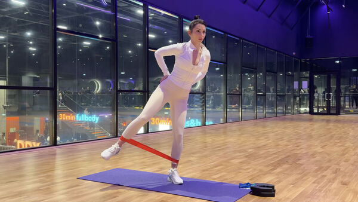

- **Primary:** Glutes
- **Secondary:** Hamstrings, Core
- **Equipment:** Long Band

Setup
**Grip:** Both hands on the hips.
**Position:** Stand with feet shoulder-width apart, resistance band looped around both ankles.
Instructions
- Shift the weight onto one leg, keeping a slight bend in the standing knee.
- Lift the other leg out to the side against the resistance of the band.
- Squeeze the glute at the top of the movement, keeping the hips level.
- Lower the leg back down slowly and with control.

## Side lunges

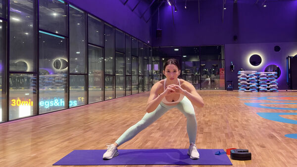

- **Primary:** Glutes
- **Secondary:** Quads, Hamstrings, Core
- **Equipment:** Body Weight, No Equipment

Setup
**Grip:** Hands clasped together in front of the chest.
**Position:** Stand with feet wide apart, toes pointing forward, core engaged.
Instructions
- Shift your weight to one side, bending that knee and lowering the hips down, keeping the other leg straight.
- Push the glutes back and keep the chest up throughout the descent.
- Push off the bent leg to return to the starting position.
- Keep both feet flat on the floor and toes pointing forward throughout the movement.

## Single-Leg Calf Raises

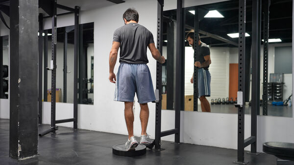

- **Primary:** Calves
- **Secondary:** —
- **Equipment:** Plate

Setup
**Grip:** Hold the rack or support with one hand for balance.
**Position:** Stand with one foot on the edge of a weight plate, heel hanging off, other foot lifted off the floor.
Instructions
- Press through the ball of the standing foot to rise up onto the toes as high as possible.
- Hold briefly at the top, squeezing the calf.
- Lower the heel back down slowly, dropping below the plate level to get a full stretch.
- Keep the standing knee straight but not locked throughout the movement.

## Single-leg calf raises with dumbbell

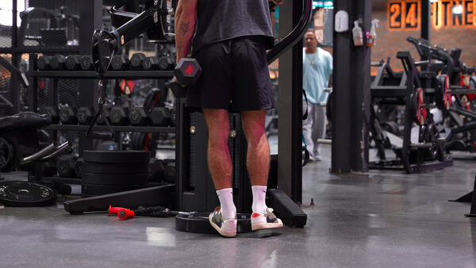

- **Primary:** Calves
- **Secondary:** —
- **Equipment:** Dumbbell, Plate

Setup
**Grip:** Hold the rack with one hand for balance, hold a dumbbell in the other hand for added weight.
**Position:** Stand with one foot on the edge of a weight plate, heel hanging off, other foot lifted off the floor.
Instructions
- Press through the ball of the standing foot to rise up onto the toes as high as possible.
- Hold briefly at the top, squeezing the calf.
- Lower the heel back down slowly, dropping below the plate level to get a full stretch.
- Keep the standing knee straight but not locked throughout the movement.

## Single-Leg Hip Thrust

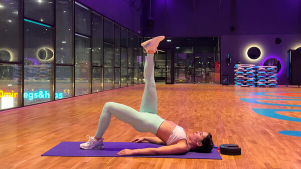

- **Primary:** Glutes
- **Secondary:** Hamstrings, Core
- **Equipment:** Body Weight, No Equipment

Setup 
**Grip:** Arms relaxed at your sides, palms facing down on the mat.
**Position:** Lie on your back with one knee bent and foot flat on the floor, other leg extended straight up toward the ceiling, core engaged.
Instructions
- Press through the heel of the bent leg to drive the hips upward toward the ceiling.
- Squeeze the glute of the working leg at the top, keeping the hips level.
- Hold briefly at the top, then lower the hips back down with control.
- Keep the extended leg straight and pointing upward throughout the movement.
- Avoid arching the lower back — the movement comes from the glute, not the back.

## Single-Leg RDL Against Wall

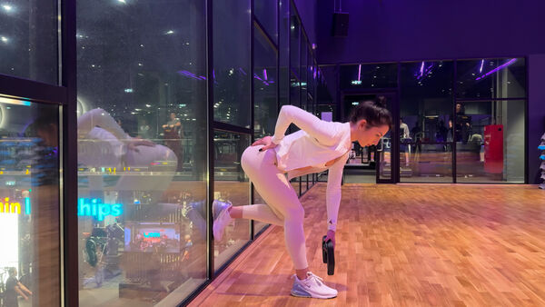

- **Primary:** Hamstrings
- **Secondary:** Glutes, Core
- **Equipment:** Plate, Wall Support

Setup
**Grip:** Hold a dumbbell in one hand, arm hanging straight down.
**Position:** Stand facing the wall, one hand resting on the hip, slight bend in the standing knee, core engaged and spine neutral.
Instructions
- Hinge forward at the hips, lowering the dumbbell toward the floor while lifting the free leg straight back.
- Keep the back flat and the hips square throughout the movement.
- Lower until your torso and lifted leg are roughly parallel to the floor.
- Drive through the heel of the standing leg to return to the upright position.

## Single-leg smith machine deadlift

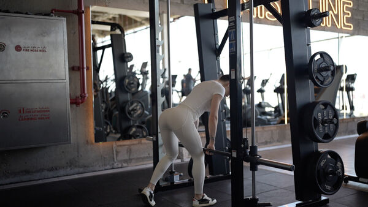

- **Primary:** Glutes
- **Secondary:** Hamstrings, Lower Back, Core
- **Equipment:** Smith Machine

**Setup**
**Grip:** Hold the bar with an overhand grip, hands shoulder-width apart.
**Position:** Stand facing the Smith machine with the bar at mid-shin level. Shift your weight onto one leg, hinge at the hips, and extend the non-working leg straight back behind you. Keep your back flat, core engaged, and a slight bend in the standing knee.
**Instructions**
- Drive through the heel of the standing leg to raise your torso back to an upright position.
- Keep the bar close to your body as you lift, moving in a straight vertical line.
- Squeeze your glutes at the top and stand fully upright.
- Pause briefly at the top of the movement.
- Slowly hinge back at the hips, lowering the bar back down while extending the non-working leg behind you.
- Keep your hips square to the floor throughout — avoid rotating them open.

## Single-Leg Wall Sit

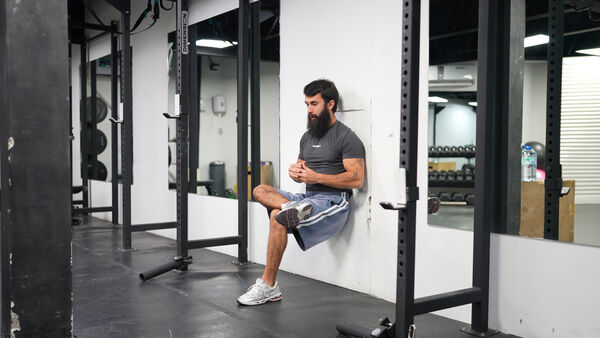

- **Primary:** Quads
- **Secondary:** Glutes
- **Equipment:** Wall Support

Setup
**Grip:** Hands loosely clasped in front of the chest.
**Position:** Stand with your back flat against the wall, slide down until the thighs are parallel to the floor, knees at 90°, core engaged.
Instructions
- From the wall sit position, lift one foot off the floor and place it on the other leg.
- Hold the position, keeping the thigh of the supporting leg parallel to the floor.
- Keep the back flat against the wall and the core tight throughout.

## Smith Machine Lunges

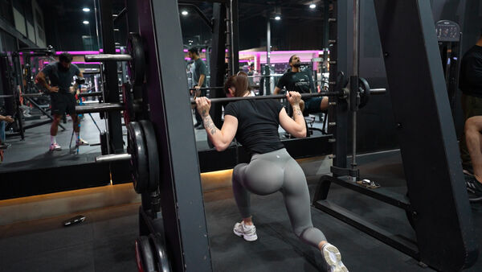

- **Primary:** Quads
- **Secondary:** Glutes, Hamstrings, Calves
- **Equipment:** Smith Machine

Setup
**Grip:** Hold the Smith Machine bar with an overhand grip, hands slightly wider than shoulder-width apart, bar resting across the upper traps.
**Position:** Stand with feet hip-width apart under the bar, core engaged and spine neutral.
Instructions
- Step one foot forward into a lunge, lowering the back knee toward the floor.
- Descend until the front thigh is parallel to the floor and the back knee nearly touches the ground.
- Keep the front knee aligned over the toes and the chest upright.
- Push through the heel of the front foot to return to the starting position.

## Squat + Calf Raises

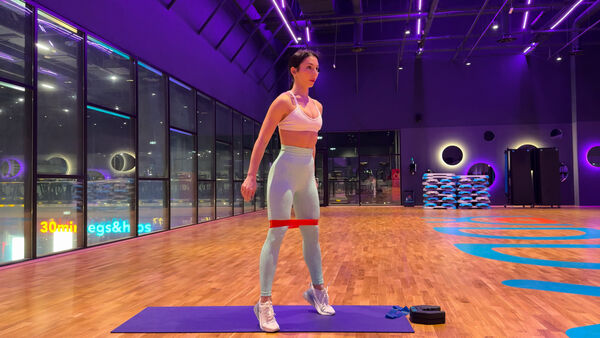

- **Primary:** Quads
- **Secondary:** Calves, Glutes, Core
- **Equipment:** Body Weight, Long Band

Setup 
**Grip:** Arms relaxed at your sides or hands clasped in front of your chest.
**Position:** Stand with feet shoulder-width apart, resistance band placed just above the ankles. Toes slightly turned out, chest up, core engaged.
Instructions
- Lower into a squat until your thighs are parallel to the floor, keeping your knees tracking over your toes.
- Drive through your heels to return to a standing position.
- At the top, immediately rise onto the balls of your feet for a full calf raise.
- Pause briefly at the top of the calf raise, squeezing your calves.
- Lower your heels back to the floor and repeat the sequence.

## Squat + RDL

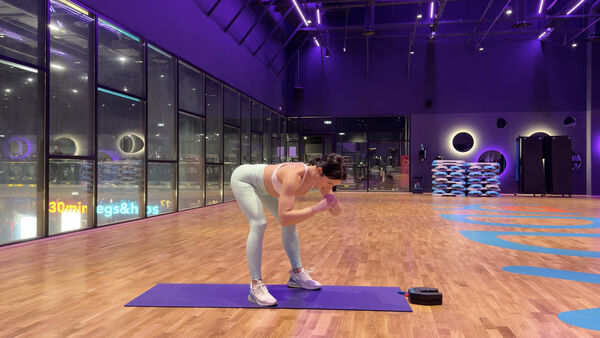

- **Primary:** Glutes
- **Secondary:** Quads, Hamstrings, Core
- **Equipment:** Body Weight, No Equipment

Setup
**Grip:** Hands clasped together in front of the chest.
**Position:** Stand with feet shoulder-width apart, toes slightly turned out, core engaged.
Instructions
- Lower into a squat, pushing the glutes back and bending the knees until thighs are parallel to the floor.
- Push through the heels to stand, then hinge forward at the hips, lowering the torso toward the floor with a flat back and nearly straight legs.
- Drive the hips forward to return to the starting position.

## Squat hip abduction

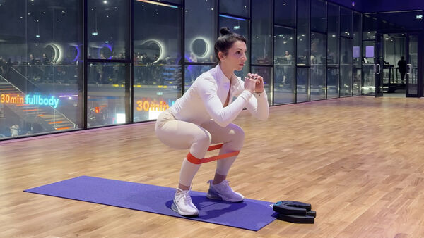

- **Primary:** Glutes
- **Secondary:** Quads, Core
- **Equipment:** Long Band

Setup
**Grip:** Hands clasped together in front of the chest.
**Position:** Stand with feet shoulder-width apart, toes slightly turned out, resistance band looped around both thighs. 
Instructions
- Lower into a squat by pushing the hips back and bending the knees until thighs are parallel to the floor.
- At the bottom of the squat, push both knees outward against the band.
- Bring the knees back to the starting position, then drive through the heels to stand.
- Maintain constant outward pressure against the band throughout the entire squat.

## Squat jump

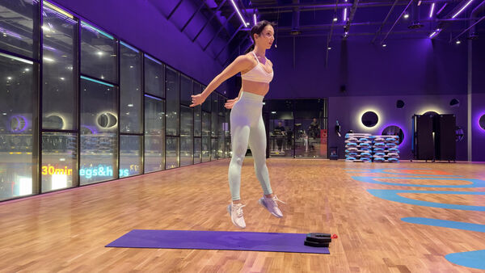

- **Primary:** Quads
- **Secondary:** Glutes, Hamstrings, Calves
- **Equipment:** Body Weight, No Equipment

Setup 
**Grip:** Arms relaxed at your sides or slightly out for balance.
**Position:** Stand with feet shoulder-width apart, toes slightly turned out.
Instructions
- Lower into a squat by pushing the hips back and bending the knees until thighs are parallel to the floor.
- Explosively push through both heels to jump off the floor.
- Land softly on the balls of the feet, immediately bending the knees to absorb the impact.
- Land back into the squat position and repeat without pausing.

## Squat pulse

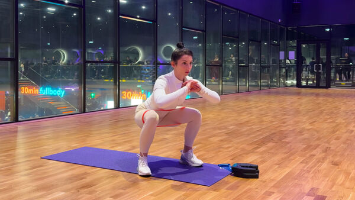

- **Primary:** Quads
- **Secondary:** Calves, Glutes, Core
- **Equipment:** Long Band, Body Weight

Setup
**Grip:** Arms bent at the chest, in a relaxed position
**Position:** Feet shoulder-width apart, toes slightly turned out. Lower into a squat until thighs are at least parallel to the floor. Chest up, spine neutral, knees tracking over toes.
Instructions
- Lower yourself into the bottom position of the squat, keeping your hands at chest level.
- Perform small controlled pulses up and down in the bottom range.
- Keep heels flat on the floor and weight through mid-foot.
- Maintain an upright torso and engaged core throughout the movement.
- Continue pulsing for the prescribed time or number of reps.

## Squat pulses

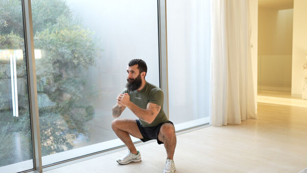

- **Primary:** Quads
- **Secondary:** Glutes, Core
- **Equipment:** Body Weight, No Equipment

Setup
**Grip: **Hands clasped in front of the chest.
**Position: **Feet shoulder-width apart, toes slightly turned out. Lower into a squat until thighs are at least parallel to the floor. Chest up, spine neutral, knees tracking over toes.
Instructions
- Lower into the bottom squat position.
- Perform small controlled pulses up and down (short range of motion).
- Keep heels on the floor and weight distributed through mid-foot.
- Maintain an upright torso and engaged core throughout.
- Continue pulsing for the prescribed time or number of reps.

## Squats from Knees

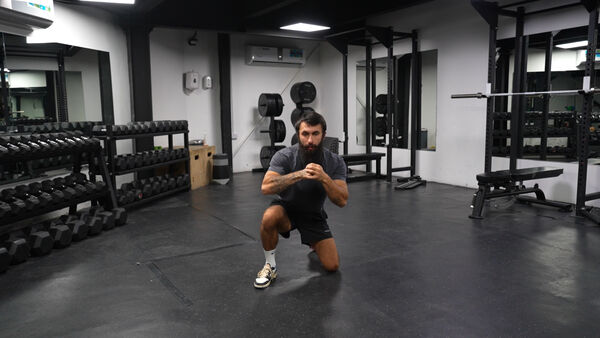

- **Primary:** Quads
- **Secondary:** Glutes, Hamstrings
- **Equipment:** No Equipment, Body Weight

Setup
**Grip:** Hands clasped together in front of the chest.
**Position:** Start in a kneeling position with both knees on the floor.
Instructions
- Push off both feet to rise up from the kneeling position into a squat.
- Land softly in the squat position with thighs parallel to the floor.
- Return back down one knee at a time to the kneeling position.

## Stationary Lunges

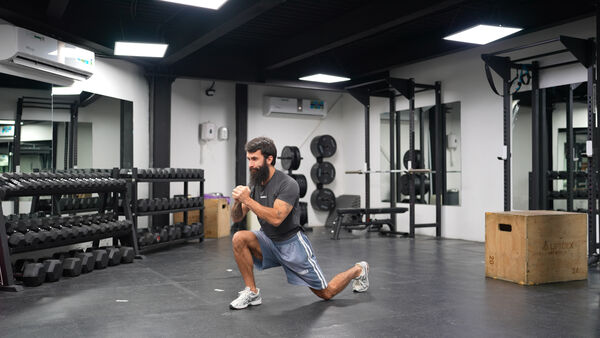

- **Primary:** Quads
- **Secondary:** Glutes, Hamstrings
- **Equipment:** No Equipment, Body Weight

Setup
**Grip:** Hands clasped together in front of the chest.
**Position:** Stand with one foot forward and one foot back in a split stance, front knee aligned over the toes, core engaged.
Instructions
- Lower the back knee toward the floor by bending both knees simultaneously.
- Descend until the front thigh is parallel to the floor and the back knee nearly touches the ground.
- Keep the front knee aligned over the toes and the chest upright throughout.
- Push through the heel of the front foot to return to the starting position.

## Sumo squat

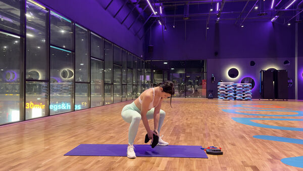

- **Primary:** Glutes
- **Secondary:** Quads, Hamstrings
- **Equipment:** Plate

Setup
**Grip:** Hold a dumbbell with both hands, letting it hang between the legs.
**Position:** Stand with feet wider than shoulder-width apart, toes turned out at 45 degrees, core engaged.
Instructions
- Lower into a squat by bending the knees and pushing the hips back, keeping the dumbbell between the legs.
- Descend until the thighs are parallel to the floor, keeping the chest up.
- Keep the knees tracking over the toes throughout the descent.
- Push through the heels to return to the starting position.

## Sumo squat with dumbbell

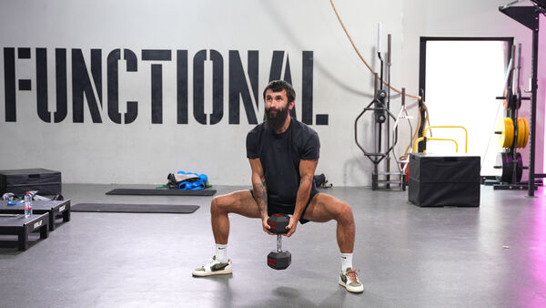

- **Primary:** Glutes
- **Secondary:** Hamstrings, Quads
- **Equipment:** Dumbbell

3 sec down, 1 sec up; focus on technique and quad/adductor pump

Setup
**Grip:** Hold a dumbbell with both hands, letting it hang between the legs.
**Position:** Stand with feet wider than shoulder-width apart, toes turned out at 45°, core engaged.
Instructions
- Lower into a squat by bending the knees and pushing the hips back, keeping the dumbbell between the legs.
- Descend until the thighs are parallel to the floor, keeping the chest up.
- Keep the knees tracking over the toes throughout the descent.
- Push through the heels to return to the starting position.

## Up and downs squat

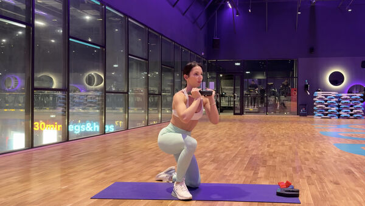

- **Primary:** Quads
- **Secondary:** Glutes, Hamstrings, Core
- **Equipment:** Plate

Setup
**Grip:** Hold a dumbbell with both hands at chest level, gripping the top of the weight.
**Position:** Stand with feet shoulder-width apart, toes slightly turned out, core engaged.
Instructions
- Lower into a squat, pushing the hips back.
- Lower one knee at a time to the floor, then fully sit down on the mat with legs bent.
- Rise back up and perform a squat again, pushing the hips back.
- Return to the starting position, keeping the chest up and knees tracking over the toes.
- Keep the heels flat on the floor and weight distributed through the mid-foot.

## Wall Sit

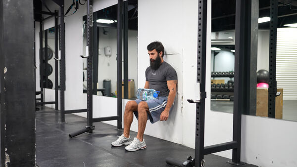

- **Primary:** Quads
- **Secondary:** Glutes
- **Equipment:** Wall Support, DIY Weight

Setup
**Grip:** Place a weight or water bottle on your legs, keeping arms relaxed.
**Position:** Stand with your back flat against the wall, feet shoulder-width apart. Slide down until the knees reach exactly 90°, thighs parallel to the floor.
**Instructions**
- With the front foot elevated, lower your body by bending both knees until the back knee nearly touches the floor.
- Keep the front knee tracking directly over the toes and the torso upright throughout the descent.
- Drive through the heel of the elevated foot to push back up to the starting position.

## Wall sit with weight

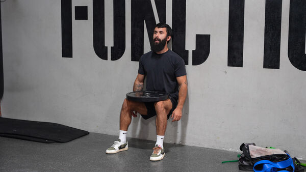

- **Primary:** Quads
- **Secondary:** Glutes, Calves
- **Equipment:** Wall Support, Plate

Setup
**Grip:** Place a weight or plate on your legs, keeping arms relaxed.
**Position:** Stand with your back flat against the wall, feet shoulder-width apart. Slide down until the knees reach exactly 90°, thighs parallel to the floor.
**Instructions**
- With the front foot elevated, lower your body by bending both knees until the back knee nearly touches the floor.
- Keep the front knee tracking directly over the toes and the torso upright throughout the descent.
- Drive through the heel of the elevated foot to push back up to the starting position.

## Weighted calf raises

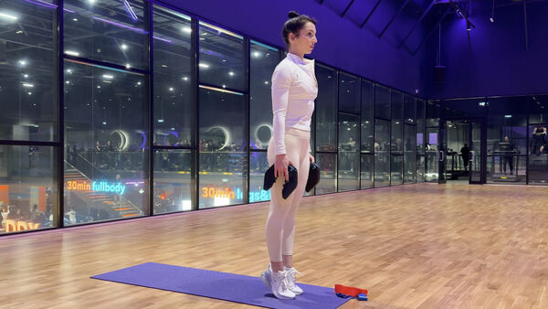

- **Primary:** Calves
- **Secondary:** Glutes, Hamstrings
- **Equipment:** Plate

Setup
**Grip:** Hold a dumbbell in each hand at your sides. 
**Position:** Stand with feet shoulder-width apart, core engaged. 
Instructions
- Press through the balls of both feet to rise up onto your toes as high as possible.
- Hold briefly at the top, squeezing the calves.
- Lower the heels back down slowly and with control.
- Keep the knees straight but not locked throughout the movement.
- Avoid leaning forward — keep the torso upright throughout.

## Weighted squat pulses

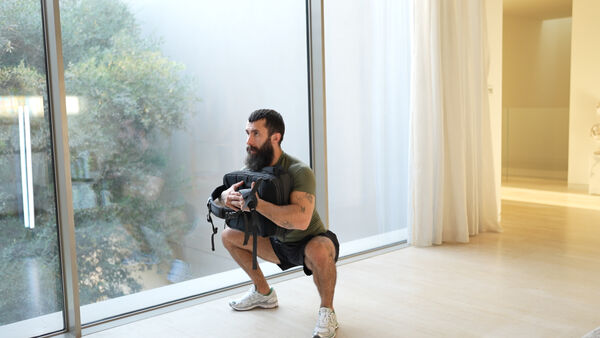

- **Primary:** Quads
- **Secondary:** Glutes, Core
- **Equipment:** Weighted Backpack

Setup
**Grip: **Arms wrapped around the backpack or holding it close to the chest (goblet-style).
**Position: **Feet shoulder-width apart, toes slightly turned out. Hold the backpack tight to the chest. Lower into a squat until thighs are at least parallel to the floor. Chest up, spine neutral, knees tracking over toes.
Instructions
- Lower into the bottom squat position while holding the backpack at chest level.
- Perform small controlled pulses up and down in the bottom range.
- Keep heels flat on the floor and weight through mid-foot.
- Maintain an upright torso and engaged core throughout the movement.
- Continue pulsing for the prescribed time or number of reps.

## Wide-stance deadlift (barbell or smith machine)

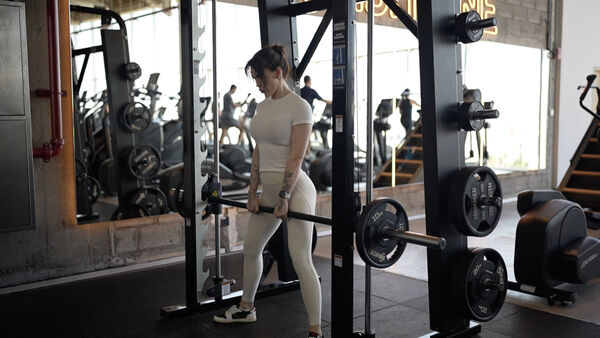

- **Primary:** Glutes
- **Secondary:** Lower back, Biceps, Hamstrings
- **Equipment:** Smith Machine

**Setup**
**Grip:** Hold the bar with an overhand grip, hands shoulder-width apart, arms hanging straight down inside your legs.
**Position:** Stand with feet wider than shoulder-width, toes slightly turned out. Hinge at the hips and bend the knees to reach the bar. Keep your back flat, chest up, and core engaged.
**Instructions**
- Drive through both heels to lift the bar, extending your hips and knees simultaneously.
- Keep the bar close to your body as it travels upward.
- Stand fully upright, squeezing your glutes at the top.
- Hinge back at the hips and bend the knees to lower the bar in a controlled motion.
- Maintain a flat back throughout — avoid rounding your lower spine at any point.

## ​Glute-Focused Hyperextension

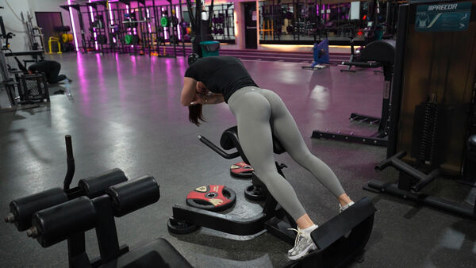

- **Primary:** Glutes
- **Secondary:** Hamstrings, Lower Back
- **Equipment:** Hyperextension Bench

Setup
**Grip:** Hands loosely clasped in front of you.
**Position:** Position yourself on the hyperextension bench with hips resting on the pad, feet secured under the footrests, torso hanging down.
Instructions
- Press the hips into the pad and raise the torso upward, squeezing the glutes.
- Rise until the body forms a straight line from head to heels.
- Squeeze the glutes firmly at the top and hold briefly.
- Lower the torso back down slowly and with control.
- Keep the movement initiated from the glutes rather than the lower back throughout.

## ​Squats

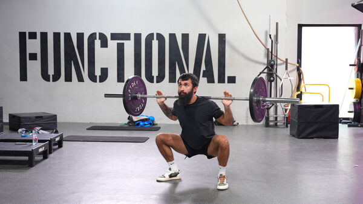

- **Primary:** Quads
- **Secondary:** Glutes, Hamstrings, Lower Back
- **Equipment:** Barbell

Setup
**Grip:** Hold the barbell with an overhand grip, hands slightly wider than shoulder-width apart, bar resting across the upper traps.
**Position:** Stand with feet shoulder-width apart, toes slightly turned out.
Instructions
- Lower into a squat by pushing the hips back and bending the knees until thighs are parallel to the floor.
- Keep the knees tracking over the toes and the chest up throughout the descent.
- Keep the heels flat on the floor and weight distributed through the mid-foot.
- Drive through the heels to return to the standing position.

#public
