# Exercises — Shoulders

22 exercises. Back to [[_Index]].

## Backpack overhead press

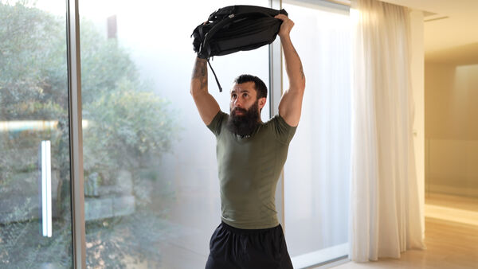

- **Primary:** Shoulders
- **Secondary:** Triceps, Core
- **Equipment:** Weighted Backpack

Setup
**Grip: **Both hands gripping the backpack handles or sides, neutral grip.
**Position: **Stand upright with feet shoulder-width apart. Hold the backpack at shoulder level with elbows slightly in front of the body. Chest up, core braced, spine neutral.
Instructions
- Brace your core and stabilize your stance.
- Press the backpack straight overhead until arms are fully extended.
- Keep the backpack stacked over shoulders and mid-foot.
- Lower the backpack back to shoulder level under control.
- Repeat for the prescribed number of reps.

## Front Plate Raises

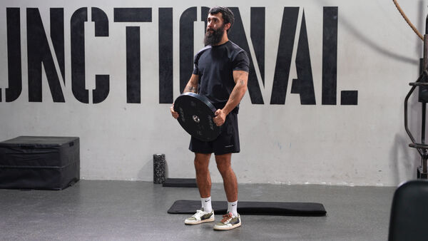

- **Primary:** Shoulders
- **Secondary:** Forearms, Core
- **Equipment:** Plate

**Setup**
**Grip:** Hold the plate on both sides with both hands, fingers wrapped around the edges and thumbs pointing upward.
**Position:** Stand tall with feet shoulder-width apart, plate held at hip level in front of the body, arms almost fully extended.
Instructions 
- 1. Hold a weight plate with both hands in front of your thighs, arms extended. 
- Raise the plate up to shoulder height while keeping your arms straight and core engaged.
- Pause briefly at the top, then lower the plate back down with control and repeat.

## Front raises

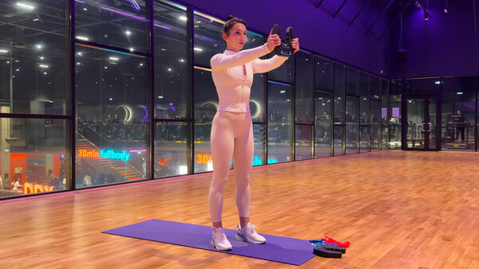

- **Primary:** Shoulders
- **Secondary:** Chest, Core
- **Equipment:** Plate

Setup
**Grip:** Hold a dumbbell with both hands, gripping the top of the weight securely.
**Position:** Stand with feet hip-width apart, arms extended straight in front of you at shoulder height, core engaged, spine neutral.
Instructions
- Lower the dumbbell down toward your hips in a controlled motion.
- Raise the dumbbell back up to shoulder height with straight arms.
- Keep your shoulders down and away from your ears throughout the movement.
- Avoid swinging the torso — movement comes from the shoulders only.
- Maintain a slight bend in the elbows to reduce joint stress.

## Lateral raises

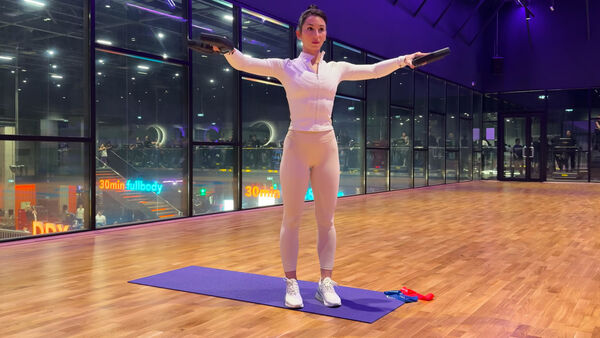

- **Primary:** Shoulders
- **Secondary:** Core, Traps
- **Equipment:** Plate

Setup
**Grip:** Hold a dumbbell in each hand with a neutral grip, palms facing inward toward the body.
**Position:** Stand with feet hip-width apart, arms relaxed at your sides, core engaged, spine neutral.
Instructions
- Raise both arms out to the sides until they reach shoulder height.
- Keep a slight bend in the elbows throughout the movement.
- Lead with the elbows, not the wrists, as you lift.
- Lower the dumbbells back down slowly and under control.
- Keep shoulders down and avoid shrugging at the top.

## Machine shoulder press

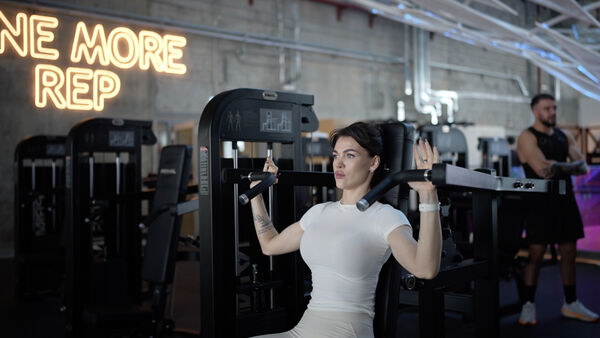

- **Primary:** Shoulders
- **Secondary:** Triceps, Chest
- **Equipment:** Seated Shoulder Press Machine

Setup
**Grip:** Grip the handles with an overhand grip, hands at shoulder-width, elbows bent and aligned with the handles at shoulder level.
**Position:** Sit upright with your back fully pressed against the pad, feet flat on the floor. Adjust the seat so the handles are at shoulder height.
Instructions
- Press the handles straight up until your arms are fully extended overhead.
- Pause briefly at the top without locking out your elbows aggressively.
- Slowly lower the handles back down to shoulder level in a controlled motion.
- Keep your back flat against the pad and core engaged throughout.
- Avoid shrugging your shoulders — keep them pulled down away from your ears.

## One-arm kettlebell push press

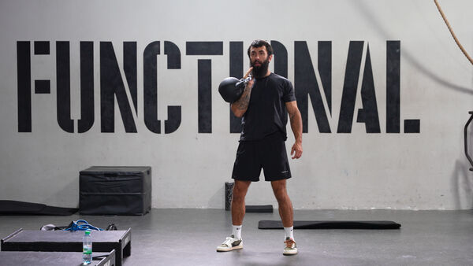

- **Primary:** Shoulders
- **Secondary:** Triceps, Quads
- **Equipment:** Kettlebell

Setup
**Grip:** Hold the kettlebell in one hand with a firm grip, handle resting diagonally across the palm. 
**Position:** Stand with feet shoulder-width apart, kettlebell in the rack position at shoulder height with the elbow tucked close to the torso.
Instructions 
- Dip slightly by bending the knees into a quick quarter-squat, keeping the torso upright.
- Explosively drive through the legs and extend the hips to generate upward momentum.
- Use that momentum to press the kettlebell vertically overhead, fully locking out the elbow at the top.
- Hold the locked-out position briefly with the arm vertical and the kettlebell stacked over the shoulder.

## Overhead Dumbbell Press

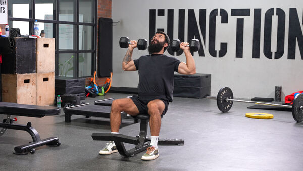

- **Primary:** Shoulders
- **Secondary:** Triceps, Traps
- **Equipment:** Dumbbell, Bench Incline

Setup
**Grip:** Hold a dumbbell in each hand with a neutral grip, elbows bent at 90°, dumbbells at shoulder height.
**Position:** Sit upright on a bench, feet flat on the floor.
Instructions
- Press both dumbbells upward until the arms are fully extended overhead.
- Keep the dumbbells directly above the shoulders at the top of the movement.
- Hold briefly at the top, then lower the dumbbells back down to shoulder height with control.
- Keep the elbows at a 90° at the bottom and avoid flaring them too far forward or back.

## Overhead Sit-Up

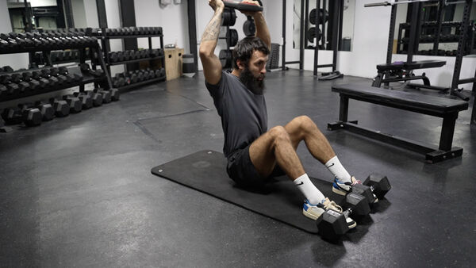

- **Primary:** Shoulders
- **Secondary:** Core, Shoulders
- **Equipment:** Plate

Setup
**Grip:** Extend the arms in front of the chest and hold a weight plate with both hands
**Position:** Sit on the mat with knees bent, feet flat on the floor, torso leaned back at a 45°. Anchor the feet under dumbbells to keep them stationary
Instructions 
- From the lying position, perform a crunch by lifting the shoulder blades off the mat, bringing the weight toward the knees.
- Continue rising into a full sit-up, extending the arms overhead at the top.
- Hold briefly at the top with arms fully extended above the head.
- Lower back down slowly, bringing the weight back to chest level as you descend.
- Keep the core engaged and avoid using momentum throughout the movement.

## Pike

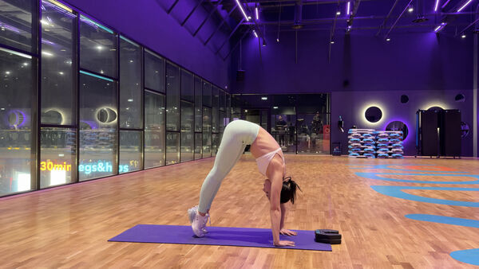

- **Primary:** Shoulders
- **Secondary:** Core, Abs, Hamstrings
- **Equipment:** Body Weight, No Equipment

Setup
**Grip:** Hands flat on the floor, shoulder-width apart, fingers pointing forward.
**Position:** Start in a downward dog position with hips raised high, forming an inverted V-shape, legs straight, core engaged.
Instructions
- From the pike position, slowly walk the hands toward the feet to deepen the stretch.
- Keep the legs as straight as possible and press the heels toward the floor.
- Hold the position, lengthening through the spine and engaging the core.
- Walk the hands back out to return to the starting position.

## Pike Push-Ups

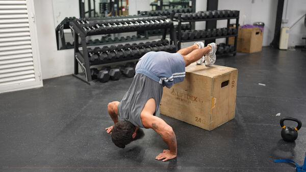

- **Primary:** Shoulders
- **Secondary:** Triceps, Chest, Core
- **Equipment:** Box

Setup
**Grip:** Hands flat on the floor, slightly wider than shoulder-width apart, fingers pointing forward.
**Position:** Place feet on top of the box, hips raised high to form an inverted V-shape, arms straight, core engaged.
Instructions
- Bend the elbows to lower the head toward the floor, keeping the elbows at a 45° angle.
- Lower until the head nearly touches the floor between the hands.
- Press through the palms to push back up to the starting position.
- Keep the core tight and avoid letting the hips drop during the push-up.

## Prone front raises on a 45° bench

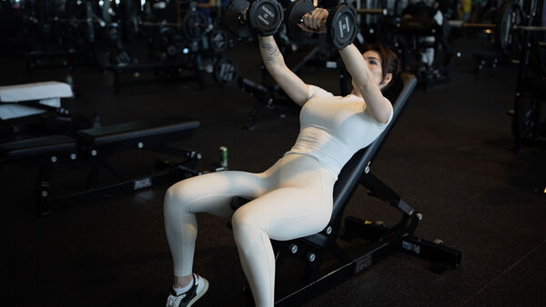

- **Primary:** Shoulders
- **Secondary:** Chest, Core
- **Equipment:** Dumbbell, Bench Incline

**Setup**
**Grip:** Hold a dumbbell in each hand with a neutral grip, palms facing each other.
**Position:** Lie chest-down on a bench set to approximately 45°, with your chest and torso supported by the pad. Let both arms hang straight down toward the floor.
**Instructions**
- Raise both dumbbells forward and upward in a straight arc until your arms are fully extended overhead.
- Keep a slight bend in the elbows throughout the movement.
- Pause briefly at the top of the movement.
- Slowly lower the dumbbells back to the starting position in a controlled motion.
- Keep your chest pressed against the bench and avoid using your back to swing the weight up.

## Rear delt fly

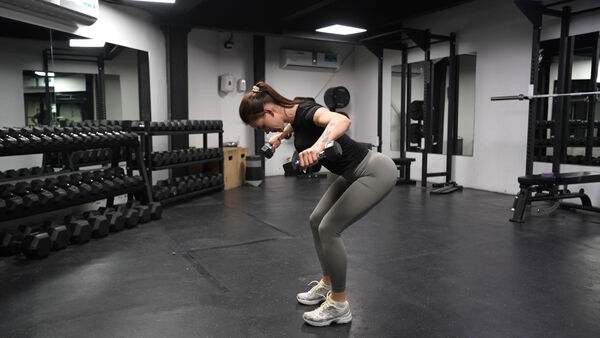

- **Primary:** Shoulders
- **Secondary:** Back
- **Equipment:** Plate

Setup
**Grip:** Hold a dumbbell in each hand with a neutral grip, palms facing each other.
**Position:** Stand with feet hip-width apart, hinge forward at the hips until the torso is nearly parallel to the floor, knees slightly bent, arms hanging straight down, core engaged.
Instructions
- Raise both arms out to the sides in a wide arc, leading with the elbows.
- Lift until the arms are bent at 45°, squeezing the rear deltoids and drawing the shoulder blades together.
- Hold briefly at the top of the movement.
- Lower the dumbbells back down slowly and with control.
- Keep the torso still and avoid using momentum throughout the movement.

## Rear Delt Fly

- **Primary:** Shoulders
- **Secondary:** Back, Core
- **Equipment:** Dumbbell

Setup
**Grip:** Hold a dumbbell in each hand with a neutral grip, palms facing each other.
**Position:** Stand with feet hip-width apart, hinge forward at the hips until the torso is nearly parallel to the floor, knees slightly bent, arms hanging straight down, core engaged.
Instructions
- Raise both arms out to the sides in a wide arc, leading with the elbows.
- Lift until the arms are bent at 45°, squeezing the rear deltoids and drawing the shoulder blades together.
- Hold briefly at the top of the movement.
- Lower the dumbbells back down slowly and with control.
- Keep the torso still and avoid using momentum throughout the movement.

## Seated dumbbell lateral raises

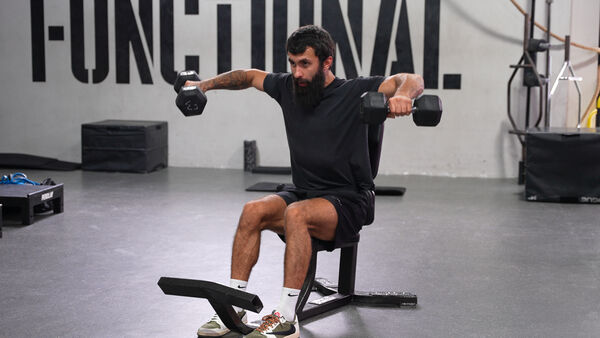

- **Primary:** Shoulders
- **Secondary:** Forearms, Core
- **Equipment:** Dumbbell, Bench

Power style, slight cheating allowed

Setup
**Grip:** Hold a dumbbell in each hand with a neutral grip, palms facing inward toward the body. Keep wrists firm and straight throughout the movement.
**Position:** Sit upright on a bench with feet flat on the floor, arms hanging naturally at the sides, dumbbells resting against the outer thighs. Core braced and chest up.
Instructions
- With a slight bend in the elbows, raise both arms out to the sides simultaneously in a wide arc.
- Lead with the elbows rather than the hands, keeping the wrists slightly lower than the elbows throughout.
- Pause briefly at the top, then lower the dumbbells slowly and in a controlled manner back to the starting position.

## Seated dumbbell press

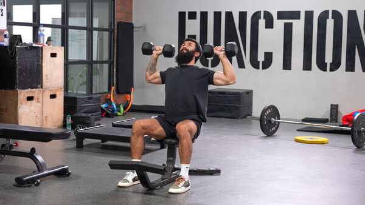

- **Primary:** Shoulders
- **Secondary:** Triceps
- **Equipment:** Dumbbell, Bench Incline

Setup
**Grip:** Hold a dumbbell in each hand with a neutral or pronated grip, palms facing forward. Keep wrists straight and stacked directly over the elbows throughout the movement.
**Position:** Sit upright on a bench with feet flat on the floor, back straight and core braced. Start with both dumbbells at shoulder height, elbows bent at roughly 90° and upper arms parallel to the floor.
Instructions
- Take a deep breath, brace the core and press both dumbbells vertically upward simultaneously.
- Keep the dumbbells moving in a straight path, converging slightly at the top without clashing.
- Fully extend the arms overhead, locking out the elbows at the top of the movement.
- Lower both dumbbells in a controlled manner back to shoulder height, elbows returning to roughly 90°.

## Shoulder Halo Raises

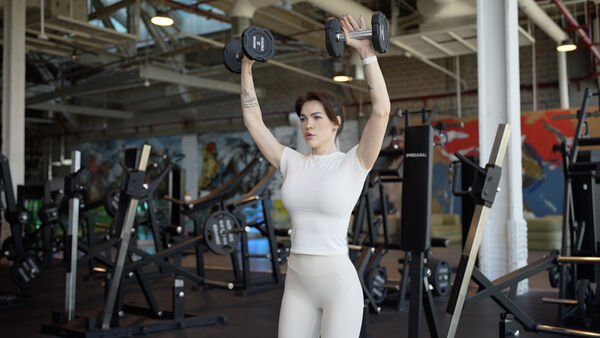

- **Primary:** Shoulders
- **Secondary:** Core, Triceps
- **Equipment:** Dumbbell

**Setup**
**Grip:** Hold a dumbbell in each hand with a neutral grip, palms facing each other.
**Position:** Stand tall with feet shoulder-width apart, core engaged and chest up. Hold the dumbbells at shoulder level with elbows slightly bent.
**Instructions**
- Raise both dumbbells overhead in a wide circular arc, moving them simultaneously outward and upward.
- Meet the dumbbells together at the top above your head, arms fully extended.
- Pause briefly at the top, then slowly lower them back down along the same arc.
- Keep the movement smooth and controlled — avoid using momentum.
- Maintain an upright torso and engaged core throughout the entire movement.

## Smith machine shoulder press

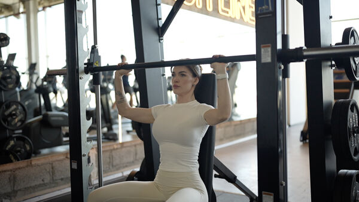

- **Primary:** Shoulders
- **Secondary:** Triceps, Chest
- **Equipment:** Smith Machine, Bench Incline

**Setup**
**Grip:** Hold the bar with an overhand grip, hands slightly wider than shoulder-width apart.
**Position:** Sit on an adjustable bench set to 90° (upright) inside the Smith machine. Position the bar at upper chest/chin level. Back flat against the pad, feet firmly on the floor.
**Instructions**
- Press the bar straight up until your arms are fully extended overhead.
- Keep your core tight and lower back pressed against the bench throughout the movement.
- Pause briefly at the top without locking out your elbows aggressively.
- Slowly lower the bar back down to the starting position at upper chest/chin level.
- Keep your elbows at roughly a 45–75° angle from your torso — avoid flaring them out too wide.

## Standing dumbbell shrugs

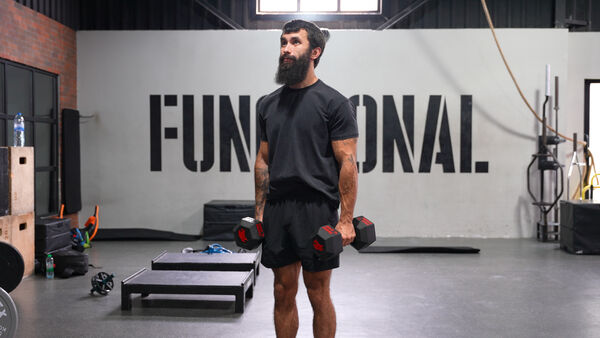

- **Primary:** Shoulders
- **Secondary:** Traps, Forearms
- **Equipment:** Dumbbell

**Setup**
**Grip:** Hold a dumbbell in each hand with a neutral grip, palms facing inward toward the body. Keep wrists firm and straight throughout the movement.
**Position:** Stand tall with feet shoulder-width apart, arms fully extended at the sides, dumbbells resting against the outer thighs. Core braced and chest up.
**Instructions**
- Elevate both shoulders straight up toward the ears in a controlled motion, keeping the arms fully extended.
- Lift as high as possible, squeezing the traps hard at the top of the movement.
- Pause briefly at the top, then lower the shoulders in a controlled manner back to the starting position.

## Standing lateral raise

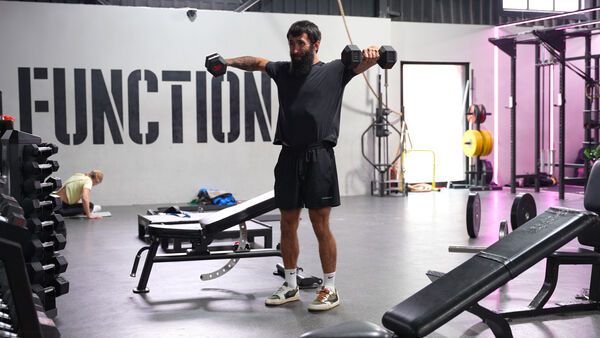

- **Primary:** Shoulders
- **Secondary:** Traps
- **Equipment:** Dumbbell

Power style, slight cheating allowed

Setup
**Grip:** Hold a dumbbell in each hand with a neutral grip, palms facing inward toward the body. Keep wrists firm and straight throughout the movement.
**Position:** Stand tall with feet shoulder-width apart, arms hanging naturally at the sides, dumbbells resting against the outer thighs. Core braced and chest up.
Instructions
- With a slight bend in the elbows, raise both arms out to the sides simultaneously in a wide arc.
- Lead with the elbows rather than the hands, keeping the wrists slightly lower than the elbows throughout.
- Lift until the arms reach shoulder height, forming a T-shape with the torso.
- Pause briefly at the top, then lower the dumbbells slowly and in a controlled manner back to the starting position.

## Standing overhead press

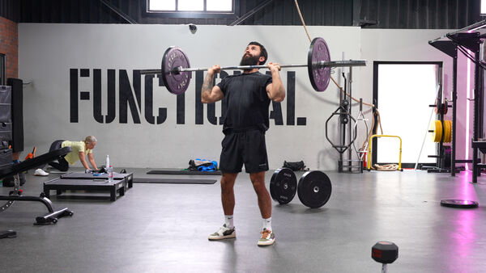

- **Primary:** Shoulders
- **Secondary:** Chest, Triceps
- **Equipment:** Barbell

Setup
**Grip:** Grip the bar just outside shoulder-width with palms facing forward and wrists stacked directly under the bar. Wrap thumbs fully around the bar.
**Position:** Stand with feet shoulder-width apart, core braced and glutes squeezed. Hold the bar at upper chest level with elbows slightly in front of the bar.
Instructions
- Take a deep breath, brace your core and press the bar vertically overhead in a straight path.
- Push your head slightly forward through your arms as the bar passes the forehead to keep the bar path vertical.
- Lock out the elbows fully at the top with the bar positioned directly over the mid-foot.
- Lower the bar back to the upper chest in a controlled manner, keeping elbows slightly forward.

## Upright Row

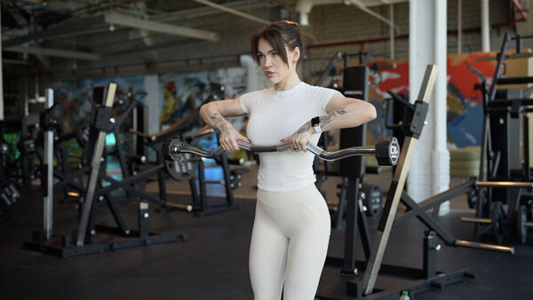

- **Primary:** Shoulders
- **Secondary:** Biceps, Traps
- **Equipment:** EZ Bar

Setup
**Grip:** Hold the EZ-bar (or barbell) with an overhand grip, hands slightly narrower than shoulder-width apart.
**Position:** Stand tall with feet shoulder-width apart, knees slightly soft. Hold the bar in front of your thighs, arms fully extended. Keep your chest up and core engaged.
Instructions
- Pull the bar straight up along your body toward your chin, leading with your elbows.
- Raise your elbows above shoulder height, keeping them flared out to the sides.
- Pause briefly at the top when the bar reaches upper chest / chin level.
- Slowly lower the bar back to the starting position in a controlled motion.
- Keep the bar close to your body throughout the entire movement.

## Upright Rows with Barbell

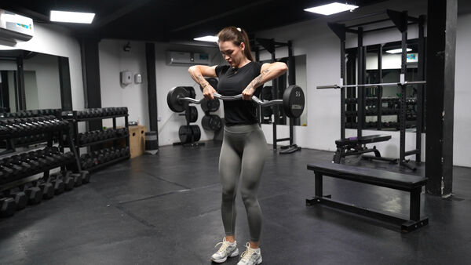

- **Primary:** Shoulders
- **Secondary:** Biceps, Traps
- **Equipment:** EZ Bar

Setup
**Grip:** Hold the EZ-bar (or barbell) with an overhand grip, hands slightly narrower than shoulder-width apart.
**Position:** Stand tall with feet shoulder-width apart, knees slightly soft. Hold the bar in front of your thighs, arms fully extended. Keep your chest up and core engaged.
Instructions
- Pull the bar straight up along your body toward your chin, leading with your elbows.
- Raise your elbows above shoulder height, keeping them flared out to the sides.
- Pause briefly at the top when the bar reaches upper chest / chin level.
- Slowly lower the bar back to the starting position in a controlled motion.
- Keep the bar close to your body throughout the entire movement.

#public
