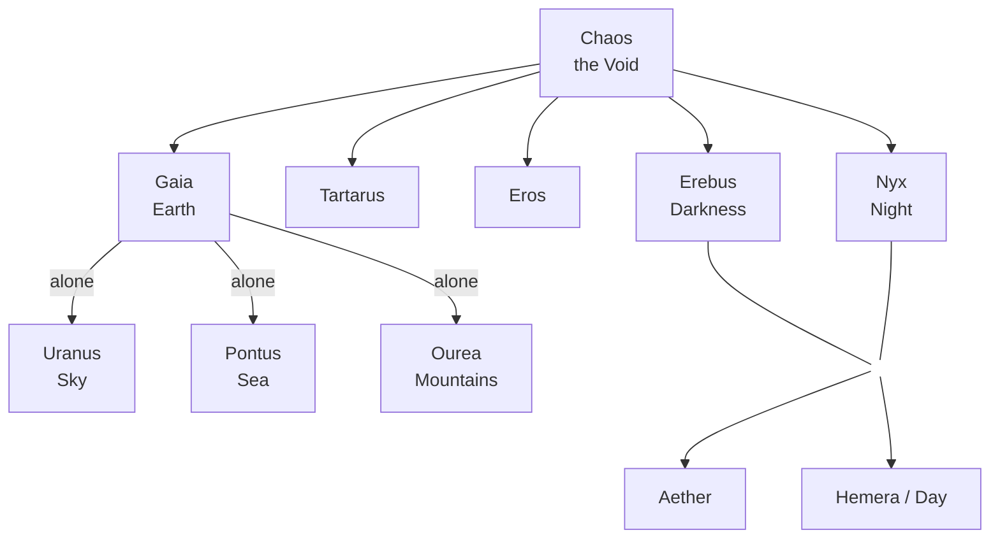
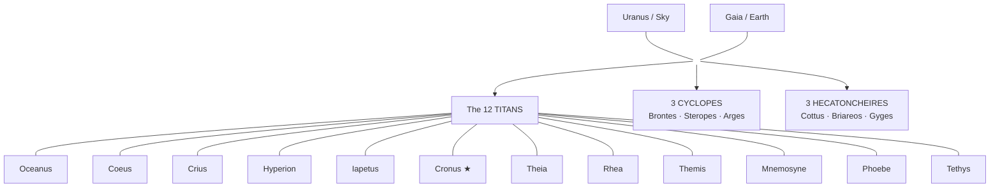
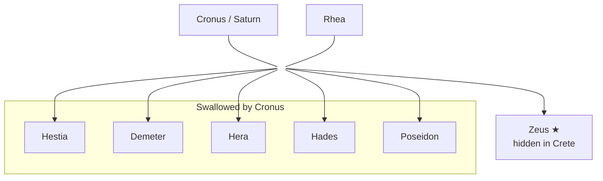
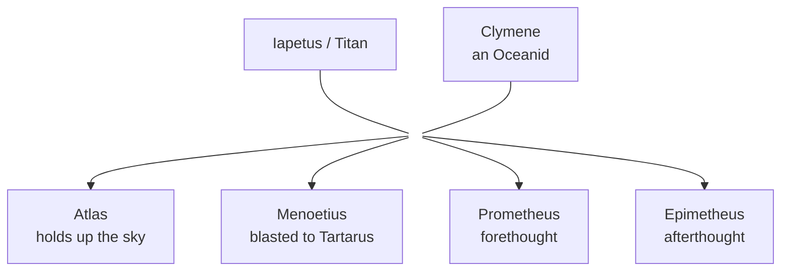
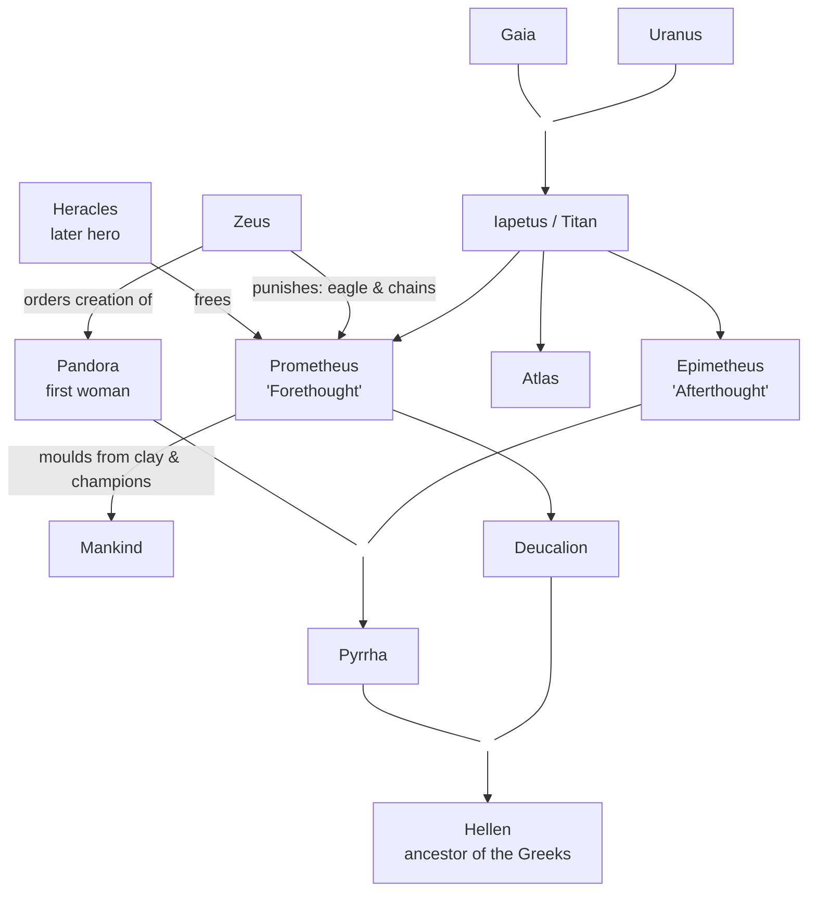

# Greek Mythology — Chronological Order, Part I: Creation → the Titanomachy

> [!info] Scope of this note
> **Part I — from the Creation of the Cosmos to the end of the Titanomachy (the War of the Titans).**
> This is the "cosmogonic" span of Greek myth: how the universe, the primordial powers, the Titans, and finally the Olympian order came to be. Later ages (the age of heroes, Perseus, Heracles, Thebes, the Argonauts, the Trojan War) will follow in subsequent parts.

> [!note] On "chronology"
> Greek myth has no single canonical timeline — the poets disagree. This ordering follows the **narrative sequence of [Hesiod's *Theogony*](https://www.perseus.tufts.edu/hopper/text?doc=Perseus:text:1999.01.0130)** (the primary source for creation and the Titanomachy), cross-checked against **Apollodorus' *Bibliotheca*** and the **Homeric Hymns**. The pseudo-historical BC dates that some sources attach (St Jerome via Apollodorus/Eusebius; the *Marmor Parium*; Carlos Parada's *Greek Mythology Link*) are **legendary reconstructions, not real history** — included only where useful for relative ordering.

**Primary sources used throughout:**
- **Hesiod, *Theogony*** (c. 700 BC) — the backbone: primordials, castration of Uranus, birth of the gods, Titanomachy.
- **Hesiod, *Works and Days*** — the Ages of Man, Prometheus, Pandora.
- **Homeric Hymns** (c. 7th–6th c. BC) — individual gods.
- **Apollodorus, *Bibliotheca*** (1st–2nd c. AD) — systematic mythography.
- **Ovid, *Metamorphoses*** (8 AD, Roman) — later elaborations (Ages of Man, creation of man).

---

## 1. The Beginning — Chaos and the Primordials
*Legendary date: **c. –1788 BC** (St Jerome's chronology — see the timeline table below).*

![[files/greek-mythology/01-chaos-watts.jpg|869]]
*"Chaos" — George Frederic Watts (and assistants), c. 1875–82. [Public domain, Wikimedia Commons](https://commons.wikimedia.org/wiki/File:Assistants_and_George_Frederic_Watts_-_Chaos_-_Google_Art_Project.jpg).*

> [!quote] Source — Hesiod, *Theogony* 116–138
> *"Verily at the first Chaos came to be, but next wide-bosomed Earth (Gaia)… and dim Tartarus… and Eros, fairest among the deathless gods."*

At the very beginning there was **Chaos** (Χάος — the "gap" or "void"), not disorder as the modern word implies, but the primal formless abyss. From Chaos, and alongside it, the first entities came into being **without parents**:

- **Gaia** (Earth) — the solid foundation of all.
- **Tartarus** — the deep abyss beneath the earth.
- **Eros** — primal desire, the force that drives generation.
- **Erebus** (Darkness) and **Nyx** (Night) — born from Chaos.

From **Nyx** and **Erebus** came **Aether** (bright upper air) and **Hemera** (Day). Nyx alone then bore a brood of dark powers: the **Moirai** (Fates), **Thanatos** (Death), **Hypnos** (Sleep), **Nemesis**, **Eris** (Strife), and others.

**Gaia**, without a mate, produced:
- **Uranus** (the starry Sky), to cover her and be the seat of the gods;
- **Ourea** (the Mountains);
- **Pontus** (the Sea).

### Family chart — the Primordials (from Chaos)



---

## 2. Uranus and Gaia — the First Divine Couple
*Legendary date: **c. –1770 to –1750 BC**.*

**Gaia** and her own son **Uranus** united and became the parents of the first great generation of powers:

- **The twelve Titans** — Oceanus, Coeus, Crius, Hyperion, Iapetus, Theia, Rhea, Themis, Mnemosyne, Phoebe, Tethys, and **Cronus** (the youngest and most terrible).
- **The three Cyclopes** — Brontes, Steropes, Arges (one-eyed smiths who later forge Zeus's thunderbolt).
- **The three Hecatoncheires** — Cottus, Briareos, Gyges — hundred-handed, fifty-headed giants of immense strength.

> [!quote] Source — Hesiod, *Theogony* 154–160
> Uranus hated his children and, as each was born, hid them away in a cavity of Gaia (in her womb / in the earth), refusing to let them into the light. Gaia, "groaning within for she was crowded," plotted revenge.

### Family chart — Uranus & Gaia and their offspring



---

## 3. The Castration of Uranus
*Legendary date: **c. –1710 BC**.*

![[files/greek-mythology/02-castration-uranus-vasari.jpg|923]]
*"The Mutilation of Uranus by Saturn (Cronus)" — Giorgio Vasari & Cristofano Gherardi, c. 1560, Palazzo Vecchio. [Public domain, Wikimedia Commons](https://commons.wikimedia.org/wiki/File:The_Mutilation_of_Uranus_by_Saturn.jpg).*

> [!quote] Source — Hesiod, *Theogony* 159–206
> Gaia fashioned a great sickle of grey flint and asked her children to punish their father. Only the youngest Titan, **Cronus**, dared. When Uranus next came to lie with Gaia, Cronus reached out from ambush, **castrated his father** with the sickle, and flung the severed genitals behind him.

Consequences of the act:
- From the **drops of blood** that fell on Gaia sprang the **Erinyes** (Furies), the **Giants**, and the **Meliae** (ash-tree nymphs).
- From the **genitals cast into the sea**, a white foam (*aphros*) gathered, and from it rose **Aphrodite** — goddess of love — who came ashore at Cythera and then Cyprus.

This act **separates Sky from Earth permanently** (Uranus withdraws to the heights) and **inaugurates the reign of the Titans** under Cronus.

![[files/greek-mythology/03-birth-venus-cabanel.jpg|705]]
*"The Birth of Venus (Aphrodite)" — Alexandre Cabanel, 1863. [Public domain, Wikimedia Commons](https://commons.wikimedia.org/wiki/File:Alexandre_Cabanel_-_The_Birth_of_Venus_-_Google_Art_Project_2.jpg).*

---

## 4. The Reign of Cronus and the Golden Age
*Legendary date: **c. –1705 BC**.*

Cronus (Roman **Saturn**) now rules the cosmos. He frees none of his monstrous siblings — the Cyclopes and Hecatoncheires remain imprisoned (in Tartarus, per later sources). He takes his sister **Rhea** as wife.

This is the **Golden Age** of the Ages of Man: under Saturn's rule mortals (in some tellings) live without toil, war, or old age, and the earth yields its fruit freely.

> [!info] Where do mortals come from?
> Humans appear here almost in passing, but the Greeks had no single, tidy creation of mankind — and the sources disagree on when and how it happened. The full account (Hesiod's successive *races* of men vs. the later tradition of **Prometheus moulding the first men from clay**, plus the theft of fire and Pandora) caps this Part: see [[Part 1 - Creation & the Titanomachy#8. Aftermath — Prometheus and the Creation of Mankind|§8, the Creation of Mankind]].

> [!quote] Source — Hesiod, *Works and Days* 109–120; Ovid, *Metamorphoses* Book 1
> *"First of all the deathless gods who dwell on Olympus made a golden race of mortal men… they lived like gods without sorrow of heart, remote and free from toil."*

### An uneasy throne — the prophecy

An oracle (from Gaia and Uranus) warned Cronus that, just as he had overthrown his own father, **he too was destined to be overcome by one of his children.** To prevent this, Cronus **swallowed each child** as Rhea bore it.

Rhea thus lost, one by one:
- **Hestia**, **Demeter**, **Hera**, **Hades**, and **Poseidon** — all swallowed whole.

![[files/greek-mythology/04-saturn-devouring-rubens.jpg|370]]
*"Saturn Devouring His Son" — Peter Paul Rubens, 1636–38, Museo del Prado. [Public domain, Wikimedia Commons](https://commons.wikimedia.org/wiki/File:Rubens_saturn.jpg).*

---

## 5. The Birth and Hiding of Zeus
*Legendary date: **c. –1703 BC**.*

> [!quote] Source — Hesiod, *Theogony* 468–491; Apollodorus, *Bibliotheca* 1.1.5–1.1.7
> When Rhea was about to bear **Zeus**, her youngest, she begged Gaia and Uranus for a plan. They sent her to **Crete**. There she bore Zeus in secret and hid him in a cave on **Mount Ida** (or Mount Dicte). To Cronus she gave **a stone wrapped in swaddling-clothes**, which he swallowed, believing it his son.

The infant Zeus was raised in secret — nursed (in various tellings) by the goat **Amaltheia**, guarded by the **Curetes**, who clashed their weapons to drown out his crying.

### Family chart — Cronus, Rhea, and the first Olympians



---

## 6. Zeus Frees His Siblings
*Legendary date: **c. –1684 BC**.*

Grown to strength, **Zeus** returned to challenge his father. By a trick — in Apollodorus, with the help of **Metis**, who gave Cronus an emetic drug — Cronus was made to **disgorge** the swallowed children (and the stone) in reverse order. The stone Zeus set up at **Delphi** (Pytho) as a marker and marvel for mortals (the *omphalos*).

Zeus's disgorged brothers and sisters — **Hestia, Demeter, Hera, Hades, Poseidon** — now emerged full-grown as his allies. Zeus also **freed the Cyclopes and the Hecatoncheires** from their imprisonment. In gratitude:
- The **Cyclopes** gave Zeus his **thunder and lightning bolt**, gave Hades a **helmet of invisibility**, and Poseidon a **trident**.
- The **Hecatoncheires** became his shock troops.

---

## 7. The Titanomachy — The War of the Titans
*Legendary date: **c. –1684 to –1674 BC** (a ten-year war).*

![[files/greek-mythology/05-fall-of-titans-cornelis.jpg|480]]
*"The Fall of the Titans" — Cornelis van Haarlem, 1588–90. [Public domain, Wikimedia Commons](https://commons.wikimedia.org/wiki/File:Cornelis_Cornelisz._van_Haarlem_-_The_Fall_of_the_Titans_-_Google_Art_Project.jpg).*

> [!quote] Source — Hesiod, *Theogony* 617–735
> The war lasted **ten years** without decision. The Olympians fought from **Mount Olympus**; the Titans from **Mount Othrys**. On Gaia's advice, Zeus released the Hecatoncheires from Tartarus; they hurled three hundred rocks at once at the Titans. Zeus loosed his newly-forged thunderbolts until "the whole earth seethed, and Ocean's streams and the unfruitful sea."

**The sides:**
- **Olympians** — Zeus, Poseidon, Hades, Hera, Demeter, Hestia, plus the Cyclopes and Hecatoncheires. Some Titans defected to Zeus: **Themis**, **Prometheus** (son of Iapetus, who foresaw the outcome), **Oceanus** and his daughter **Styx** (whose children — Zelus, Nike, Kratos, Bia — became Zeus's constant companions).
- **Titans** — led by **Cronus**, with **Iapetus**, **Hyperion**, **Coeus**, **Crius**, and **Atlas** (son of Iapetus) as war-leader.

**Outcome:**
- The Titans were **defeated and cast down into Tartarus**, bound in chains, with the Hecatoncheires set as their guards.
- **Atlas**, as punishment, was condemned to **hold up the sky (heavens)** at the western edge of the world forever.
- **Zeus, Poseidon, and Hades divided the cosmos by lot**: Zeus took the **sky**, Poseidon the **sea**, Hades the **underworld** — the Earth and Olympus held in common.

This ends the war and establishes the **reign of Zeus and the Olympian order.**

### Family chart — the Titan line at war (Iapetus's sons)



---

## 8. Aftermath — Prometheus and the Creation of Mankind
*Legendary date: **c. –1667 BC** (Prometheus chained) · **–1654 BC** (Pandora).*

With the Olympians secure in heaven, the myth turns from the birth of the gods to the making and fate of **mortals**. Here the Titan **Prometheus** ("Forethought") steps to the centre of the story — creator, benefactor, and eternal rebel against Zeus. He and his brother **Epimetheus** ("Afterthought") are sons of the Titan **Iapetus**; unlike their kin they were spared imprisonment, and their opposite natures — one who plans ahead, one who only understands too late — drive everything that follows.

### The making of the human race

> [!info] Chronology note — reading order vs. date
> This section caps Part I thematically, but by the legendary dates its events (**–1667/–1654**, and the Flood at **–1460**) actually fall *after* the founding of Olympus and the birth of the younger gods in [[Part 2 - The Age of Gods|Part II]]. So the gods who act below — **Athena**, **Hephaestus**, **Hermes** (assembling Pandora) — are born in Part II §1 (**~–1680**), which is why they already exist here. For the pure by-date sequence see the [[Part 5 - Master Timeline (by date)|strict chronology index]].

There are two great strands in how the Greeks explained where people came from, and the sources do not fully agree — worth keeping both in view.

> [!abstract]+ Timeline — the making of mortals
> ```mermaid
> flowchart TD
>     classDef sec fill:#e8e8e8,stroke:#888,font-weight:bold,color:#000;
>     classDef ev fill:#fff,stroke:#bbb,color:#000;
>     TITLE["<b>The making of mortals — Prometheus to the Flood</b>"]:::sec
>     S1["Two creations"]:::sec
>     E1_1["Hesiod's races · Golden, Silver, Bronze races; then Heroes, then Iron (now)"]:::ev
>     E1_2["Prometheus moulds mankind · men from clay & water, Athena breathes in life"]:::ev
>     S2["Prometheus champions man"]:::sec
>     E2_1["Trick at Mecone · men keep the meat, gods get bones & fat"]:::ev
>     E2_2["Zeus withholds fire · Prometheus steals it in a fennel-stalk; fire = all the arts"]:::ev
>     S3["Zeus's twofold revenge"]:::sec
>     E3_1["Pandora · first woman; her jar looses every evil, only Hope stays"]:::ev
>     E3_2["Prometheus bound · chained in the Caucasus; the eagle & the liver; freed by Heracles"]:::ev
>     S4["A second creation"]:::sec
>     E4_1["The Flood (–1460) · Deucalion & Pyrrha survive; stones become a new race"]:::ev
>     E4_2["Hellen · their son; ancestor of the HELLENES → the Age of Heroes"]:::ev
>     TITLE --> S1 --> E1_1 --> E1_2 --> S2 --> E2_1 --> E2_2 --> S3 --> E3_1 --> E3_2 --> S4 --> E4_1 --> E4_2
> ```
> Only the **Flood (–1460)** carries a fixed legendary date here; the rest is generational/thematic order, not dated events.

> [!quote] Source — Hesiod, *Works and Days* 106–201 (the Five Ages of Man)
> Hesiod's older account has **no single moment of creation**. Instead the gods make **successive races** of mortals, each worse than the last:
> - **Golden Age** — under Cronus; men lived like gods, without toil, sorrow, or old age, and the earth gave its fruits freely.
> - **Silver Age** — a lesser race, foolish and impious; Zeus destroyed them.
> - **Bronze Age** — a hard race of war, armed in bronze, who destroyed themselves.
> - **The Age of Heroes** — the demigods and warriors of the great sagas (Thebes, Troy); nobler than the Bronze race, many now dwell in the **Isles of the Blessed**.
> - **Iron Age** — the present, toilsome age of Hesiod himself and of us: labour, injustice, and decline, with the gods slowly withdrawing.

> [!quote] Source — Apollodorus, *Bibliotheca* 1.7.1; Ovid, *Metamorphoses* 1.76–88; Pausanias 10.4.4
> The **later and more famous** tradition makes **Prometheus the direct creator of humanity**: he **moulded the first men out of clay and water**, shaping them in the image of the gods, and (in Ovid) gave them an upright stance to gaze at the heavens while the beasts look down at the earth. In some versions **Athena breathed life** into these clay figures. Pausanias reports that in his day travellers were still shown the very clay from which Prometheus formed mankind, at Panopeus in Phocis.

![[files/greek-mythology/26-prometheus-creates-man-hansen.jpg|480]]
*"Prometheus Moulding Man from Clay" — Constantin Hansen, 1845. [Public domain, Wikimedia Commons](https://commons.wikimedia.org/wiki/File:Constantin_Hansen_-_Prometheus_Moulding_Man_from_Clay_-_KMS3665_-_Statens_Museum_for_Kunst.jpg).*

These humans were fragile and defenceless. When Epimetheus had earlier handed out gifts to the animals — claws, fur, wings, speed — he thoughtlessly used them all up and left **nothing for man**. It fell to Prometheus, the brother with foresight, to make up the deficit — and it is this pity for his own creation that sets him against Zeus.

### The trick at Mecone

![[files/greek-mythology/06-prometheus-fire-fueger.jpg|480]]
*"Prometheus Brings Fire to Mankind" — Heinrich Füger, 1817. [Public domain, Wikimedia Commons](https://commons.wikimedia.org/wiki/File:Heinrich_fueger_1817_prometheus_brings_fire_to_mankind.jpg).*

> [!quote] Source — Hesiod, *Theogony* 535–560
> At **Mecone**, gods and mortals met to settle how sacrifices would be divided. Prometheus, championing man, butchered a great ox and made **two portions**: one hid the good meat and entrails inside the ox's unappealing stomach; the other dressed the bare **bones in glistening fat**. He invited Zeus to choose. Zeus — seeing the trick but choosing it deliberately, says Hesiod, to have a pretext for punishment — took the fat-covered bones. Ever after, mortals **burned the bones and fat for the gods on their altars and kept the meat for themselves**: an origin-myth for Greek sacrifice itself.

### The theft of fire

Enraged at being cheated, Zeus **withheld fire** from mankind — condemning Prometheus's creatures to raw food, cold, and darkness, no better than beasts. Prometheus answered by **stealing fire from heaven** (from the forge, or from the sun), hiding a glowing ember in the hollow stalk of a **giant fennel** (*narthex*), and carrying it down to men.

Fire is more than warmth: for the Greeks it is the root of **all the arts and crafts** — metalwork, cooking, medicine, civilisation itself. In Aeschylus's *Prometheus Bound*, Prometheus claims he gave humanity not only fire but numbers, writing, agriculture, and the reading of omens — the whole toolkit that raised man out of animal helplessness. This is why he is remembered as the great **culture-bringer** and friend of mankind.

### Zeus's twofold revenge — Pandora

![[files/greek-mythology/27-pandora-waterhouse.jpg|380]]
*"Pandora" — John William Waterhouse, 1896. [Public domain, Wikimedia Commons](https://commons.wikimedia.org/wiki/File:John_William_Waterhouse_-_Pandora,_1896.jpg).*

> [!quote] Source — Hesiod, *Theogony* 570–612 & *Works and Days* 60–105
> **On mankind**, Zeus devised a beautiful curse. He had **Hephaestus** shape the first **woman** out of earth and water; **Athena** clothed and taught her crafts; **Aphrodite** gave her grace and longing; **Hermes** put in her a "shameless mind and deceitful nature" and a persuasive voice. Each god gave a gift — hence her name, **Pandora**, "all-gifts." She was sent to Prometheus's simpler brother **Epimetheus**, who — forgetting Prometheus's warning never to accept a gift from Zeus — welcomed her.
>
> Pandora carried a great **jar** (*pithos* — "box" is a later mistranslation by Erasmus). When she lifted its lid, out swarmed every **evil, disease, toil, and sorrow** that afflicts humanity, scattering beyond recall. Only **Hope** (*Elpis*) remained inside, trapped under the rim. Before this, Hesiod says, mortals had lived free of hardship and disease; woman and the jar together end the earthly paradise.

The two brothers embody the moral: **Forethought** tried to shield mankind; **Afterthought** doomed them by acting without thinking. Between them, humanity gains fire and the arts but also loses its ease — the mythic price of knowledge.

### Prometheus bound

![[files/greek-mythology/07-prometheus-bound-rubens.jpg|480]]
*"Prometheus Bound" — Peter Paul Rubens & Frans Snyders, 1611–18. [Public domain, Wikimedia Commons](https://commons.wikimedia.org/wiki/File:Peter_Paul_Rubens_-_Prometheus_Bound_-_WGA20279.jpg).*

> [!quote] Source — Hesiod, *Theogony* 521–534; Aeschylus, *Prometheus Bound*
> **On Prometheus himself**, Zeus took a harsher vengeance. He had the Titan **chained to a crag** in the **Caucasus** mountains, and sent an **eagle** to feed each day on his **liver**, which regenerated every night so the torture never ended. Prometheus, being immortal, could not die and could not escape — and he defied Zeus throughout, refusing to submit or beg.

His release comes only **generations later**: the hero **Heracles**, passing during his Labours ([[Part 3 - The Age of Heroes|Part III]]), shot the eagle and freed him — with Zeus's eventual consent, for by then Prometheus's knowledge of a dangerous prophecy (that a son of the sea-nymph Thetis would surpass his father) made reconciliation worthwhile. Thetis was married off to a mortal, Peleus — and their son would be **Achilles** ([[Part 4 - Thebes & the Trojan War|Part IV]]).

### The Flood — a second creation

> [!quote] Source — Apollodorus, *Bibliotheca* 1.7.2; Ovid, *Metamorphoses* 1.253–415
> Later, angered by the wickedness of the Bronze-Age race, Zeus resolved to **destroy mankind with a great flood**. Forewarned by Prometheus, his son **Deucalion** and wife **Pyrrha** (daughter of Epimetheus and Pandora) built an **ark** and survived nine days of deluge, coming to rest on Mount Parnassus. As the sole survivors, they repopulated the earth by an oracle's riddle: to throw "the bones of their mother" behind them — meaning the **stones of Mother Earth**, which sprang up as a new race of humans. Their son **Hellen** became the ancestor of the **Hellenes** (the Greeks).

This Greek flood-myth closes the age of the first creation and links Prometheus's line directly to the ancestry of the Greek peoples — the bridge from the age of gods into the coming **Age of Heroes**.

### Prometheus's connections to the divine order



---

## Quick-reference timeline (Part I)

> [!abstract]+ Timeline — Part I at a glance
> ```mermaid
> flowchart TD
>     classDef sec fill:#e8e8e8,stroke:#888,font-weight:bold,color:#000;
>     classDef ev fill:#fff,stroke:#bbb,color:#000;
>     TITLE["<b>Part I — Creation to the Titanomachy (St Jerome's legendary dates)</b>"]:::sec
>     S1["The primordials"]:::sec
>     E1_1["–1788 · Chaos; birth of Gaia, Tartarus, Eros, Erebus, Nyx"]:::ev
>     E1_2["–1770 · Gaia bears Uranus, Pontus, the Mountains"]:::ev
>     E1_3["–1750 · Uranus & Gaia beget the Titans, Cyclopes, Hecatoncheires"]:::ev
>     S2["Cronus rises"]:::sec
>     E2_1["–1710 · Cronus castrates Uranus; birth of Aphrodite, Erinyes, Giants"]:::ev
>     E2_2["–1705 · reign of Cronus begins; the Golden Age"]:::ev
>     E2_3["–1703 · Cronus swallows his children; Rhea hides Zeus in Crete"]:::ev
>     S3["The war of the gods"]:::sec
>     E3_1["–1684 · Zeus frees his siblings, the Cyclopes & Hecatoncheires"]:::ev
>     E3_2["–1684 to –1674 · the TITANOMACHY; Titans cast into Tartarus"]:::ev
>     E3_3["–1674 · the cosmos divided — sky, sea, underworld; Atlas punished"]:::ev
>     S4["The making of mortals"]:::sec
>     E4_1["Prometheus era · mankind moulded from clay; the trick at Mecone"]:::ev
>     E4_2["–1667 / –1654 · Prometheus chained for fire; Pandora released"]:::ev
>     E4_3["–1460 · the Flood; Deucalion & Pyrrha; Hellen, father of the Greeks"]:::ev
>     TITLE --> S1 --> E1_1 --> E1_2 --> E1_3 --> S2 --> E2_1 --> E2_2 --> E2_3 --> S3 --> E3_1 --> E3_2 --> E3_3 --> S4 --> E4_1 --> E4_2 --> E4_3
> ```

> [!warning] About the dates
> The **Legendary date (BC)** column follows the ancient chronology of **St Jerome** (drawing on Apollodorus, Diodorus Siculus and Eusebius), as tabulated by [Abagond](https://abagond.wordpress.com/2023/06/30/greek-myths-in-chronological-order/). These are **not historical dates** — no records or archaeology support them; they are an ancient attempt to fit the myths onto a calendar. Treat them as relative ordering only. (The maicar.com/*Marmor Parium* tradition gives somewhat different figures.)

| Seq | Legendary date (BC) | Event | Primary source |
| --- | --- | --- | --- |
| 1 | **–1788** | Chaos; birth of Gaia, Tartarus, Eros, Erebus, Nyx | Hesiod, *Theogony* 116–125 |
| 2 | **–1770** | Gaia bears Uranus, Pontus, the Mountains | *Theogony* 126–132 |
| 3 | **–1750** | Uranus & Gaia beget the Titans, Cyclopes, Hecatoncheires | *Theogony* 132–153 |
| 4 | **–1710** | Castration of Uranus by Cronus; birth of Aphrodite, Erinyes, Giants | *Theogony* 154–206 |
| 5 | **–1705** | Reign of Cronus begins; the Golden Age | *Works & Days* 109–120; Ovid, *Met.* 1 |
| 6 | **–1703** | Cronus swallows his children; Rhea hides Zeus in Crete | *Theogony* 453–491 |
| 7 | **–1684** | Zeus frees his siblings, Cyclopes & Hecatoncheires | Apollodorus 1.2.1 |
| 8 | **–1684 to –1674** | **The Titanomachy** — 10-year war; Titans cast into Tartarus | *Theogony* 617–735 |
| 9 | **–1674** | Division of the cosmos (sky / sea / underworld); Atlas punished | *Theogony* 517–520; Apollodorus 1.2.1 |
| 10 | **⟨undated⟩** *(≈ Prometheus era)* | **Creation of mankind** — Prometheus moulds the first men from clay (Athena breathes in life); *cf.* Hesiod's successive Ages/races of men | Apollodorus 1.7.1; Ovid, *Met.* 1.76–88; *Works & Days* 106–201 |
| 11 | **–1667 / –1654** | Prometheus chained (fire); Pandora released | *Theogony* 535–616; *Works & Days* 42–105 |

---

## Sources & further reading

- **Hesiod**, *Theogony* & *Works and Days* — trans. available on [Perseus Digital Library](https://www.perseus.tufts.edu/hopper/text?doc=Perseus:text:1999.01.0130).
- **Apollodorus**, *Bibliotheca* (The Library) — [Perseus](https://www.perseus.tufts.edu/hopper/text?doc=Perseus:text:1999.01.0022).
- **Homeric Hymns** — to Aphrodite, Demeter, Hermes, etc.
- **Ovid**, *Metamorphoses* Book 1 — the Ages of Man, creation of man (Roman synthesis).
- Carlos Parada, [*Greek Mythology Link* — Mythical Chronology](https://www.maicar.com/GML/MythicalChronology.html) (legendary BC datings).
- [Abagond, "Greek myths in chronological order"](https://abagond.wordpress.com/2023/06/30/greek-myths-in-chronological-order/) (Jerome/Apollodorus/Eusebius datings).

*Illustrations are public-domain artworks from Wikimedia Commons, stored locally in `files/greek-mythology/`.*

> [!todo] Navigation
> → **Part II:** [[Part 2 - The Age of Gods|The Age of Gods]] — the Olympians established, Typhon's revolt, the Gigantomachy, Persephone & the seasons, Dionysus.
> → **Part III:** [[Part 3 - The Age of Heroes|The Age of Heroes]] — Perseus, Bellerophon, Heracles, Theseus, the Argonauts.
> → **Part IV:** [[Part 4 - Thebes & the Trojan War|Thebes & the Trojan War]] — Cadmus, Oedipus, Seven Against Thebes, the Trojan War, the Odyssey.
> ⚑ **By-date master index:** [[Part 5 - Master Timeline (by date)|Master Timeline (by date)]] — every event from all four parts interleaved in pure legendary-BC order.
