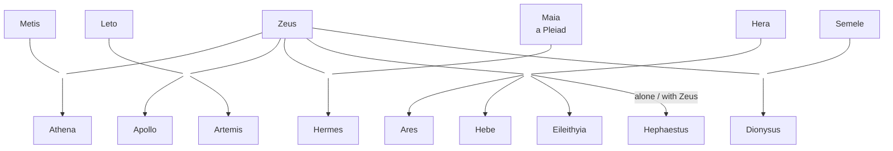
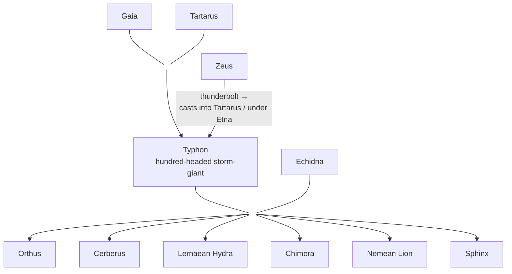
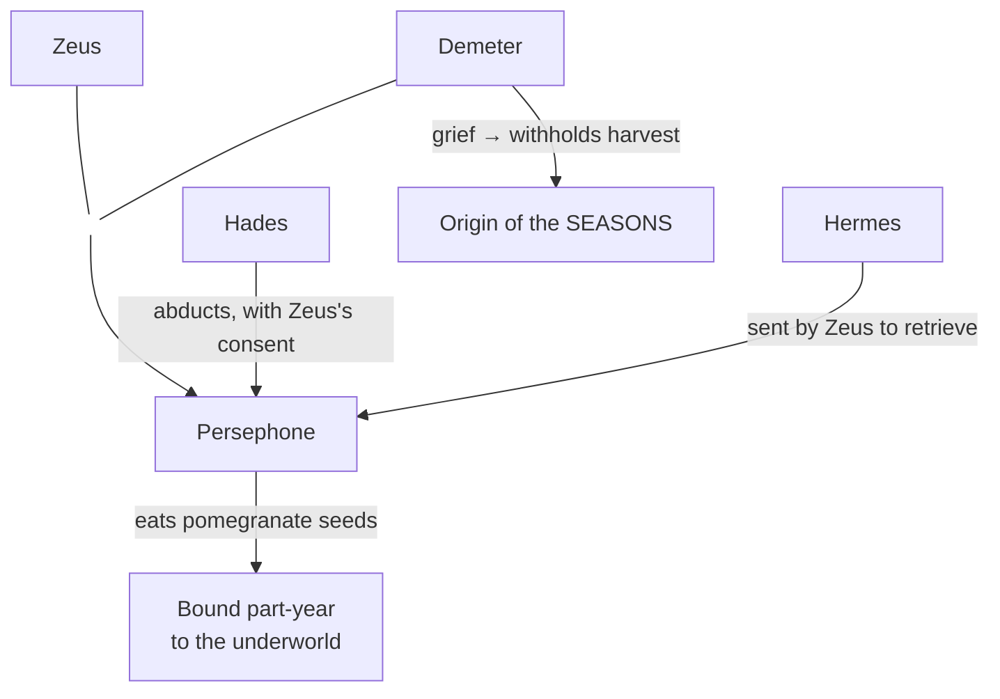
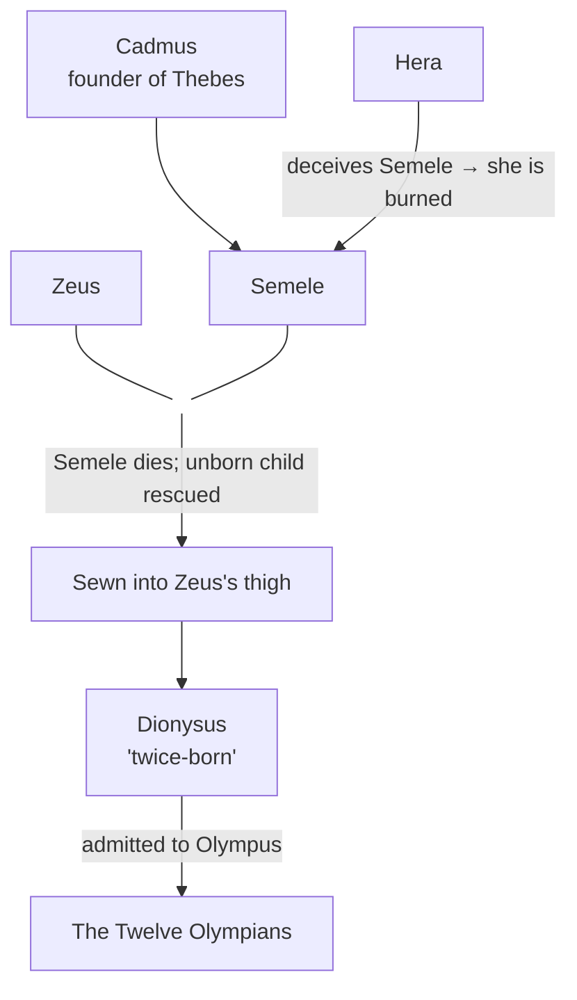

# Greek Mythology — Chronological Order, Part II: The Age of Gods

> [!info] Scope of this note
> **Part II — the consolidation of Zeus's reign and the age of the gods.**
> Following the [[Part 1 - Creation & the Titanomachy|Titanomachy (Part I)]], this covers how Zeus secured Olympus against two great challenges — **Typhon** and the **Gigantomachy** — took his consorts and fathered the younger Olympians, and how the divine order that governs the later world of heroes was set: the twelve Olympians, the abduction of **Persephone** (origin of the seasons), and the birth of **Dionysus**.

> [!note] Continuity
> Continues directly from [[Part 1 - Creation & the Titanomachy|Part I: Creation → the Titanomachy]]. Same source conventions: narrative order follows **Hesiod's *Theogony***, cross-checked against **Apollodorus' *Bibliotheca*** and the **Homeric Hymns**. BC datings (where mentioned) are legendary reconstructions, not history.

**Primary sources used in Part II:**
- **Hesiod, *Theogony*** — Zeus's marriages and children; the Typhonomachy (820–880).
- **Apollodorus, *Bibliotheca* 1.6** — the Gigantomachy and Typhon in systematic form.
- **Homeric Hymn to Demeter** (2) — the abduction of Persephone.
- **Homeric Hymn to Dionysus** & **Euripides, *Bacchae*** — the birth and nature of Dionysus.
- **Pindar** and vase-painting tradition — the Gigantomachy iconography.

---

## 1. Zeus Enthroned — the Olympian Order
*Legendary date: **c. –1684 to –1674 BC** (St Jerome's chronology — see the timeline table below).*

![[files/greek-mythology/08-council-of-gods-raphael.jpg|853]]
*"The Council of the Gods" — Raphael and workshop, 1517–18, Villa Farnesina, Rome. [Public domain, Wikimedia Commons](https://commons.wikimedia.org/wiki/File:Raffaello,_concilio_degli_dei_02.jpg).*

With the Titans in Tartarus and the cosmos divided by lot (Zeus—sky, Poseidon—sea, Hades—underworld), Zeus establishes his court on **Mount Olympus**. The ruling generation becomes the **Twelve Olympians**.

> [!quote] Source — Hesiod, *Theogony* 881–885
> *"But when the blessed gods had finished their toil, and settled by force their struggle for honours with the Titans, they pressed far-seeing Olympian Zeus to reign and to rule over them, by Earth's prompting. So he divided their dignities amongst them."*

### The Twelve Olympians

| God | Roman | Domain | Parentage |
| --- | --- | --- | --- |
| **Zeus** | Jupiter | Sky, king of gods | Cronus & Rhea |
| **Hera** | Juno | Marriage, queen | Cronus & Rhea |
| **Poseidon** | Neptune | Sea, earthquakes | Cronus & Rhea |
| **Demeter** | Ceres | Grain, harvest | Cronus & Rhea |
| **Hestia**¹ | Vesta | Hearth | Cronus & Rhea |
| **Athena** | Minerva | Wisdom, war-craft | Zeus & Metis |
| **Apollo** | Apollo | Light, prophecy, music | Zeus & Leto |
| **Artemis** | Diana | Hunt, wilds, moon | Zeus & Leto |
| **Ares** | Mars | War | Zeus & Hera |
| **Aphrodite** | Venus | Love, beauty | born of Uranus' foam (Part I) |
| **Hephaestus** | Vulcan | Fire, forge | Hera (& Zeus) |
| **Hermes** | Mercury | Messenger, trade, thieves | Zeus & Maia |

¹ *In many lists **Dionysus** replaces Hestia among the Twelve once he is born and admitted to Olympus (§6).*

### Family chart — Zeus's consorts and the younger Olympians



> [!tip] The swallowing of Metis — a pattern repeats
> Warned (again by Gaia and Uranus) that **Metis** would bear a child greater than its father, Zeus **swallowed Metis** while she was pregnant — echoing Cronus. But the child was already forming: **Athena** later sprang **fully armed from Zeus's head** (split open by Hephaestus' axe). By absorbing Metis (whose name means "cunning wisdom"), Zeus internalises wisdom itself and breaks the cycle of son-overthrows-father. His reign is stable where his father's and grandfather's were not.

![[files/greek-mythology/09-birth-athena-amphora.jpg|480]]
*Birth of Athena from the head of Zeus — Attic black-figure amphora, c. 550–525 BC, Louvre F32. [Public domain, Wikimedia Commons](https://commons.wikimedia.org/wiki/File:Amphora_birth_Athena_Louvre_F32.jpg).*

---

## 2. The Typhonomachy — Zeus vs Typhon
*Legendary date: **not dated** in St Jerome's chronology.*

![[files/greek-mythology/10-zeus-typhon-hydria.jpg|480]]
*Zeus attacking Typhon with his thunderbolt — Chalcidian black-figure hydria, c. 550 BC, Staatliche Antikensammlungen, Munich. [Public domain, Wikimedia Commons](https://commons.wikimedia.org/wiki/File:Zeus_Typhon_Staatliche_Antikensammlungen_596.jpg).*

The Titanomachy was not the last threat. **Gaia**, angered at the defeat of her Titan children, bore one final monster with **Tartarus**: **Typhon** (Typhoeus) — a storm-giant with a hundred serpent-heads, whose challenge to Zeus is the single greatest duel in Greek myth.

> [!quote] Source — Hesiod, *Theogony* 820–868
> *"From his shoulders grew a hundred heads of a snake, a fearful dragon, with dark, flickering tongues… and voices in all his fearful heads which uttered every kind of sound unspeakable."* Zeus, seeing the danger to his rule, "thundered hard and mightily: and the earth around resounded terribly, and the wide heaven above, and the sea and Ocean's streams and the nether parts of the earth."

**Outcome:** Zeus blasted Typhon with his thunderbolts and cast him down into **Tartarus** (in a widespread later version, he is pinned beneath **Mount Etna** in Sicily, whose eruptions are Typhon's fiery breath). From Typhon and **Echidna** ("mother of monsters") descend many of the beasts the later heroes must face — the Nemean Lion, the Hydra, Cerberus, the Chimera, the Sphinx.



---

## 3. The Gigantomachy — War with the Giants
*Legendary date: **not dated** in St Jerome's chronology (later than the Titanomachy, and requires the mortal Heracles, so within the Heroic Age).*

![[files/greek-mythology/11-gigantomachy-pergamon.jpg|480]]
*Athena battling the Giant Alcyoneus — Gigantomachy frieze, Pergamon Altar, c. 2nd c. BC. [Public domain, Wikimedia Commons](https://commons.wikimedia.org/wiki/File:Pergamonaltarathena.jpg).*

Distinct from the Titanomachy (with which it is often confused), the **Gigantomachy** is the revolt of the **Giants** — sprung from the blood of the castrated Uranus that fell on Gaia (Part I). Gaia raised them against the Olympians to avenge the Titans.

> [!quote] Source — Apollodorus, *Bibliotheca* 1.6.1–2
> An oracle declared that the gods could **not** kill the Giants unless a **mortal** fought alongside them. Gaia sought a magic herb to make the Giants proof even against mortals; Zeus forbade Dawn, Moon and Sun to shine and harvested the herb himself first. Then Athena summoned **Heracles** to the gods' aid.

**Key moments:**
- **Heracles** — the greatest of the Greek heroes, a mortal son of **Zeus** whose full saga (the Twelve Labours and more) is told in [[Part 3 - The Age of Heroes#3. Heracles — the Greatest of the Heroes|Part III §3]]; he is the "mortal" the oracle demands — shot the Giants with his arrows; each Giant, once wounded by a god's weapon, was finished off by Heracles.
- **Alcyoneus** was immortal while he touched his native earth — Heracles dragged him beyond its borders to kill him.
- **Porphyrion** attacked Hera; Zeus struck him with a thunderbolt and Heracles finished him.
- **Athena** crushed **Enceladus** under the island of Sicily and flayed **Pallas**.
- **Dionysus, Hephaestus, the Fates** and others each slew a Giant.

**Significance:** the Gigantomachy binds the mortal hero **Heracles** into the divine order — it foreshadows the [[Part 1 - Creation & the Titanomachy|Age of Heroes]] and became the classic Greek emblem of *civilisation (the Olympians) vanquishing chaos (the Giants)*.

> [!warning] Don't confuse the two wars — and note the date
> **Titanomachy** = Olympians vs **Titans** (Cronus's generation), ends Part I. **Gigantomachy** = Olympians (+ Heracles) vs **Giants** (born of Uranus's blood). Different opponents, different war, and the Gigantomachy happens *after* Zeus is already king.
>
> **Chronology caveat:** although it's placed here (in the "Age of Gods") because it completes the gods' consolidation of power, the Gigantomachy actually belongs **late in the [[Part 3 - The Age of Heroes|Age of Heroes]] (~–1250 BC)** — it requires the *adult mortal* Heracles, whose Labours are dated –1258 to –1246. By strict date it is one of the *latest* events in this note, not one of the earliest. See the [[Part 5 - Master Timeline (by date)|strict chronology index]].

---

## 4. Hades and Poseidon — the Other Two Realms
*Legendary date: from the division of the cosmos, **c. –1674 BC**.*

While Zeus rules the sky, his brothers hold their lots:
- **Poseidon** rules the sea from a palace in its depths; with his trident he stirs storms and earthquakes ("Earth-shaker"). He lies with **Medusa** — one of the three **Gorgons** (monstrous sisters, daughters of the sea-gods Phorcys and Ceto; Medusa alone is mortal, and her gaze turns onlookers to stone) — and she conceives by him. The children are not born now, though: they emerge only a whole generation later, when the hero Perseus beheads her and the winged horse **Pegasus** and the giant **Chrysaor** spring from her severed neck (→ [[Part 3 - The Age of Heroes#1. Perseus — the First Great Hero|Perseus slays Medusa, Part III §1]]).
- **Hades** rules the dead in the underworld, rarely leaving it. He is not "evil" — he is the stern, just custodian of the dead, aided by his helm of invisibility (Cyclopes' gift, Part I).

This sets up the pivotal myth that links the underworld to the living world: the abduction of Persephone.

---

## 5. The Abduction of Persephone — Origin of the Seasons
*Legendary date: **c. –1420 BC**.*

![[files/greek-mythology/12-rape-persephone-bernini.jpg|480]]
*"The Rape of Proserpina" — Gian Lorenzo Bernini, 1621–22, Galleria Borghese. [Public domain, Wikimedia Commons](https://commons.wikimedia.org/wiki/File:Rape_of_Proserpina_-_Gian_Lorenzo_Bernini.jpg).*

> [!quote] Source — Homeric Hymn to Demeter (2), lines 1–89, 300–470
> As **Persephone** (daughter of **Zeus** and **Demeter**) gathered flowers, the earth split open and **Hades** — with Zeus's secret consent — carried her off to be his queen. **Demeter**, goddess of grain, wandered the earth grieving, and in her sorrow **withheld all growth**: nothing sprouted, and famine threatened to destroy mortals (and with them the gods' offerings).

**The resolution — and why we have seasons:**
- Zeus sent **Hermes** to bring Persephone back. But Hades had given her **pomegranate seeds** to eat; having tasted the food of the dead, she was bound to the underworld.
- The compromise: Persephone spends **part of the year** (a third, or half, depending on the source) below with Hades, and the rest above with Demeter.
- When mother and daughter are reunited, the earth blooms (**spring/summer**); when Persephone descends, Demeter mourns and the earth goes barren (**autumn/winter**).

This myth also founds the **Eleusinian Mysteries**, the most important mystery cult of the Greek world.



---

## 6. The Birth of Dionysus — the Last Olympian
*Legendary date: **c. –1420 BC**.*

![[files/greek-mythology/13-bacchus-caravaggio.jpg|480]]
*"Bacchus (Dionysus)" — Caravaggio, c. 1596–98, Galleria degli Uffizi. [Public domain, Wikimedia Commons](https://commons.wikimedia.org/wiki/File:Bacchus_(by_Michelangelo_Merisi_da_Caravaggio)_%E2%80%93_Galleria_degli_Uffizi,_Florence.jpg).*

The youngest major god, and the only Olympian born of a **mortal** mother: **Dionysus**, god of wine, ecstasy, theatre, and divine madness.

> [!info] Chronology note
> Dionysus (**–1420 BC**) is the **grandson of Cadmus**, whose founding of Thebes is told in [[Part 4 - Thebes & the Trojan War#1. Cadmus Founds Thebes|Part IV §1]] but dated *earlier* (**–1437 BC**). So although the Theban saga is kept together in Part IV for readability, by strict date Cadmus precedes this birth. See the [[Part 5 - Master Timeline (by date)|strict chronology index]].

> [!quote] Source — Euripides, *Bacchae*; Apollodorus 3.4.3; Homeric Hymn 1
> Zeus loved **Semele**, a Theban princess (daughter of Cadmus). Jealous **Hera**, disguised, goaded Semele into demanding Zeus reveal himself in full divine glory. Bound by oath, Zeus appeared as lightning — and Semele was **consumed by the fire**. Zeus snatched the unborn child and **sewed him into his own thigh**, from which Dionysus was later born ("twice-born"). Raised in secret to escape Hera's wrath, he grew to introduce the vine and his ecstatic rites across the world before ascending to Olympus.

Dionysus's admission to Olympus (often displacing **Hestia** to keep the number twelve) closes the roster of the great gods. With the divine order complete, the myths turn to **mortals and heroes**.

### Family chart — Dionysus's twice-born descent



---

## Quick-reference timeline (Part II)

> [!abstract]+ Timeline — Part II at a glance
> ```mermaid
> flowchart TD
>     classDef sec fill:#e8e8e8,stroke:#888,font-weight:bold,color:#000;
>     classDef ev fill:#fff,stroke:#bbb,color:#000;
>     TITLE["<b>Part II — the Age of Gods (St Jerome's legendary dates)</b>"]:::sec
>     S1["Olympus established"]:::sec
>     E1_1["–1684 to –1674 · Zeus enthroned; the Twelve Olympians established"]:::ev
>     E1_2["c. –1680 · Zeus swallows Metis; Athena born from his head"]:::ev
>     E1_3["–1684 to –1667 · Zeus's unions — Leto, Maia, Hera"]:::ev
>     S2["Mortals & monsters"]:::sec
>     E2_1["≈ –1667 · mankind moulded from clay; Athena breathes in life"]:::ev
>     E2_2["undated · the Typhonomachy — Zeus defeats Typhon, last child of Gaia"]:::ev
>     E2_3["undated · the Gigantomachy — Olympians & Heracles defeat the Giants"]:::ev
>     S3["The younger gods"]:::sec
>     E3_1["–1420 · Hades abducts Persephone → origin of the seasons"]:::ev
>     E3_2["–1420 · birth of Dionysus from Semele / Zeus's thigh"]:::ev
>     TITLE --> S1 --> E1_1 --> E1_2 --> E1_3 --> S2 --> E2_1 --> E2_2 --> E2_3 --> S3 --> E3_1 --> E3_2
> ```

> [!warning] About the dates
> The **Legendary date (BC)** column follows **St Jerome's** ancient chronology (via Apollodorus / Diodorus / Eusebius), as tabulated by [Abagond](https://abagond.wordpress.com/2023/06/30/greek-myths-in-chronological-order/) — **not** real history. Some events here (Typhon, the Gigantomachy) are **not dated** in that source; marked "—".

| Seq | Legendary date (BC) | Event | Primary source |
| --- | --- | --- | --- |
| 1 | **–1684 to –1674** | Zeus enthroned; the Twelve Olympians established | Hesiod, *Theogony* 881–885 |
| 2 | **c. –1680** | Zeus swallows Metis; Athena born from his head | *Theogony* 886–900; Apollodorus 1.3.6 |
| 3 | **–1684 to –1667** | Zeus's unions: Leto (Apollo, Artemis), Maia (Hermes), Hera (Ares, Hebe, Hephaestus) | *Theogony* 918–923 |
| 4 | **⟨≈ –1667⟩** | **Creation of mankind** — Prometheus moulds men from clay, Athena breathes in life *(full account: [[Part 1 - Creation & the Titanomachy#8. Aftermath — Prometheus and the Creation of Mankind\|Part I §8]]; the gods who make man are born just above, which is why they exist by now)* | Apollodorus 1.7.1; Ovid, *Met.* 1 |
| 5 | **—** *(not dated)* | **Typhonomachy** — Zeus defeats Typhon, last child of Gaia | *Theogony* 820–868 |
| 6 | **—** *(not dated)* | **Gigantomachy** — Olympians + Heracles defeat the Giants | Apollodorus 1.6.1–2 |
| 7 | **–1420** | Abduction of Persephone by Hades → origin of the seasons | Homeric Hymn to Demeter (2) |
| 8 | **–1420** | Birth of Dionysus from Semele / Zeus's thigh | Euripides, *Bacchae*; Apollodorus 3.4.3 |

---

## Sources & further reading

- **Hesiod**, *Theogony* — [Perseus Digital Library](https://www.perseus.tufts.edu/hopper/text?doc=Perseus:text:1999.01.0130).
- **Apollodorus**, *Bibliotheca* 1.6 (Gigantomachy, Typhon), 3.4 (Dionysus) — [Perseus](https://www.perseus.tufts.edu/hopper/text?doc=Perseus:text:1999.01.0022).
- **Homeric Hymn to Demeter** (2) — the Persephone myth and the Eleusinian Mysteries.
- **Euripides**, *Bacchae* — the definitive dramatic treatment of Dionysus.
- **Pindar** and Attic/Pergamene vase & relief tradition — Gigantomachy iconography.

*Illustrations are public-domain artworks from Wikimedia Commons, stored locally in `files/greek-mythology/`.*

> [!todo] Navigation
> ← **Part I:** [[Part 1 - Creation & the Titanomachy|Creation → the Titanomachy]]
> → **Part III:** [[Part 3 - The Age of Heroes|The Age of Heroes]] — Perseus, Bellerophon, Heracles, the Argonauts, Theseus.
> → **Part IV (to come):** Thebes (Cadmus, Oedipus) and the Trojan War cycle.
