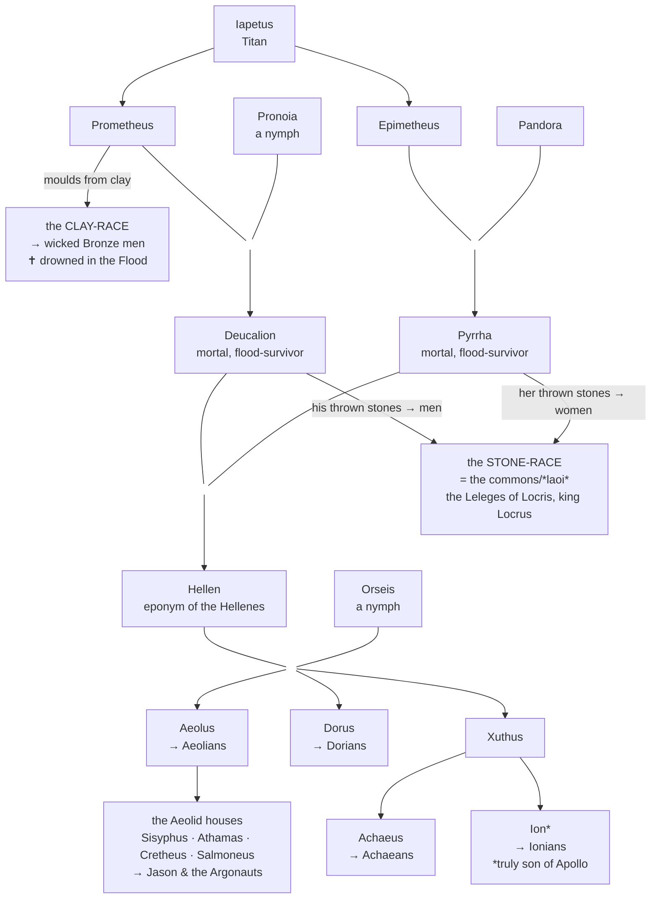
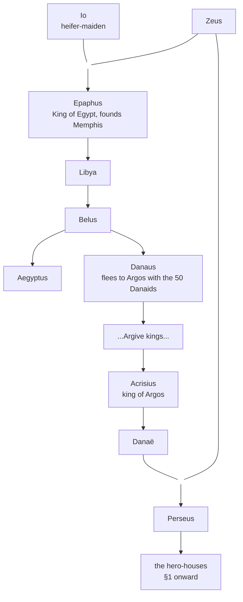
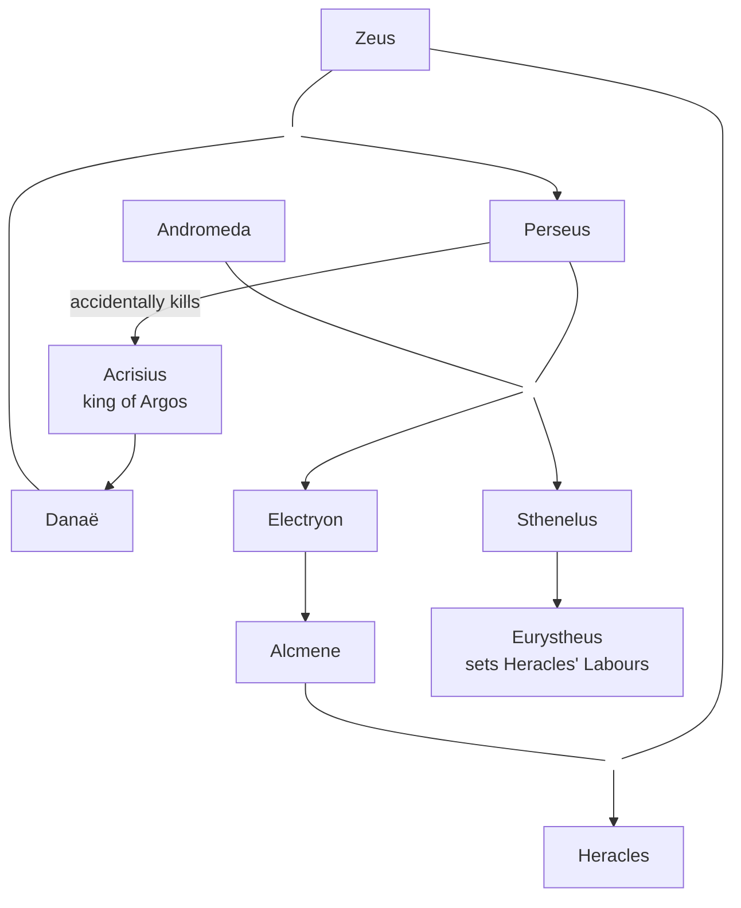
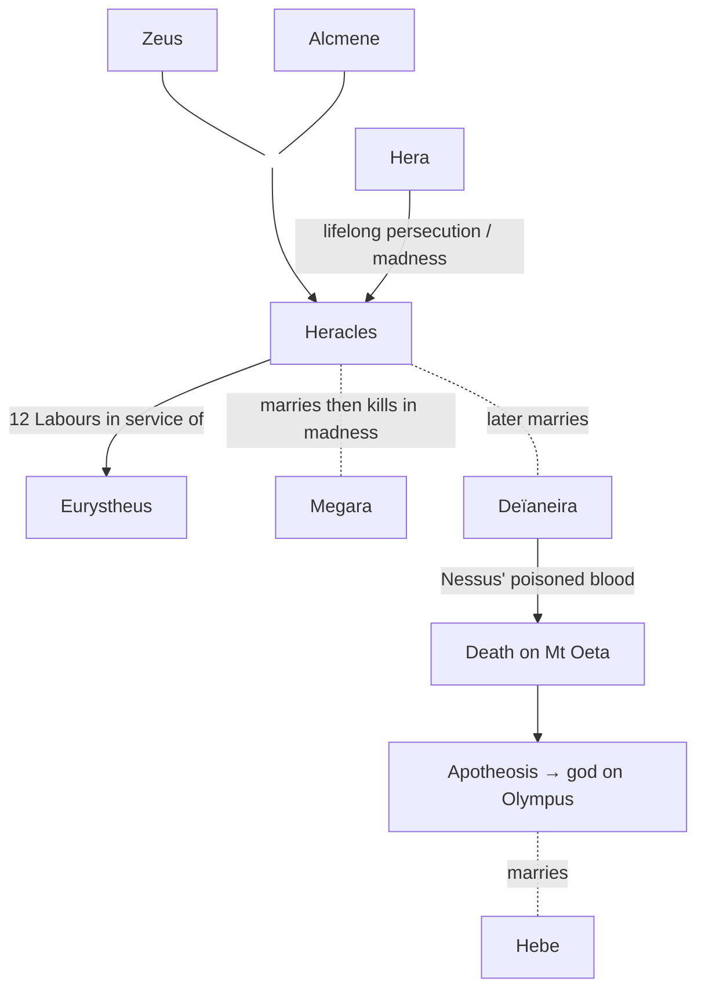
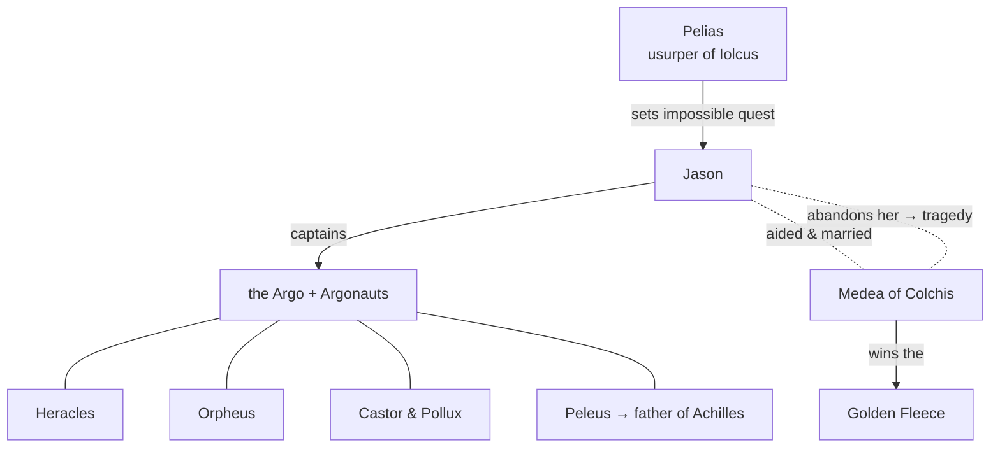
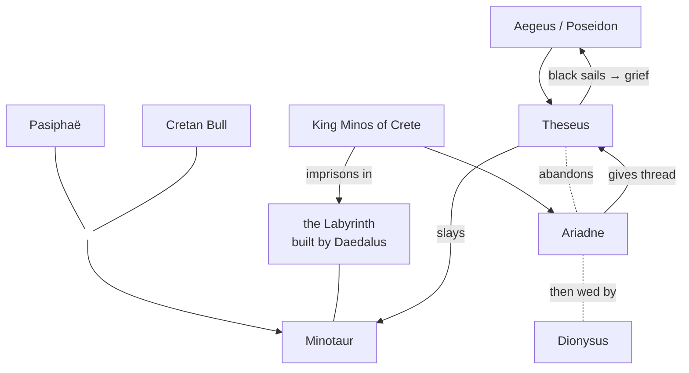

# Greek Mythology — Chronological Order, Part III: The Age of Heroes

> [!info] Scope of this note
> **Part III — the Age of Heroes (the Bronze/Heroic Age).**
> With the divine order settled ([[Part 2 - The Age of Gods|Part II]]), the myths turn to **mortals fathered or favoured by the gods** who tame the monsters born of Typhon and Echidna. This covers the great hero-cycles in roughly the order the legendary chronologies place them: **Perseus → Bellerophon → Heracles → the Argonauts → Theseus.** These generations overlap — Heracles even sails briefly with the Argonauts — so "chronology" here means genealogical sequence, not fixed dates.

> [!note] Continuity & sources
> Continues from [[Part 2 - The Age of Gods|Part II: The Age of Gods]]. Primary sources shift from Hesiod toward the mythographers and tragedians:
> - **Apollodorus, *Bibliotheca* 2–3, *Epitome*** — the systematic backbone for every hero here.
> - **Pindar, *Odes*** — Perseus, Bellerophon, Jason (Pythian 4, 10; Olympian 13).
> - **Apollonius of Rhodes, *Argonautica*** — the definitive Argonaut epic.
> - **Ovid, *Metamorphoses*** — Perseus & Medusa, Minotaur, Daedalus.
> - **Euripides, Sophocles** — the tragic hero-plays.
> - Legendary datings (Parada / Marmor Parium): Labours of Heracles ~1263 BC, Argonauts ~1263 BC, Theseus ~1230s BC — all shortly before the [[Part 4 - Thebes & the Trojan War|Trojan War]].

---

## 0. The Line of Mankind — from the Flood to the Heroes

Before the heroes, a bridge: **how the human race grew from its re-creation after the Flood into the royal houses that produce Perseus, Heracles and the rest.** The gods are settled ([[Part 2 - The Age of Gods|Part II]]); now mortals multiply into peoples and kings.

### From clay and stones to the first peoples

Humanity does not descend from one couple — it comes in **layers**, and the sources make a sharp distinction between beings who are **born** (gods and their offspring, produced by union) and beings who are **made** (mortals, manufactured from clay or stone). Keeping the two apart resolves almost every apparent contradiction below.

> [!abstract] Born vs made — the key distinction
> - **The divine line is *born*.** Prometheus and Epimetheus are **Titans** — sons of Iapetus, born the ordinary way, back to the primordial Sky and Earth. When Prometheus fathers **Deucalion** (on the Oceanid **Pronoia**) and Epimetheus fathers **Pyrrha** (on **Pandora**), these are *births*, not sculptures. Deucalion and Pyrrha are cousins.
> - **Mankind is *made*.** As a craftsman (not a father), Prometheus **moulds mortals from clay**; after the Flood, humanity is remade **from stones**. These have no divine parent.
> - **Why is Deucalion mortal, if his father is a Titan?** Because divinity in Greek myth is a *status*, not an inherited substance — a god's child is not automatically a god (all the demigod-heroes prove it). Deucalion's mother is only a nymph (the fading end of divinity), and his mythic *role* is to be the human flood-survivor. So the tradition simply treats him as a mortal man. He is neither god nor "demigod" (that term is reserved for the mortal-plus-god heroes of the Heroic Age, below).

**The three layers of mortals:**
1. **The clay-race** — Prometheus's original moulded humans, who over the Ages of Man degenerate into the wicked **Bronze race** and are wiped out by Zeus's **Flood**.
2. **The hinge** — **Deucalion & Pyrrha**, divinely-descended mortals who *live among* the clay-race but outlast it, the only two survivors of the Flood.
3. **The post-Flood world** — repopulated **two ways at once**: the anonymous **stone-race** (the commons) and the survivors' **own bloodline** (the kings and Greek tribes, via their son **Hellen**).

> [!note] First man · first woman · first king
> - **First man:** there is no single "Adam." Prometheus's clay-men are collective; the first *named* man and **first mortal king** is usually **Phoroneus** of Argos (son of the river-god Inachus) — first to gather scattered people into a community and to use fire (Pausanias 2.15). Arcadian tradition instead names **Pelasgus** as its autochthonous (earth-born) first man.
> - **First woman:** **Pandora** — but note she is *made separately*, as Zeus's punishment-gift to mankind (Part I §8), not from the first men. Greek man and woman have different origins (no Eve-from-a-rib).
> - **First king:** **Phoroneus** (Argive tradition); **Deucalion** is sometimes called first king of the post-Flood world.

#### The stone-race — where the common people come from

> [!quote] Source — Ovid, *Metamorphoses* 1.313–415; Pindar, *Olympian* 9.42–46; Hesiod, *Catalogue* fr. 82; Apollodorus 1.7.2
> Only Deucalion and Pyrrha survive the Flood. At the temple of **Themis** they receive a riddling oracle: *"veil your heads, loosen your robes, and throw behind you the bones of your great mother."* Pyrrha refuses to scatter her mother's bones — until Deucalion decodes it: the "great mother" is **Earth (Gaia)**, and her "bones" are **stones**. The stones they throw soften, take rough human shape "like half-carved marble," and come alive: **Deucalion's stones became men, Pyrrha's became women.** *(In the older tradition it is **Hermes**, not Themis, who gives the instruction directly.)*

This is an **aetiology** built on a Greek pun that can't survive translation: **λᾶας** (*laas*, "stone") sounds like **λαός** (*laos*, "the people"). So "the people came from stones" is written into the language itself — and Ovid draws the moral that humans are therefore a *genus durum*, a **hard race**, tough and made for toil, because we are sprung from rock.

**Do any stones become named kings?** The stone-race stays *collective* — it is the **commons**, not individual heroes. But the sources do give it an identity and a ruler: Hesiod (*Catalogue* fr. 82, via Strabo) names the stone-born people the **Leleges** of **Locris**, whom *"Zeus gave to Deucalion"* under the chieftain **Locrus** — and **Pindar** says the **kings of Locris descend from that stone-race**. So the stones become *a people with a king*, not a lineage of famous individuals. The **pivotal names** of Greek myth come instead from the survivors' own son — **Hellen**.

#### The Hellenic line — where the kings and tribes come from

Deucalion and Pyrrha's own son **Hellen** is the eponymous ancestor of all Greeks (the *Hellenes*). With the nymph **Orseis** *(named Othreis / Phthia in variant sources)* he fathers the founders of the four Greek tribes — and from **Aeolus** springs the vast Aeolid house (Sisyphus, Athamas, Cretheus, Salmoneus) that leads on to Jason and the Argonauts.



### The Egyptian line — Io to Perseus

A second human line runs **through Egypt** and converges on the same heroes. **Io**, a priestess loved by Zeus, is turned into a heifer and driven to Egypt, where she bears **Epaphus**, who becomes **King of Egypt** and founds Memphis. From his line come the twin kings **Aegyptus** and **Danaus**; Danaus flees back to **Argos** with his fifty daughters (the **Danaids**), returning the line to Greece — where it descends to **Acrisius**, **Danaë**, and **Perseus**, and so to **Heracles**.



> [!tip] Why this matters
> These two trees are the **human spine of the mythos**: divine creation → the Flood → the Greek peoples (Hellen) and the Egyptian-Argive kings (Io → Perseus). Every hero below hangs off this frame. Perseus (§1) is where the two threads meet the narrative — so his story opens the Age of Heroes.

---

## 1. Perseus — the First Great Hero
*Legendary date: **c. –1365 BC** (birth) · **–1344 BC** (slays Medusa) — St Jerome's chronology, see the timeline table below.*

### Danaë and the shower of gold

![[files/greek-mythology/14-danae-klimt.jpg|380]]
*"Danaë" — Gustav Klimt, 1907. [Public domain, Wikimedia Commons](https://commons.wikimedia.org/wiki/File:Klimt_Danae.jpg).*

> [!quote] Source — Apollodorus, *Bibliotheca* 2.4.1
> King **Acrisius** of Argos was warned by an oracle that his daughter **Danaë's** son would kill him. He locked her in a bronze chamber — but **Zeus** came to her as a **shower of golden rain**, and she bore **Perseus**. Acrisius set mother and child adrift in a chest; they washed ashore on **Seriphos**, where the fisherman Dictys raised the boy.

### The slaying of Medusa

![[files/greek-mythology/15-perseus-medusa-cellini.jpg|480]]
*"Perseus with the Head of Medusa" — Benvenuto Cellini, 1545–54, Loggia dei Lanzi, Florence. [Public domain, Wikimedia Commons](https://commons.wikimedia.org/wiki/File:Benvenuto_Cellini-Perseus_With_the_Head_of_Medusa-The_Loggia_dei.jpg).*

King **Polydectes** of Seriphos, wanting Danaë, sent Perseus on a suicidal errand: **the head of the Gorgon Medusa** (whose gaze turned onlookers to stone). Aided by the gods — **Hermes'** winged sandals, **Athena's** mirror-shield, **Hades'** helm of invisibility, and the *kibisis* (bag) — Perseus:
- forced the **Graeae** (who shared one eye) to reveal the nymphs holding the gear;
- beheaded Medusa by looking only at her reflection.
- From Medusa's severed neck sprang **Pegasus** (the winged horse) and **Chrysaor**.

**On the way home** he rescued the princess **Andromeda**, chained to a rock as a sacrifice to a sea-monster, and married her. Returning to Seriphos, he turned Polydectes to stone with the head. He later gave the head to Athena (who set it on her **aegis**).

> [!note] The prophecy fulfilled
> At a funeral games, Perseus threw a discus that struck and killed an old man in the crowd — **Acrisius**, his grandfather. The oracle came true despite every precaution: a recurring Greek theme (compare Oedipus in [[Part 4 - Thebes & the Trojan War|Part IV]]).



*Perseus is the great-grandfather of **Heracles** — the hero-lines are one family.*

---

## 2. Bellerophon — Rider of Pegasus
*Legendary date: **not dated** in St Jerome's chronology (a contemporary of the early heroes).*

![[files/greek-mythology/16-bellerophon-chimera-mosaic.jpg|480]]
*Bellerophon on Pegasus slaying the Chimera — Roman mosaic, 2nd–3rd c. AD, Rolin Museum, Autun. [Public domain, Wikimedia Commons](https://commons.wikimedia.org/wiki/File:Bellerophon_riding_Pegasus_and_killing_the_Chimera,_Roman_mosaic,_the_Rolin_Museum_in_Autun,_France,_2nd_to_3rd_century_AD.jpg).*

> [!quote] Source — Homer, *Iliad* 6.155–202; Pindar, *Olympian* 13; Apollodorus 2.3
> **Bellerophon** of Corinth, falsely accused by Stheneboea (whose advances he refused), was sent to King Iobates of Lycia bearing a sealed letter demanding his death (the original "**Bellerophon's letter**"). Set the impossible task of killing the **Chimera** — a fire-breathing lion-goat-serpent, offspring of Typhon — he first tamed the winged horse **Pegasus** with a golden bridle given by **Athena**, then killed the monster from the air.

**His fall:** grown arrogant, Bellerophon tried to fly Pegasus up to Olympus itself. Zeus sent a gadfly to sting the horse; Bellerophon was thrown and spent his last years crippled and shunned — the archetypal warning against *hubris*.

---

## 3. Heracles — the Greatest of the Heroes
*Legendary date: **c. –1258 to –1246 BC** (the Twelve Labours) · **–1226 BC** (death & apotheosis).*

![[files/greek-mythology/17-heracles-farnese.jpg|480]]
*"Farnese Hercules" — Roman marble (Glykon, after Lysippos), 3rd c. AD, Naples. [Public domain, Wikimedia Commons](https://commons.wikimedia.org/wiki/File:Herakles_Farnese_MAN_Napoli_Inv6001_n01.jpg).*

> [!quote] Source — Apollodorus, *Bibliotheca* 2.4.8–2.7; Euripides, *Heracles*
> Son of **Zeus** and the mortal **Alcmene** (granddaughter of Perseus). Hera, forever jealous, persecuted him from birth — sending serpents to his cradle (which the infant strangled). Driven **mad by Hera**, Heracles killed his own wife **Megara** and their children. To purify this blood-guilt, the oracle at Delphi sent him to serve his cousin **King Eurystheus** of Mycenae, who imposed the **Twelve Labours**.

### The Twelve Labours

| # | Labour | Monster's origin |
| --- | --- | --- |
| 1 | Slay the **Nemean Lion** | offspring of Typhon/Echidna |
| 2 | Slay the **Lernaean Hydra** | offspring of Typhon/Echidna |
| 3 | Capture the **Ceryneian Hind** | sacred to Artemis |
| 4 | Capture the **Erymanthian Boar** | — |
| 5 | Clean the **Augean Stables** in one day | — |
| 6 | Drive off the **Stymphalian Birds** | — |
| 7 | Capture the **Cretan Bull** | (father of the Minotaur, §5) |
| 8 | Steal the **Mares of Diomedes** | man-eating horses |
| 9 | Fetch the **Girdle of Hippolyta** | queen of the Amazons |
| 10 | Fetch the **Cattle of Geryon** | three-bodied giant |
| 11 | Fetch the **Apples of the Hesperides** | guarded by Ladon; Atlas's aid |
| 12 | Bring up **Cerberus** from the underworld | offspring of Typhon/Echidna |

> [!tip] Why the Labours matter
> Notice how many monsters are **Typhon-and-Echidna's brood** from [[Part 2 - The Age of Gods|Part II]] — Heracles is systematically clearing the world of the chaos-creatures that survived the gods' wars. He also fought in the **Gigantomachy** (Part II) as the mortal the gods required.

**Death and apotheosis:** poisoned unwittingly by the centaur **Nessus'** tainted blood (via his wife Deïaneira), Heracles built his own pyre on **Mount Oeta**. His mortal part burned away; **Zeus raised him to Olympus** as a god, reconciled at last with Hera, and married to **Hebe**. He is the only hero to become fully divine.



---

## 4. Jason and the Argonauts — the Quest for the Golden Fleece
*Legendary date: **c. –1246 BC**.*

![[files/greek-mythology/19-golden-fleece-draper.jpg|480]]
*"The Golden Fleece" — Herbert James Draper, 1904. [Public domain, Wikimedia Commons](https://commons.wikimedia.org/wiki/File:Herbert_James_Draper,_The_Golden_Fleece.jpg).*

> [!quote] Source — Apollonius of Rhodes, *Argonautica*; Pindar, *Pythian* 4; Apollodorus 1.9
> **Jason's** uncle **Pelias** had usurped the throne of Iolcus. When Jason arrived (wearing a single sandal — the man the oracle warned Pelias about), Pelias set him an impossible quest: fetch the **Golden Fleece** from distant **Colchis**. Jason assembled the greatest heroes of the age — the **Argonauts** — aboard the ship *Argo*.

**The crew** included (in various tellings) **Heracles**, **Orpheus** (whose music calmed storms and later the Sirens), **Castor and Pollux** (the Dioscuri), **Atalanta**, **Peleus** (future father of Achilles), and **Telamon**.

**The voyage** — a chain of episodes: the women of Lemnos; the Harpies tormenting blind prophet **Phineus** (freed by the winged Boreads); the **Clashing Rocks (Symplegades)**, passed by releasing a dove first. At Colchis, King **Aeëtes** demanded Jason yoke fire-breathing bulls and sow dragon's teeth. The king's daughter, the sorceress **Medea**, fell in love with Jason (via Hera and Aphrodite's scheme) and helped him win the Fleece past its sleepless dragon.

**Aftermath:** the couple fled; Medea's magic and ruthlessness (she killed her own brother to delay pursuit) secured escape. Their story ends in tragedy at Corinth — when Jason abandoned her for another bride, **Medea** killed their children in revenge (**Euripides, *Medea***).



---

## 5. Theseus — Hero of Athens
*Legendary date: **c. –1271 BC** (birth) · **–1252 BC** (slays the Minotaur).*

![[files/greek-mythology/18-theseus-minotaur-canova.jpg|480]]
*"Theseus and the Minotaur" — Antonio Canova, 1781–83, Victoria & Albert Museum. [Public domain, Wikimedia Commons](https://commons.wikimedia.org/wiki/File:Antonio_Canova-Theseus_and_the_Minotaur-Victoria_and_Albert_Museum.jpg).*

> [!quote] Source — Plutarch, *Life of Theseus*; Apollodorus, *Epitome* 1; Ovid, *Metamorphoses* 8
> **Theseus**, son of King **Aegeus** of Athens (or of Poseidon), grew up far away, then journeyed to Athens clearing the road of bandits (Periphetes, Sinis, Procrustes, and others) — his "labours" mirroring Heracles', whom he consciously emulated.

### The Minotaur and the Labyrinth

Athens was forced to send **seven youths and seven maidens** as tribute to Crete, to be devoured by the **Minotaur** — a bull-headed man, offspring of Queen **Pasiphaë** and the Cretan Bull, kept in the **Labyrinth** built by the craftsman **Daedalus**. Theseus volunteered. King Minos's daughter **Ariadne** fell in love and gave him a **ball of thread** to retrace his path; Theseus killed the Minotaur and escaped.

**The tragic homecoming:** he abandoned Ariadne on Naxos (where **Dionysus** took her as bride), then **forgot to change his black sails to white** — the agreed signal of success. Seeing black sails, his father **Aegeus** threw himself into the sea, which bears his name ever after (the **Aegean**).

> [!note] Daedalus and Icarus
> Imprisoned by Minos for aiding Theseus, **Daedalus** built wax-and-feather wings to escape with his son **Icarus** — who flew too near the sun, melted his wings, and fell to his death. Another *hubris* parable, twinned with Bellerophon's.



---

## Quick-reference timeline (Part III)

> [!abstract]+ Timeline — Part III at a glance
> ```mermaid
> timeline
>     title Part III — the Age of Heroes (one overlapping family)
>     section The Argive line
>         –1365 birth · –1344 : PERSEUS — slays Medusa, Pegasus born, rescues Andromeda
>         undated : BELLEROPHON — tames Pegasus, kills the Chimera, falls in hubris
>     section The great Labours
>         –1258 to –1246 Labours · –1226 death : HERACLES — the Twelve Labours, Gigantomachy, apotheosis
>         –1246 : the ARGONAUTS — Jason & Medea win the Golden Fleece
>     section Attica's hero
>         –1271 birth · –1252 : THESEUS — slays the Minotaur, unites Attica
> ```

> [!warning] About the dates
> The **Legendary date (BC)** column follows **St Jerome's** ancient chronology (via Apollodorus / Diodorus / Eusebius), tabulated by [Abagond](https://abagond.wordpress.com/2023/06/30/greek-myths-in-chronological-order/) — a legendary reconstruction, **not** real history. Bellerophon is **not dated** in that source; marked "—".

| Seq | Legendary date (BC) | Hero-cycle | Key deed | Primary source |
| --- | --- | --- | --- | --- |
| 1 | **–1365** (birth) · **–1344** | **Perseus** | Slays Medusa; Pegasus born; rescues Andromeda | Apollodorus 2.4; Ovid *Met.* 4 |
| 2 | **—** *(not dated)* | **Bellerophon** | Tames Pegasus; kills the Chimera; falls in hubris | *Iliad* 6; Pindar *Ol.* 13 |
| 3 | **–1258 to –1246** (Labours) · **–1226** (death) | **Heracles** | The Twelve Labours; Gigantomachy; apotheosis | Apollodorus 2.4–2.7 |
| 4 | **–1246** | **Argonauts** | Jason + Medea win the Golden Fleece | Apollonius, *Argonautica* |
| 5 | **–1271** (birth) · **–1252** (Minotaur) | **Theseus** | Slays the Minotaur in the Labyrinth; unites Attica | Plutarch, *Theseus* |

> [!info] These generations overlap
> Perseus is Heracles' great-grandfather; Heracles sails (briefly) with the Argonauts; Theseus is Heracles' contemporary and admirer; Peleus the Argonaut fathers **Achilles**, hero of the [[Part 4 - Thebes & the Trojan War|Trojan War]]. The Heroic Age is essentially **one extended family**, converging on Troy.

---

## Sources & further reading

- **Apollodorus**, *Bibliotheca* Books 2–3 & *Epitome* — [Perseus](https://www.perseus.tufts.edu/hopper/text?doc=Perseus:text:1999.01.0022).
- **Apollonius of Rhodes**, *Argonautica* — the Argonaut epic.
- **Pindar**, *Odes* (Pythian 4 & 10, Olympian 13) — Perseus, Bellerophon, Jason.
- **Ovid**, *Metamorphoses* Books 4 & 8 — Perseus/Medusa, Minotaur, Daedalus & Icarus.
- **Plutarch**, *Life of Theseus*; **Euripides**, *Heracles* & *Medea*.

*Illustrations are public-domain artworks from Wikimedia Commons, stored locally in `files/greek-mythology/`.*

> [!todo] Navigation
> ← **Part II:** [[Part 2 - The Age of Gods|The Age of Gods]]
> ← **Part I:** [[Part 1 - Creation & the Titanomachy|Creation → the Titanomachy]]
> → **Part IV:** [[Part 4 - Thebes & the Trojan War|Thebes & the Trojan War]] — the House of Thebes (Cadmus, Oedipus, Seven Against Thebes) and the Trojan War cycle: the culmination and end of the Heroic Age.
