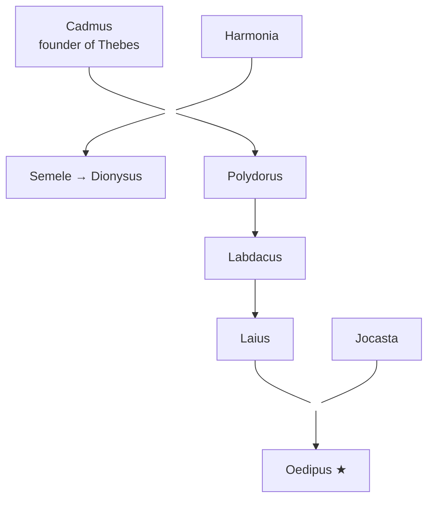
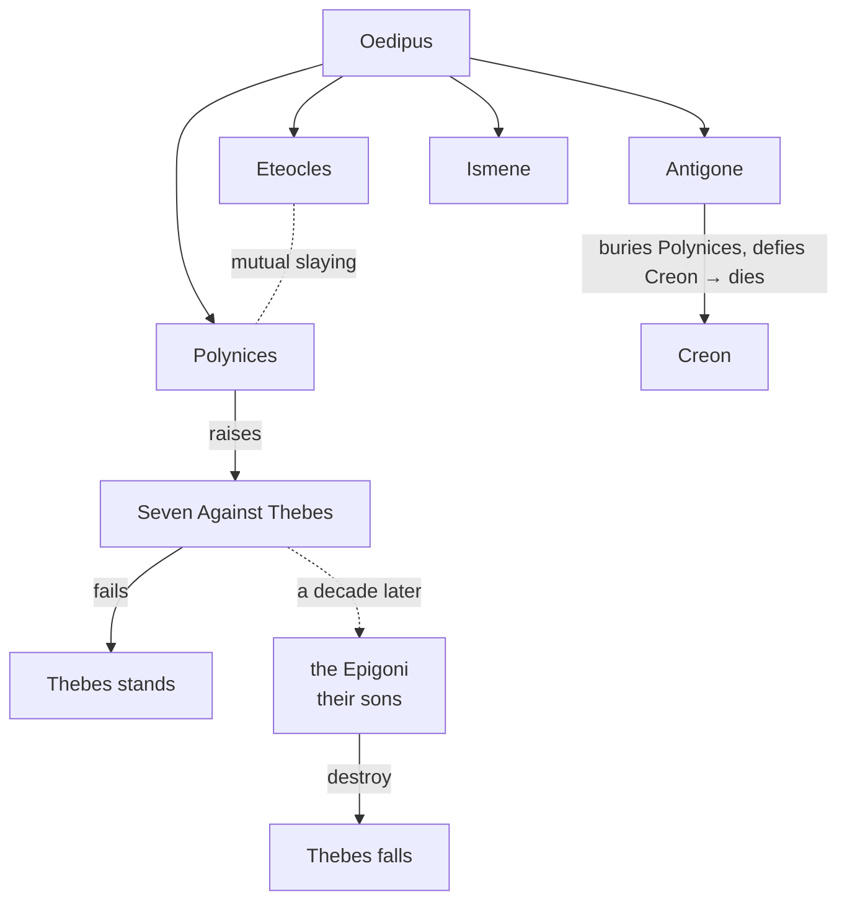
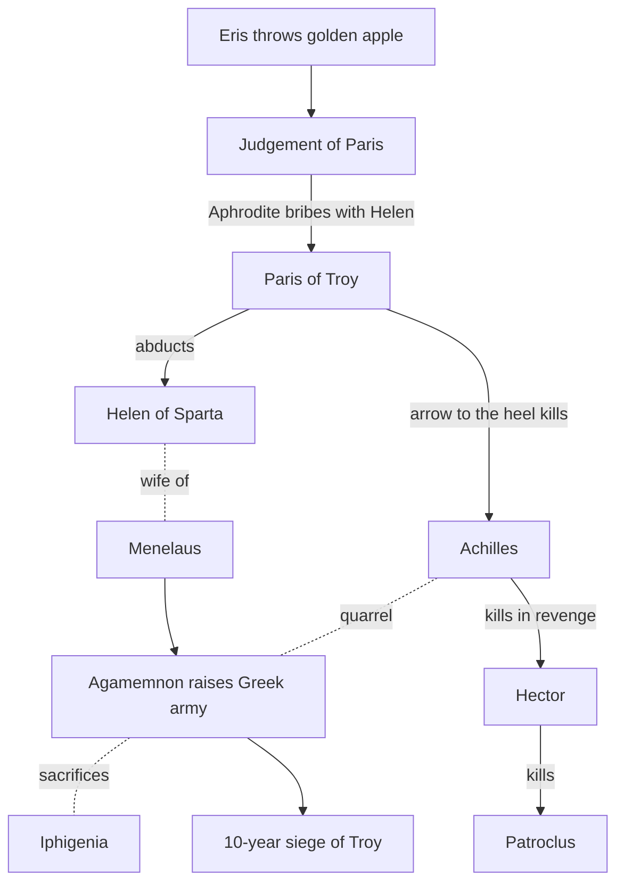

# Greek Mythology — Chronological Order, Part IV: Thebes & the Trojan War

> [!info] Scope of this note
> **Part IV — the two great saga-cycles that close the Heroic Age: the House of Thebes and the Trojan War.**
> Following the individual hero-quests of [[Part 3 - The Age of Heroes|Part III]], myth now turns to **doomed dynasties and total war**. First the cursed royal line of **Thebes** (Cadmus → Oedipus → the wars over the city); then the **Trojan War** — the event toward which the whole Heroic Age has been converging — and its long aftermath, the **Odyssey**. After Troy, the age of heroes ends and myth gives way to legendary history.

> [!note] Continuity & sources
> Continues from [[Part 3 - The Age of Heroes|Part III: The Age of Heroes]]. Sources here are the richest in all of Greek myth:
> - **Homer, *Iliad* & *Odyssey*** (c. 8th c. BC) — the war's central episodes and Odysseus's return.
> - **The Epic Cycle** (*Cypria*, *Aethiopis*, *Little Iliad*, *Iliou Persis*, *Nostoi*, *Telegony* — mostly lost, known via summaries) — the parts of the war Homer omits.
> - **The Theban plays** — **Sophocles**, *Oedipus Rex*, *Oedipus at Colonus*, *Antigone*; **Aeschylus**, *Seven Against Thebes*, *Oresteia*.
> - **Apollodorus, *Bibliotheca* 3 & *Epitome*** — systematic mythography for both cycles.
> - **Virgil, *Aeneid*** (Roman) — the fall of Troy from the Trojan side, and the bridge to Rome.
> - Legendary datings (Marmor Parium / Eratosthenes): fall of Troy commonly given as **1184 BC**.

---

## PART A — THE HOUSE OF THEBES
*Legendary span: **c. –1437 to –1215 BC** (St Jerome's chronology — see the timeline table below).*

## 1. Cadmus Founds Thebes
*Legendary date: **c. –1437 BC**.*

> [!info] Chronology note — the earliest event in this note
> Thebes is kept together here for narrative cohesion, but Cadmus (**–1437 BC**) is actually the **earliest mortal-age event of Parts III–IV** — it predates every hero of the [[Part 3 - The Age of Heroes|Age of Heroes]] (Perseus begins **–1365**) and even the birth of his own grandson **Dionysus** ([[Part 2 - The Age of Gods#6. The Birth of Dionysus — the Last Olympian|Part II §6]], **–1420**). By strict date, read this section *before* Part III. See the [[Part 5 - Master Timeline (by date)|strict chronology index]].

![[files/greek-mythology/20-cadmus-dragon-zuccarelli.jpg|480]]
*"Cadmus Killing the Dragon" — Francesco Zuccarelli, 18th c. [Public domain, Wikimedia Commons](https://commons.wikimedia.org/wiki/File:Cadmus_killing_the_Dragon_by_Francesco_Zuccarelli.jpg).*

> [!quote] Source — Apollodorus, *Bibliotheca* 3.4.1; Ovid, *Metamorphoses* 3
> **Cadmus**, a Phoenician prince, was sent by his father to find his sister **Europa** (abducted by Zeus as a bull) and forbidden to return without her. The oracle at Delphi told him to abandon the search, follow a cow, and found a city where it lay down. At the site he slew a **dragon sacred to Ares** and, on Athena's advice, **sowed its teeth** in the earth. Armed men (the **Spartoi**, "sown men") sprang up and fought until only five remained — the founding nobility of **Thebes**.

Cadmus married **Harmonia** (daughter of Ares and Aphrodite) — a wedding attended by the gods. But the dragon was Ares' creature, and a **curse** shadowed the line ever after. Their descendants include **Semele** (mother of [[Part 2 - The Age of Gods|Dionysus]]) and, generations later, **Laius**.



---

## 2. Oedipus — the Cursed King
*Legendary date: **c. –1269 to –1235 BC**.*

![[files/greek-mythology/21-oedipus-sphinx-ingres.jpg|480]]
*"Oedipus and the Sphinx" — Jean-Auguste-Dominique Ingres, 1808/1827. [Public domain, Wikimedia Commons](https://commons.wikimedia.org/wiki/File:Oedipus_and_Sphinx_(Ingres).jpg).*

> [!quote] Source — Sophocles, *Oedipus Rex*; Apollodorus 3.5.7–9
> King **Laius** of Thebes was warned that his own son would kill him and marry his wife **Jocasta**. When **Oedipus** was born, Laius pierced the infant's feet and left him to die on a mountain — but a shepherd saved him, and he grew up in Corinth believing the Corinthian king his father.

**The prophecy grinds on** (the classic Greek irony — every act to escape fate fulfils it):
- Learning of a prophecy that he would kill his father and wed his mother, Oedipus **fled Corinth** (from the wrong parents).
- On the road he quarrelled with and **killed a stranger** — Laius, his true father.
- At Thebes he answered the riddle of the **Sphinx** (*"What walks on four legs in the morning, two at noon, three in the evening?"* — *Man*), destroying her. As reward he was made king and **married the widowed queen — Jocasta, his mother.**

When plague struck Thebes and the truth was uncovered, **Jocasta hanged herself** and **Oedipus blinded himself** with her brooches, going into exile. His children were also his siblings: **Eteocles, Polynices, Antigone, Ismene.**

---

## 3. The Wars over Thebes
*Legendary date: **c. –1225 BC** (Seven Against Thebes) · **c. –1215 BC** (the Epigoni destroy Thebes).*

**Seven Against Thebes** — Oedipus's sons **Eteocles** and **Polynices** agreed to share the throne in alternate years, but Eteocles refused to yield. Polynices raised an army under seven champions (Adrastus, Tydeus, Capaneus, Amphiaraus, and others) to attack the city's seven gates.

> [!quote] Source — Aeschylus, *Seven Against Thebes*; Apollodorus 3.6
> The assault failed; most of the Seven died. **Eteocles and Polynices killed each other** in single combat — the curse of the house consuming the last brothers. Creon, now regent, forbade Polynices' burial as a traitor.

**Antigone** — Oedipus's daughter **Antigone** defied Creon's edict to bury her brother, was condemned, and hanged herself — triggering the suicides of Creon's son and wife (**Sophocles, *Antigone***).

**The Epigoni** — a decade later the **sons** of the Seven ("the Epigoni") returned and **destroyed Thebes**, avenging their fathers. This ends the Theban cycle just as the Trojan generation comes of age.



---

## PART B — THE TROJAN WAR
*Legendary span: **c. –1203 to –1173 BC**, anchored on the Fall of Troy (**–1183/–1184 BC**).*

## 4. The Seeds of War — the Judgement of Paris
*Legendary date: **c. –1203 BC** (abduction of Helen).*

![[files/greek-mythology/22-judgement-paris-rubens.jpg|480]]
*"The Judgement of Paris" — Peter Paul Rubens, c. 1636. [Public domain, Wikimedia Commons](https://commons.wikimedia.org/wiki/File:Peter_Paul_Rubens_-_The_Judgement_of_Paris_-_WGA20277.jpg).*

> [!quote] Source — *Cypria* (Epic Cycle); Apollodorus, *Epitome* 3.1–2
> At the wedding of **Peleus** (the Argonaut, [[Part 3 - The Age of Heroes|Part III]]) and the sea-nymph **Thetis** — parents of **Achilles** — **Eris** (Strife), uninvited, threw down a golden apple marked *"to the fairest."* **Hera, Athena, and Aphrodite** each claimed it. Zeus made the Trojan prince **Paris** judge. Each goddess offered a bribe; Paris chose **Aphrodite**, who promised him **Helen** — the most beautiful woman in the world, already wife of **Menelaus** of Sparta.

Paris sailed to Sparta and carried Helen off to Troy. Menelaus and his brother **Agamemnon** (king of Mycenae) invoked the oath sworn by all Helen's former suitors and raised a **pan-Greek army** to bring her back. A thousand ships gathered at Aulis; to gain fair winds, Agamemnon **sacrificed his own daughter Iphigenia** — a crime that would later kill him.

---

## 5. The *Iliad* — the Wrath of Achilles
*Legendary date: **c. –1193 to –1184 BC** (the war's tenth year).*

![[files/greek-mythology/23-wrath-achilles-rubens.jpg|480]]
*"The Wrath of Achilles" — Peter Paul Rubens, c. 1630–35. [Public domain, Wikimedia Commons](https://commons.wikimedia.org/wiki/File:Peter_Paul_Rubens_-_The_Wrath_of_Achilles_-_Google_Art_Project.jpg).*

> [!quote] Source — Homer, *Iliad* (the war's tenth year)
> The *Iliad* covers only a few weeks of the **ten-year** siege. It opens with a quarrel: **Agamemnon** seizes **Achilles'** war-prize Briseis, and the enraged Achilles **withdraws from the fighting**. Without him the Greeks are driven back to their ships.

**The turning point:**
- Achilles' beloved companion **Patroclus** borrows his armour to rally the Greeks — and is **killed by the Trojan prince Hector**.
- Consumed by grief and fury, Achilles returns, routs the Trojans, and **kills Hector**, dragging his body round the walls.
- The poem ends with **Priam**, Troy's aged king, secretly begging Achilles for his son's body — a moment of shared humanity — and Hector's funeral.

**Beyond the *Iliad*** (Epic Cycle): **Achilles** is later killed by an arrow from Paris (guided by Apollo) to his **heel** — his one vulnerable spot. **Paris** is killed in turn; the war grinds toward its trick ending.



---

## 6. The Fall of Troy — the Wooden Horse
*Legendary date: **c. –1183 BC** (traditionally –1184 BC).*

![[files/greek-mythology/24-trojan-horse-tiepolo.jpg|480]]
*"The Procession of the Trojan Horse into Troy" — Giovanni Domenico Tiepolo, c. 1760. [Public domain, Wikimedia Commons](https://commons.wikimedia.org/wiki/File:Giovanni_Domenico_Tiepolo_-_The_Procession_of_the_Trojan_Horse_in_Troy_-_WGA22382.jpg).*

> [!quote] Source — *Iliou Persis* (Epic Cycle); Virgil, *Aeneid* 2; Apollodorus, *Epitome* 5
> Unable to take Troy by force, **Odysseus** devised the **Wooden Horse**: the Greeks built a huge hollow horse, hid their best warriors inside, and sailed away as if giving up. The Trojans, ignoring the warnings of the priest **Laocoön** (strangled with his sons by sea-serpents) and the prophetess **Cassandra**, dragged the horse inside their walls as a trophy.

That night the hidden Greeks emerged, opened the gates, and Troy was **sacked and burned**. King Priam was slaughtered at his altar; Hector's infant son thrown from the walls; the Trojan women taken as slaves. Only **Aeneas** escaped, carrying his father — to found the line that (in Roman myth) leads to **Rome** (*Aeneid*).

---

## 7. The *Odyssey* — the Long Way Home
*Legendary date: **c. –1183 to –1173 BC**.*

![[files/greek-mythology/25-ulysses-sirens-draper.jpg|380]]
*"Ulysses and the Sirens" — Herbert James Draper, 1909. [Public domain, Wikimedia Commons](https://commons.wikimedia.org/wiki/File:Herbert_James_Draper,_Ulysses_and_the_Sirens,_1909.jpg).*

> [!quote] Source — Homer, *Odyssey*
> The *nostoi* ("returns") of the Greek heroes were mostly disastrous. **Odysseus** took **ten more years** to reach home to Ithaca, blown across a world of marvels: the **Lotus-Eaters**; the Cyclops **Polyphemus** (whom he blinds, earning Poseidon's wrath); the witch **Circe**; the **Sirens**; the monsters **Scylla and Charybdis**; the cattle of the Sun; and years held by the nymph **Calypso**.

Returning at last disguised as a beggar, Odysseus found his palace overrun by **suitors** pressing his faithful wife **Penelope**. With his son **Telemachus**, he **slaughtered the suitors** and reclaimed his household — the last great deed of the Heroic Age.

> [!note] Agamemnon's homecoming — the other kind of *nostos*
> Not all returns were triumphant. **Agamemnon** came home to Mycenae and was **murdered by his wife Clytemnestra** (avenging Iphigenia) and her lover. His son **Orestes** later killed her in revenge, was pursued by the **Erinyes** (the Furies of [[Part 1 - Creation & the Titanomachy|Part I]]), and was finally **acquitted at Athens** by a jury under Athena — the mythical founding of the law-court, ending the cycle of blood-vengeance (**Aeschylus, *Oresteia***).

---

## Quick-reference timeline (Part IV)

> [!abstract]+ Timeline — Part IV at a glance
> ```mermaid
> flowchart TD
>     classDef sec fill:#e8e8e8,stroke:#888,font-weight:bold,color:#000;
>     classDef ev fill:#fff,stroke:#bbb,color:#000;
>     TITLE["<b>Part IV — Thebes & the Trojan War (the anchor is Troy's fall, –1183)</b>"]:::sec
>     S1["The House of Thebes"]:::sec
>     E1_1["–1437 · CADMUS founds Thebes; sows the dragon's teeth"]:::ev
>     E1_2["–1269 to –1235 · OEDIPUS kills Laius, answers the Sphinx, weds Jocasta"]:::ev
>     E1_3["–1225 Seven · –1215 Epigoni · Seven Against Thebes; Antigone; Epigoni destroy Thebes"]:::ev
>     S2["The Trojan War"]:::sec
>     E2_1["–1203 · Judgement of Paris → abduction of Helen → the fleet at Aulis"]:::ev
>     E2_2["–1193 to –1184 · the ILIAD — wrath of Achilles; Patroclus & Hector die"]:::ev
>     E2_3["–1183 (trad. –1184) · death of Achilles; the Wooden Horse; the fall of Troy"]:::ev
>     S3["The returns"]:::sec
>     E3_1["–1183 to –1173 · the ODYSSEY — Odysseus's ten-year return, the nostoi"]:::ev
>     E3_2["–1183 · murder & vengeance in the House of Atreus (Agamemnon → Orestes)"]:::ev
>     TITLE --> S1 --> E1_1 --> E1_2 --> E1_3 --> S2 --> E2_1 --> E2_2 --> E2_3 --> S3 --> E3_1 --> E3_2
> ```

> [!warning] About the dates
> The **Legendary date (BC)** column follows **St Jerome's** ancient chronology (via Apollodorus / Diodorus / Eusebius), tabulated by [Abagond](https://abagond.wordpress.com/2023/06/30/greek-myths-in-chronological-order/). This is the **best-attested** stretch of the mythical calendar — the Fall of Troy (**–1183/–1184**) is the anchor date the ancients worked back from — but it remains legendary reconstruction, not verified history.

| Seq | Legendary date (BC) | Event | Primary source |
| --- | --- | --- | --- |
| 1 | **–1437** | **Cadmus** founds Thebes; sows the dragon's teeth | Apollodorus 3.4; Ovid *Met.* 3 |
| 2 | **–1269 to –1235** | **Oedipus** kills Laius, answers the Sphinx, weds Jocasta | Sophocles, *Oedipus Rex* |
| 3 | **–1225** (Seven) · **c. –1215** (Epigoni) | **Seven Against Thebes**; Antigone; the Epigoni destroy Thebes | Aeschylus; Sophocles, *Antigone* |
| 4 | **–1203** | **Judgement of Paris** → abduction of Helen → the fleet at Aulis | *Cypria*; Apollodorus *Epit.* 3 |
| 5 | **–1193 to –1184** | **The *Iliad*** — wrath of Achilles; Patroclus & Hector die | Homer, *Iliad* |
| 6 | **–1183** *(trad. –1184)* | Death of Achilles; **the Wooden Horse; fall of Troy** | *Iliou Persis*; Virgil, *Aeneid* 2 |
| 7 | **–1183 to –1173** | **The *Odyssey*** — Odysseus's ten-year return; the *nostoi* | Homer, *Odyssey* |
| 8 | **–1183** (murder) | Murder & vengeance of the House of Atreus (Agamemnon → Orestes) | Aeschylus, *Oresteia* |

---

## Epilogue — the End of the Age of Heroes

With Troy fallen and the heroes dead or scattered, the mythic age closes. Hesiod's **Ages of Man** ([[Part 1 - Creation & the Titanomachy|Part I]]) frames this as the end of the **Heroic Age** and the descent into the present **Iron Age** — an age of toil and decline, with no more demigods walking the earth. The surviving threads run into **legendary history**: the **Return of the Heraclidae** (the "Dorian invasion"), the colonisation of Ionia, and — via Aeneas — the founding of **Rome**. Myth hands over to chronicle.

---

## Sources & further reading

- **Homer**, *Iliad* & *Odyssey* — [Perseus Digital Library](https://www.perseus.tufts.edu/hopper/collection?collection=Perseus:collection:Greco-Roman).
- **The Epic Cycle** (*Cypria*, *Aethiopis*, *Little Iliad*, *Iliou Persis*, *Nostoi*) — surviving via Proclus's summaries.
- **Sophocles**, *Oedipus Rex*, *Oedipus at Colonus*, *Antigone*; **Aeschylus**, *Seven Against Thebes*, *Oresteia*.
- **Apollodorus**, *Bibliotheca* 3 & *Epitome* — [Perseus](https://www.perseus.tufts.edu/hopper/text?doc=Perseus:text:1999.01.0022).
- **Virgil**, *Aeneid* Book 2 — the fall of Troy and the bridge to Rome.
- **Euripides**, *Iphigenia at Aulis*, *The Trojan Women*, *Electra*.

*Illustrations are public-domain artworks from Wikimedia Commons, stored locally in `files/greek-mythology/`.*

> [!todo] Navigation — the series is complete
> ← **Part I:** [[Part 1 - Creation & the Titanomachy|Creation → the Titanomachy]]
> ← **Part II:** [[Part 2 - The Age of Gods|The Age of Gods]]
> ← **Part III:** [[Part 3 - The Age of Heroes|The Age of Heroes]]
> **Part IV (this note):** Thebes & the Trojan War — the end of the Heroic Age.
