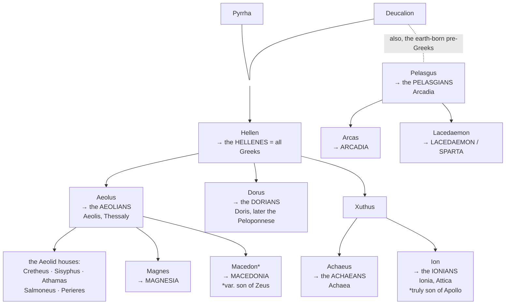
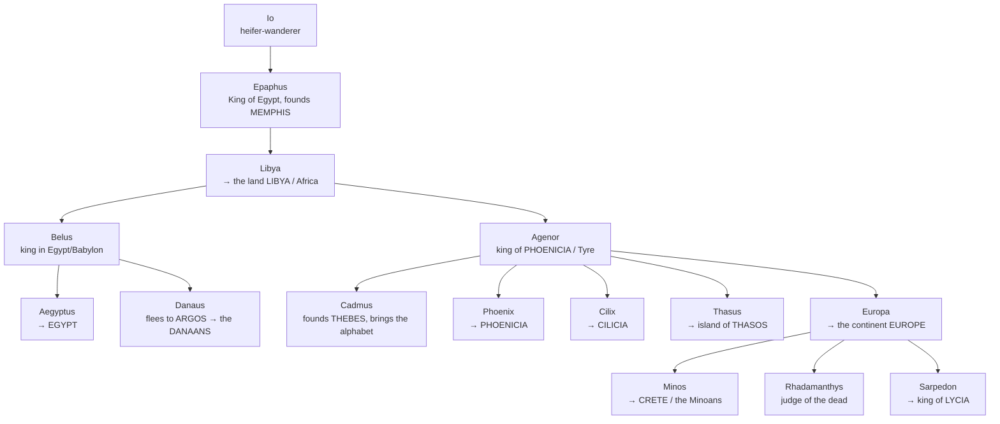
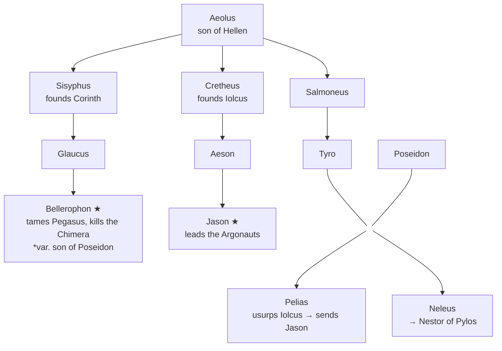
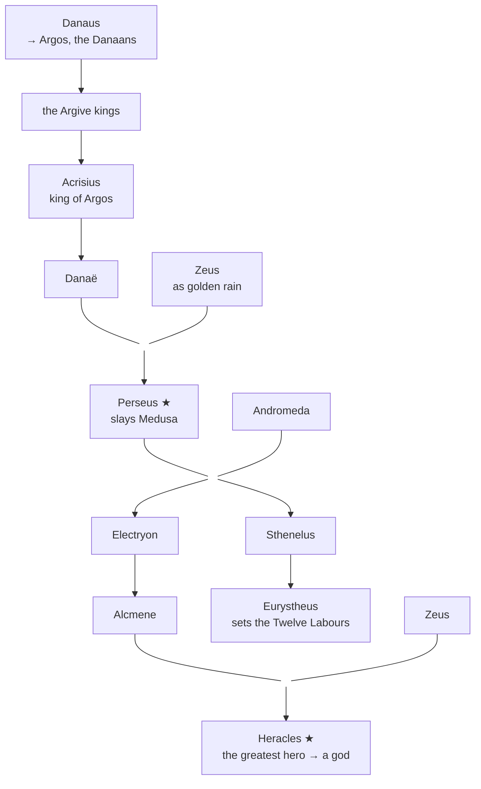
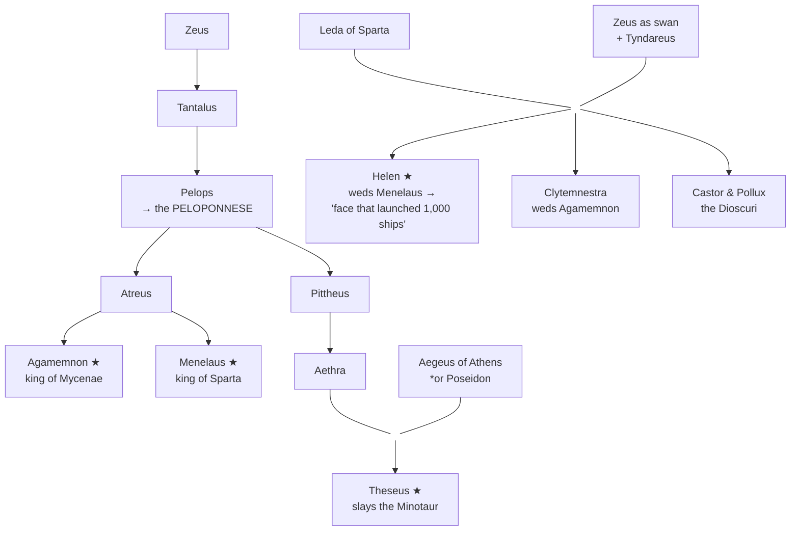
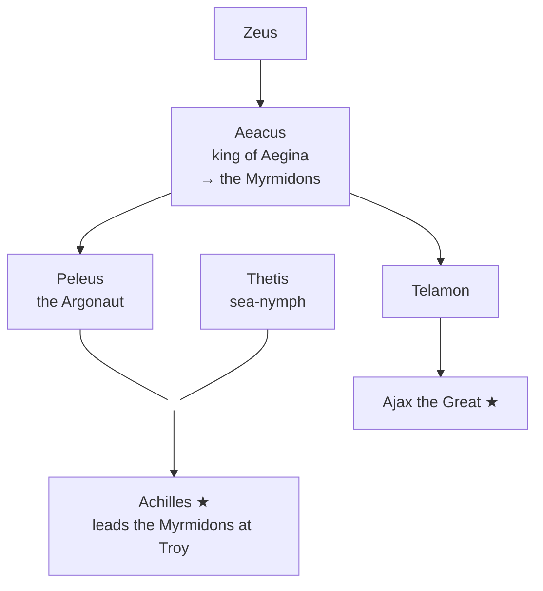
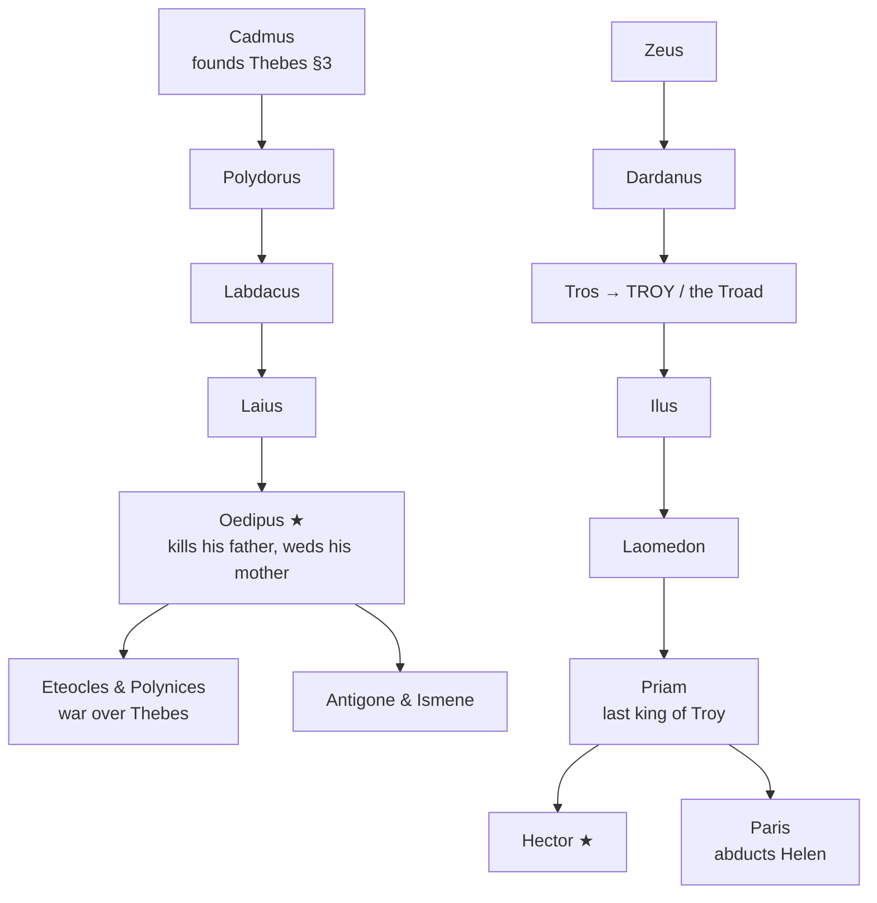
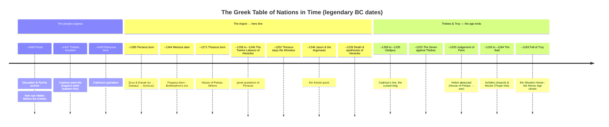

# Greek Mythology — Peoples & Lands: the Table of Nations

![[greek_table_of_nations.png|1660]]
*<b>The Peoples & Lands of Greek Myth</b> — a Table of Nations, where the descendants of Deucalion, Io & Agenor gave their names to the map. Base geometry: Natural Earth (public domain); coordinates approximate, several locations legendary.*

> [!info] Scope of this note
> A companion to the four narrative parts: **how the human race, once re-created after the Flood, spread out into the peoples, tribes, and kingdoms of the Greek world — and how the map itself (continents, seas, regions, cities) took its names from mythic ancestors.**
> This is the Greek counterpart to the **Table of Nations** in *Genesis 10*: a genealogy in which each descendant is the **eponym** (name-giver) of a people or a place. Where the Bible has Japheth → the coastland peoples, Greek myth has **Hellen → the Hellenes**, **Ion → the Ionians**, **Europa → Europe**.

> [!note] How to read this — eponymous myth
> The Greeks explained ethnic and geographic names by inventing an **ancestor** whose name matched: the *Dorians* must descend from a **Dorus**, *Arcadia* from an **Arcas**, *Asia* from an **Asia**. These figures are back-formations from the place-names, not history — but they are the framework the Greeks used to relate every people to every other. Treat each "X founded / named Y" below as **myth-logic**, not fact. Variant parentages are flagged, as the sources rarely agree.

> [!tip] Continuity
> Builds directly on [[Part 3 - The Age of Heroes#0. The Line of Mankind — from the Flood to the Heroes|Part III §0: The Line of Mankind]] (clay-race → Flood → stone-race + the Hellenic line) and the **Io → Egypt → Argos** line traced there. Read that first; this note widens it from a family tree into a *map*.

---

## 1. What the Greeks called themselves

Before the peoples, a caution: "the Greeks" had **no single name** in myth. Homer never says "Greeks." Instead three names, each with its own eponymous ancestor, are used interchangeably for the whole nation:

| Name in the poems | Eponym | Origin |
| --- | --- | --- |
| **Hellenes** (Ἕλληνες) | **Hellen** | The umbrella term for all Greeks; still their self-name today (*Hellas*). |
| **Achaeans** (Ἀχαιοί) | **Achaeus** | Homer's commonest word for the Greek army at Troy. |
| **Danaans** (Δαναοί) | **Danaus** | From the Argive line (below); Homer's second word for the Greeks. |
| **Argives** (Ἀργεῖοι) | *Argos* (the city/region) | Homer's third word for the Greeks generally. |

*("Greeks" itself is the **Roman** name — Latin *Graeci*, from a small tribe the **Graeci**/**Graikoi**, said to descend from a **Graecus**. The Romans met that tribe first and applied its name to the whole nation.)*

---

## 2. The Table of Nations — the Hellenic stemma

The core genealogy: from the flood-survivors down to the tribes and their lands. Every leaf is a **people or place named after the ancestor**.

> [!abstract]+ Timeline — how the mainland was peopled
> ```mermaid
> timeline
>     title Peopling the Greek mainland — the Hellenic line
>     section After the Flood (–1460)
>         Flood survivors : Deucalion & Pyrrha ; their thrown stones make the stone-race, the common folk (Leleges of Locris)
>         Their son Hellen : the HELLENES, all Greeks, take his name
>     section The sons of Hellen
>         Aeolus : settles AEOLIS & Thessaly ; his sons Magnes → MAGNESIA, Macedon → MACEDONIA
>         Dorus : the DORIANS of DORIS (who later take the Peloponnese)
>         Xuthus : father of Achaeus → ACHAEA and Ion → IONIA & Attica
>     section The older earth-born stock
>         Pelasgus, first man of Arcadia : his line gives Arcas → ARCADIA and Lacedaemon → SPARTA
> ```
> Only the **Flood (–1460)** carries a fixed legendary date here; the rest is generational order, not dated events.



> [!note] The Pelasgians — the people "before" the Greeks
> The Greeks believed an older, **earth-born (autochthonous)** race, the **Pelasgians**, held the land before the Hellenes — descended from **Pelasgus**, "first man" of Arcadia, who sprang from the soil. They are the myth's way of accounting for the pre-Greek population. Arcadia (mountainous, inland) prided itself on being the oldest, "pre-lunar" people, sprung straight from the earth rather than from Deucalion.

### The eponym table (Hellenic branch)

| Eponym | People / Land | Story & notes |
| --- | --- | --- |
| **Hellen** | Hellenes / **Hellas** | Son of Deucalion; the name-giver of all Greeks. |
| **Aeolus** | Aeolians / **Aeolis** | Eldest son of Hellen; his many children (the *Aeolids*) seed most heroic houses — Jason's line among them. |
| **Dorus** | Dorians / **Doris** | The Dorians later "return" under the Heraclids to take the Peloponnese. |
| **Xuthus** | — | Father of Achaeus and Ion; himself exiled to Athens. |
| **Achaeus** | Achaeans / **Achaea** | Homer's usual word for all Greeks. |
| **Ion** | Ionians / **Ionia**, Attica | Officially Xuthus's son, but *really* the son of **Apollo** by Xuthus's wife Creusa (Euripides, *Ion*) — so Athens claims a divine founder. |
| **Magnes** | **Magnesia** (Thessaly) | Aeolid. |
| **Macedon** | **Macedonia** | Variously son of Aeolus or of Zeus. |
| **Arcas** | **Arcadia** | Grandson of Pelasgus; son of Zeus and the nymph Callisto (who became the Great Bear). |
| **Lacedaemon** | **Sparta / Lacedaemon** | Son of Zeus; married Sparta, after whom the city is named. |
| **Pelops** | **Peloponnese** ("Island of Pelops") | The whole southern peninsula bears his name; ancestor of the Atreid kings (Agamemnon, Menelaus) — see [[Part 4 - Thebes & the Trojan War|Part IV]]. |

---

## 3. The Egyptian–Phoenician line, and the naming of the continents

A second great stream runs through **Io** — and this is where the map of the *world* (not just Greece) gets its names. Io, an Argive priestess loved by Zeus and turned into a heifer, is driven in torment across the earth (see [[Part 3 - The Age of Heroes#0. The Line of Mankind — from the Flood to the Heroes|Part III §0]]). Her wanderings **name the geography she crosses**:

| Place | Named from | Story |
| --- | --- | --- |
| **Ionian Sea** | **Io** | The sea she swam in her heifer-flight (one tradition). |
| **Bosphorus** | Greek *bous poros*, "**ox-ford**" | The strait Io the heifer crossed — literally "the crossing of the cow." |

Io reaches **Egypt**, is restored to human form, and bears **Epaphus** — and from him descends the whole eastern royal stemma:

> [!abstract]+ Timeline — how Io's line named the wider world
> ```mermaid
> timeline
>     title Io's line names the wider world
>     section Io's flight
>         The heifer's crossing : the BOSPHORUS, 'ox-ford' ; the IONIAN SEA
>         Io reaches Egypt : restored to human form, bears Epaphus who founds MEMPHIS
>     section The eastern kings
>         Epaphus → Libya : names LIBYA / Africa
>         Libya's sons : Belus in Egypt-Babylon ; Agenor king of PHOENICIA / Tyre
>         Belus's sons : Aegyptus → EGYPT ; Danaus flees to ARGOS, the DANAANS
>     section Agenor's children scatter, seeking Europa
>         Cadmus founds THEBES (–1437) : brings the alphabet ; 'cow-land' Boeotia
>         The brothers settle : Phoenix → PHOENICIA, Cilix → CILICIA, Thasus → THASOS
>         Europa carried to Crete : gives her name to the continent EUROPE
>         Europa's sons : Minos → CRETE, the Minoans ; Sarpedon → LYCIA
> ```
> Only **Cadmus's founding of Thebes (–1437)** is fixed in the legendary chronology; the rest is generational order.



### Eponym table (eastern branch)

| Eponym | People / Land | Story & notes |
| --- | --- | --- |
| **Epaphus** | founds **Memphis** (Egypt) | Io's son by Zeus, born once she reaches Egypt; first king of the line. |
| **Libya** | **Libya** (= Greek name for Africa) | Daughter of Epaphus; by Poseidon, mother of Belus and Agenor. |
| **Belus** | (Babylon / Egypt) | Stays east; father of the feuding twins Aegyptus and Danaus. |
| **Aegyptus** | **Egypt** | His 50 sons pursue Danaus's 50 daughters (the Danaids). |
| **Danaus** | the **Danaans** (Greeks); **Argos** | Flees back to Argos, returning the line to Greece; his descendants → Acrisius → Danaë → **Perseus** → **Heracles**. |
| **Agenor** | **Phoenicia** (Tyre/Sidon) | Libya's other son; father of Europa and her searching brothers. |
| **Phoenix** | **Phoenicia** | Brother of Europa; settled and named the land after himself. |
| **Cilix** | **Cilicia** (SE Anatolia) | Gave up the search for Europa and settled there. |
| **Thasus** | island of **Thasos** | Founded a city on the Aegean island. |
| **Cadmus** | founds **Thebes**; **Boeotia** | Sent to find Europa; instead founds Thebes (following a cow — hence *Boeotia*, "cow-land") and **brings the Phoenician alphabet to Greece**. Full story: [[Part 4 - Thebes & the Trojan War#1. Cadmus Founds Thebes|Part IV §1]]. |

### Europa and the continents

> [!quote] Source — Apollodorus 3.1.1; Ovid, *Met.* 2.833–875; Herodotus 4.45
> **Europa**, daughter of the Phoenician king Agenor, was gathering flowers by the sea when **Zeus, in the form of a gentle white bull**, knelt before her. She climbed on his back — and he plunged into the sea and carried her to **Crete**. There she bore Zeus three sons: **Minos** (the great king of Crete), **Rhadamanthys**, and **Sarpedon**. Her father sent her brothers (Cadmus, Phoenix, Cilix, Thasus) to find her, forbidding their return without her; they never found her, and each **founded a kingdom** instead — so the fruitless search for Europa scattered the Phoenician royal seed across the map.

- **Europe** — the continent is named after **Europa**. She herself never reached the mainland, but her brother **Cadmus**, searching for her, brought Phoenician civilisation (and the alphabet) to Greece; myth treats her as the "mother" of the European lands.
- **The three-continent scheme.** The Greeks divided the world into **Europe, Asia, and Libya (Africa)** — and a rival tradition (Herodotus notes it) makes all three **daughters of Oceanus**: the Oceanids **Europa, Asia, and Libya**, each giving her name to a continent. So "Asia" too is an eponym — either the Oceanid, or (Herodotus) the wife of the Titan Iapetus.
- **Crete / the Minoans** take their name from Europa's son **Minos**; **Lycia** from her son **Sarpedon**.

---

## 4. The autochthonous peoples — sprung from the earth itself

Not every people descends from Deucalion or Io. Several proud old cities claimed their first king was **autochthonous** — born *directly from the soil*, owing nothing to any migrant ancestor. This is the myth-logic of "we were always here."

> [!abstract]+ Timeline — the peoples who claim no migration
> ```mermaid
> timeline
>     title The earth-born peoples — no migration, 'always here'
>     section Sprung straight from the soil
>         Athens, Attica : Cecrops & Erichthonius, born from the earth ; the city never conquered or repopulated
>         Arcadia : Pelasgus, the mountain 'first man', oldest of all
>     section Peopled by a marvel
>         Thebes : the Spartoi, 'sown men' risen from Cadmus's dragon-teeth
>         Aegina : the Myrmidons, the island's ants turned to men for King Aeacus
> ```
> These foundings sit *outside* the migration chronology — the whole point of an autochthony claim is that the people have no arrival-date.

| People / City | Earth-born founder | Story |
| --- | --- | --- |
| **Athenians** (Attica) | **Cecrops** & **Erichthonius** | Cecrops, first king of Athens, was **half-man, half-serpent**, born from the earth. Erichthonius likewise sprang from the soil (from Hephaestus's seed, raised by Athena). Athens boasted it was never conquered or repopulated — its people *are* the land. |
| **Thebans** | the **Spartoi** ("sown men") | Not from Deucalion but from **dragon's teeth** Cadmus sowed; five survivors became Thebes' founding nobility (see [[Part 4 - Thebes & the Trojan War#1. Cadmus Founds Thebes|Part IV §1]]). |
| **Arcadians** | **Pelasgus** | The earth-born "first man" of the mountainous interior (above). |
| **Myrmidons** (Achilles' people) | born **from ants** | On **Aegina**, King **Aeacus** (son of Zeus) prayed after a plague emptied the island; Zeus turned the island's **ants** (*myrmekes*) into people — the **Myrmidons**, the loyal soldiers Achilles later leads at Troy. |

---

## 5. Where the heroes come from — hanging the hero-cycles on the spine

The eponyms above are name-givers; the **heroes** of [[Part 3 - The Age of Heroes|Part III]] and [[Part 4 - Thebes & the Trojan War|Part IV]] are their descendants. Every great hero hooks onto one of the branches already drawn — so you can trace *any* of them back to Deucalion, Io, or Zeus. Below, each hero-cycle is rooted at the exact spine-point it grows from. **★ = a hero with his own saga.**

> [!tip] The one-line rule
> Almost every hero is **Zeus's descendant by a different route**: through **Aeolus** (the Aeolid quests), through **Io → Danaus** (the Argive line to Perseus & Heracles), or through **Tantalus → Pelops** (the Atreid kings). Zeus is the single trunk; the eponyms are the boughs; the heroes are the fruit.

### 5a. The Aeolid heroes — off **Aeolus** (§2)

**Aeolus's** sons seed the quest-heroes. **Sisyphus** of Corinth is grandfather of **Bellerophon**; **Cretheus** of Iolcus is grandfather of **Jason**; and **Salmoneus's** daughter **Tyro**, by Poseidon, bears **Pelias** — the very usurper who sends Jason after the Fleece.



### 5b. Perseus & Heracles — off **Danaus → Acrisius** (§3)

The Egyptian line loops back to Argos and produces the two mightiest heroes. **Danaë's** son by Zeus is **Perseus**; Perseus and **Andromeda** found the Perseid house, from which — three generations on — **Alcmene** bears **Heracles** to Zeus, while cousin **Eurystheus** sets his Labours.



### 5c. The House of Pelops — the Atreid kings & Theseus — off **Pelops** (§2)

**Pelops** (whose grandfather is **Zeus**, via **Tantalus**) gives the Peloponnese its name and founds the doomed **Atreid** dynasty — **Agamemnon** and **Menelaus**, warlords of the Trojan War. On his other side, Pelops's grandson through **Aethra** is **Theseus** of Athens. And the **Spartan** sisters **Helen** and **Clytemnestra** (with their brothers the **Dioscuri**) marry straight into this house.



### 5d. The Aeacids of Aegina — off **Aeacus** & the Myrmidons (§4)

The ant-born island of **Aegina** (§4) produces the greatest warriors of Troy. **Aeacus's** sons **Peleus** and **Telamon** father **Achilles** (by the sea-nymph **Thetis**) and **Ajax** — and Achilles leads Aeacus's own **Myrmidons** into battle.



### 5e. Thebes & Troy — the two doomed cities

**Oedipus** grows from the **eastern line**: he is a descendant of **Cadmus** (§3), through **Laius**. The Trojan royal house — **Priam**, **Hector**, **Paris** — descends from **Dardanus**, another son of **Zeus** (by Electra, daughter of Atlas), so even Greece's enemies share the trunk.



> [!note] The heroes outside the Greek spine
> A few key figures in the sagas are deliberately **not** Deucalion's or Io's descendants — they come from elsewhere, which is precisely their narrative role:
>
> - **Odysseus** — king of **Ithaca**, son of Laertes; a western-islands line outside the great eastern/Argive stemma (his cunning is that of an outsider, not a dynast).
> - **Medea** — granddaughter of the sun-god **Helios**, daughter of King Aeëtes of **Colchis** (the far Black-Sea east): a foreign sorceress, the outsider Jason brings home.
> - **Orpheus** — son of the Muse **Calliope** (Thracian line); his power is art, not blood.
> - **Atalanta** — an **Arcadian** huntress of the old Pelasgian stock (§2), exposed at birth and suckled by a bear.
> - **Patroclus** — an Aeolid by descent (son of Menoetius), but remembered only as **Achilles' companion**.

> [!tip] Read the hero-cycles in full
> These trees only show *descent*. For the stories themselves: **Perseus, Bellerophon, Heracles, Jason, Theseus** → [[Part 3 - The Age of Heroes|Part III]]; **Oedipus, the Seven, Agamemnon, Achilles, Odysseus** → [[Part 4 - Thebes & the Trojan War|Part IV]].

---

## 6. When it all happens — the peoples-and-heroes timeline

The eponymous ancestors and the heroes they beget occupy a **legendary chronology** (St Jerome's dates via Apollodorus; see the [[Part 5 - Master Timeline (by date)|Master Timeline]]). Reading top to bottom, you can watch the family spine *grow*: Flood → Greek peoples → the eastern kings → the hero-generations → Troy, where the age ends.



> [!note] What the timeline shows
> The three genealogical streams of this note **converge in time** at Troy. The **Atreids** (Pelops line) command; the **Aeacids** (Aegina) and Aeolids fight; **Helen** (Spartan/Zeus line) is the prize; and the whole war is dated *after* every hero-birth above — the Heroic Age spends its bloodlines all at once, then ends. For the full interleaved chronology see the [[Part 5 - Master Timeline (by date)|Master Timeline]].

---

## 7. One-glance summary — the map from the myth

**Three ways humanity fills the Greek world:**
1. **The stone-race** → the anonymous commons (the *laoi*; the Leleges of Locris). *"How many people?"*
2. **The Hellenic bloodline** (Hellen → Aeolus/Dorus/Xuthus) → the **named tribes and their lands**. *"Which Greeks?"*
3. **The eastern line** (Io → Egypt → Phoenicia → Europa/Cadmus/Danaus) → links Greece to **Egypt, Phoenicia, and the naming of the continents**, and loops back home through **Danaus → Perseus**. *"How Greece connects to the wider world."*
4. **Autochthons** (Athens, Arcadia, the Spartoi, the Myrmidons) → the peoples who claim to spring **from the soil itself**, outside all migration.

And above every branch stands **Zeus**, who fathers the founder of nearly every line — the true single ancestor of "the peoples," through different mortal women in different lands.

---

## Sources & further reading

- **Hesiod**, *Catalogue of Women* — the lost genealogical backbone of Greek ethnography; the Hellen stemma survives in fragments.
- **Apollodorus**, *Bibliotheca* 1.7 (Deucalion/Hellen), 2.1 (Io/Danaus), 3.1 (Agenor/Europa/Cadmus) — [Perseus](https://www.perseus.tufts.edu/hopper/text?doc=Perseus:text:1999.01.0022).
- **Herodotus**, *Histories* 4.45 — the continents named after women; scepticism about the eponyms.
- **Ovid**, *Metamorphoses* 2 (Europa & the bull), 1 (Io, Deucalion).
- **Euripides**, *Ion* — Ion as secret son of Apollo, ancestor of the Ionians.
- **Pausanias**, *Description of Greece* 8 (Arcadia, Pelasgus) — local autochthony traditions.

> [!todo] Navigation
> → **The genealogical spine:** [[Part 3 - The Age of Heroes#0. The Line of Mankind — from the Flood to the Heroes|Part III §0: The Line of Mankind]]
> → **Cadmus, Europa's brother, founds Thebes:** [[Part 4 - Thebes & the Trojan War#1. Cadmus Founds Thebes|Part IV §1]]
> → **Creation of the first humans:** [[Part 1 - Creation & the Titanomachy#8. Aftermath — Prometheus and the Creation of Mankind|Part I §8]]
> ⚑ **By-date master index:** [[Part 5 - Master Timeline (by date)|Master Timeline]]
